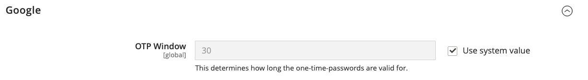
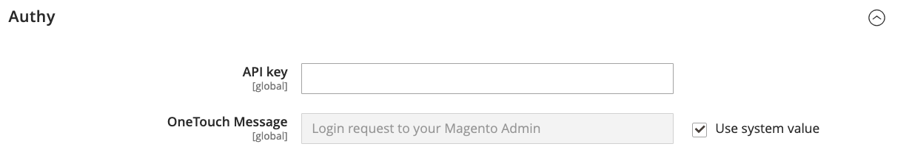

# [!UICONTROL Security] > [!UICONTROL 2FA]

>[!NOTE]
>
>Pour les magasins qui ont activé l’authentification Adobe Identity Management Services (IMS), l’authentification native Adobe Commerce et Magento Open Source à deux facteurs (2FA) est désactivée. Les utilisateurs administrateurs connectés à leur instance Adobe Commerce avec leurs informations d’identification Adobe n’ont pas besoin de s’authentifier à nouveau pour de nombreuses tâches d’administration. L’authentification est gérée par Adobe IMS lorsque l’utilisateur administrateur se connecte à sa session en cours. Voir [&#x200B; Intégration d’Adobe Commerce à Adobe IMS](https://experienceleague.adobe.com/docs/commerce-admin/start/admin/ims/adobe-ims-integration-overview.html).

{{config}}

Pour plus d’informations sur la modification de ces paramètres, voir [Authentification à deux facteurs (2FA)](../../systems/security-two-factor-authentication.md) dans le _Guide d’administration des systèmes_.

## [!UICONTROL General]

<!-- zoom -->

| Champ | [Portée](../../getting-started/websites-stores-views.md#scope-settings) | Description |
|--- |--- |--- |
| [!UICONTROL Providers to use] | Global | Indique les méthodes d’authentification à deux facteurs dont vous avez besoin. Si vous sélectionnez plusieurs fournisseurs, chaque utilisateur doit configurer chaque méthode 2FA lors de sa prochaine connexion. |
| [!UICONTROL Configuration Email URL for Web API] | Global | Pour les implémentations personnalisées, URL d’un lien de configuration d’e-mail secondaire envoyé aux utilisateurs _Admin_ lors de la première connexion. Dans le modèle d’e-mail, utilisez l’espace réservé `:tfat` pour indiquer où le jeton est injecté. |
| [!UICONTROL Retry attempt limit for Two-Factor Authentication] | Global | Détermine le nombre de fois qu’un administrateur peut saisir un [!DNL one-time password (OTP)] avant que son compte ne soit temporairement désactivé. Valeur par défaut : `10` |
| [!UICONTROL Two-Factor Authentication lockout time (seconds)] | Global | Détermine la durée (en secondes) pendant laquelle un administrateur peut attendre avant de saisir un [!DNL one-time password (OTP)] avant que son compte ne soit temporairement désactivé. Valeur par défaut : `300` |

{style="table-layout:auto"}

## [!UICONTROL Google]

<!-- zoom -->

| Champ | [Portée](../../getting-started/websites-stores-views.md#scope-settings) | Description |
|--- |--- |--- |
| [!UICONTROL OTP Window] | Global | Détermine la durée (en secondes) pendant laquelle le système accepte les [!DNL one-time-password (OTP)] d&#39;un administrateur après leur expiration. Ne peut pas être supérieur à la durée de vie d’un seul mot de passe à usage unique (généralement 30 secondes). Valeur par défaut : `29` |

{style="table-layout:auto"}

## [!UICONTROL Duo Security]

<!-- zoom -->

| Champ | [Portée](../../getting-started/websites-stores-views.md#scope-settings) | Description |
|--- |--- |--- |
| [!UICONTROL Client Id] | Global | Identifiant client de votre compte [!DNL Duo Security]. |
| [!UICONTROL Client Secret] | Global | Secret client de votre compte [!DNL Duo Security]. |
| [!UICONTROL Integration Key] | Global | Clé d’intégration de votre compte d’API [!DNL Duo Security]. |
| [!UICONTROL Secret Key] | Global | Clé secrète de votre compte API [!DNL Duo Security]. |
| [!UICONTROL API Hostname] | Global | Nom d’hôte de l’API de votre compte [!DNL Duo Security]. |

{style="table-layout:auto"}

## [!UICONTROL Authy]

<!-- zoom -->

| Champ | [Portée](../../getting-started/websites-stores-views.md#scope-settings) | Description |
|--- |--- |--- |
| [!UICONTROL API Key] | Global | Clé API de votre compte [!DNL Authy]. |
| [!UICONTROL OneTouch Message] | Global | Message qui apparaît dans l’authentificateur [!DNL Authy] lors de la connexion. Valeur par défaut : `Login request to your Magento Admin` |

{style="table-layout:auto"}

## [!UICONTROL U2F Key]

<!-- zoom -->

| Champ | [Portée](../../getting-started/websites-stores-views.md#scope-settings) | Description |
|--- |--- |--- |
| [!UICONTROL WebApi Challenge Domain] | Global | Domaine utilisé pour générer et traiter des défis [!DNL WebAuthn] pour les implémentations WebAPI personnalisées. |

{style="table-layout:auto"}
