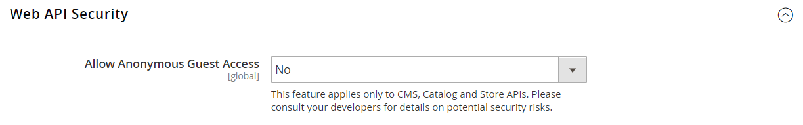

# [!UICONTROL Services] > [!UICONTROL Magento Web API]

{{config}}

<!-- [X-ref](../systems/integrations.md) -->

## [!UICONTROL SOAP Settings]

<!-- zoom -->

| Champ | [Portée](../../getting-started/websites-stores-views.md#scope-settings) | Description |
|--- |--- |--- |
| [!UICONTROL Default Response Charset] | Affichage en magasin | Détermine le jeu de caractères par défaut. Si ce paramètre est vide, UTF-8 est utilisé. |

{:style=&quot;table-layout:auto&quot;}

## [!UICONTROL GraphQl Input Limits]

<!-- zoom -->

| Champ | [Portée](../../getting-started/websites-stores-views.md#scope-settings) | Description |
|--- |--- |--- |
| [!UICONTROL Enable Input Limits] | Affichage en magasin | Détermine si les limites d’entrée sont activées pour les appels GraphQL. Valeur par défaut : `No`. |
| [!UICONTROL Maximum Page Size] | Affichage en magasin | Définit le nombre maximal d’éléments autorisés dans le résultat d’une recherche paginée dans la réponse GraphQL. Cette option n’est pas disponible lorsque _Activer les limites d’entrée_ = `No`. |

{:style=&quot;table-layout:auto&quot;}

## [!UICONTROL Web Api Input Limits]

<!-- zoom -->

| Champ | [Portée](../../getting-started/websites-stores-views.md#scope-settings) | Description |
|--- |--- |--- |
| [!UICONTROL Enable Input Limits] | Affichage en magasin | Détermine si les limites d’entrée sont activées pour les appels d’API Web. Valeur par défaut : `No`. |
| Limite de liste d’entrée | Affichage en magasin | Définit le nombre maximal d’éléments autorisés dans une propriété de tableau d’entités dans la requête d’API Web. Cette option n’est pas disponible lorsque _Activer les limites d’entrée_ = `No`. |
| [!UICONTROL Maximum Page Size] | Affichage en magasin | Définit le nombre maximal d’éléments autorisés dans le résultat d’une recherche paginée dans la réponse de l’API Web. Cette option n’est pas disponible lorsque _Activer les limites d’entrée_ = `No`. |
| [!UICONTROL Default Page Size] | Affichage en magasin | Définit le nombre par défaut d’éléments dans le résultat d’une recherche paginée dans la réponse de l’API Web. |

{:style=&quot;table-layout:auto&quot;}

## [!UICONTROL Web API Security]

<!-- zoom -->

| Champ | [Portée](../../getting-started/websites-stores-views.md#scope-settings) | Description |
|--- |--- |--- |
| [!UICONTROL Allow Anonymous Guest Access] | Global | Détermine que les invités peuvent accéder anonymement au CMS, au catalogue et au stockage des ressources à partir des API SOAP et REST. Par défaut, l’accès anonyme aux invités n’est pas autorisé. Options : `Yes` / `No` |

{:style=&quot;table-layout:auto&quot;}

## [!UICONTROL JWT Authentication]

<!-- zoom -->

| Champ | [Portée](../../getting-started/websites-stores-views.md#scope-settings) | Description |
|--- |--- |--- |
| [!UICONTROL Algorithm to sign/encrypt JWTs used for authentication] | Global | Spécifie le type d’algorithme JWS ou JWE utilisé pour le chiffrement JWT (JSON Web Token). |
| [!UICONTROL Content encryption algorithm for JWEs] | Global | Indique le type d’algorithme de chiffrement de contenu utilisé pour le chiffrement JWT lorsque l’algorithme JWE est sélectionné. Cette option est ignorée pour les algorithmes JWS. |
| [!UICONTROL Customer JWT Expires In] | Global | Définit la durée (en minutes) avant l’expiration d’un jeton porteur JWT client. Le jeton porteur JWT du client expire dans 30 minutes si ce champ est vide ou a une valeur négative. Valeur par défaut : `60` |
| [!UICONTROL Admin User JWT Expires In] | Global | Définit la durée (en minutes) avant l’expiration du jeton porteur JWT d’administration. Le jeton porteur JWT d’administration expire dans 30 minutes si ce champ est vide ou a une valeur négative. Valeur par défaut : `60` |

{:style=&quot;table-layout:auto&quot;}
