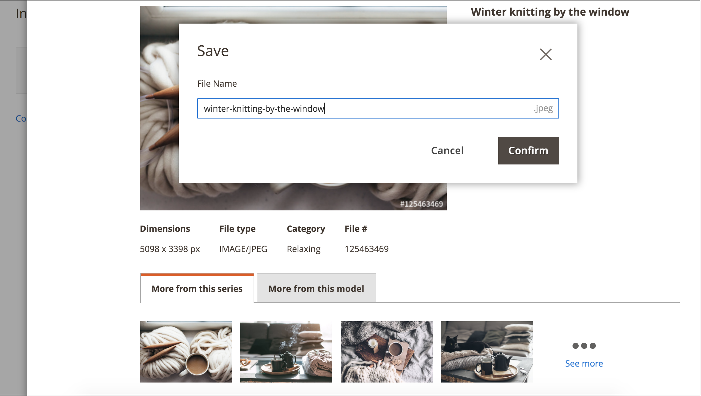

# Obtenir la licence d’une image Adobe Stock

Les ressources Adobe Stock que vous souhaitez utiliser pour vos magasins de production Adobe Commerce et Magento Open Source doivent disposer d’une licence. Cette licence vous garantit un accès légal à l’image et vous permet d’éliminer le filigrane Adobe Stock présent dans tous les [aperçus d’image](./adobe-stock-save-preview.md). Pour acquérir des images sous licence ou enregistrer des images déjà sous licence, vous devez être connecté à votre compte Adobe.

Le nouveau [[!DNL Media Gallery]](media-gallery.md) offre une intégration directe à Adobe Stock, ce qui facilite l’obtention de licences pour vos images directement depuis la page de la galerie.

>[!BEGINSHADEBOX]

**Conditions préalables**

La fonction de licence d’Adobe Stock n’est disponible que si l’[intégration d’Adobe Stock](./adobe-stock.md) est installée et configurée. L’octroi de licences pour les images [Adobe Stock][adobe-stock] nécessite un plan Adobe Stock payant et un compte [Adobe][adobe-signin].

>[!ENDSHADEBOX]

## Obtenir la licence d’une image à partir de la nouvelle [!DNL Media Gallery]

1. Dans la barre latérale _Admin_, accédez à **[!UICONTROL Content]** > _[!UICONTROL Media]_>**[!UICONTROL Media Gallery]**.

1. Suivez les étapes de la section [Utilisation d’images Adobe Stock](./adobe-stock-manage.md) pour vous connecter et enregistrer les images d’aperçu dans le [espace de stockage multimédia](./media-storage.md).

   {width="600" zoomable="yes"}

1. Cliquez sur les trois points situés sous l’image ({width="10" zoomable="no"}), puis cliquez sur **[!UICONTROL License]**.

   {width="600" zoomable="yes"}

   >[!NOTE]
   >
   >Si vous n’êtes pas connecté, le formulaire de connexion s’affiche. Pour plus d’informations sur la connexion, voir [ Utilisation d’images Adobe Stock ](./adobe-stock-manage.md).

1. Dans la boîte de dialogue de confirmation de licence, cliquez sur **[!UICONTROL Confirm]** pour obtenir la licence de l’image.

   {width="350" zoomable="yes"}

   >[!NOTE]
   >
   >Vous devez disposer de [crédits Adobe Stock disponibles][stock-credits] sur votre compte pour obtenir la licence de l’image.

## Obtenir la licence d’une image à partir du stockage multimédia standard

1. [Accédez à la grille de recherche Adobe Stock][adobe-stock-manage.md].

1. Pour [afficher les détails de l’image][adobe-stock-manage.md#view-image-details], cliquez sur une image dans la grille de recherche dans l’ordre.

1. Selon le statut de licence actuel de l’image, effectuez l’une des opérations suivantes :

   - Si l’image est déjà sous licence, cliquez sur **[!UICONTROL Save]**.

   - Si l’image n’est _pas_ sous licence, cliquez sur **[!UICONTROL License and Save]**.

     >[!NOTE]
     >
     >Vous devez disposer de [crédits Adobe Stock disponibles][stock-credits] sur votre compte pour obtenir la licence de l’image.

   Cette action affiche une invite vous demandant de spécifier un nom de fichier utilisé pour enregistrer l’image dans le [espace de stockage multimédia](./media-storage.md). Un nom de fichier par défaut est fourni, mais vous pouvez personnaliser le nom en fonction de vos préférences.

   {width="550" zoomable="yes"}

1. Cliquez sur **[!UICONTROL Confirm]**.

   La page redirige vers l’espace de stockage multimédia et l’aperçu que vous avez enregistré s’affiche.

[access-search]: adobe-stock-manage.md#access-the-adobe-stock-search-grid
[view-details]: adobe-stock-manage.md#view-image-details
[stock-credits]: https://helpx.adobe.com/stock/help/credit-packs.html
[adobe-stock]: https://stock.adobe.com
[adobe-signin]: https://helpx.adobe.com/manage-account/using/access-adobe-id-account.html
