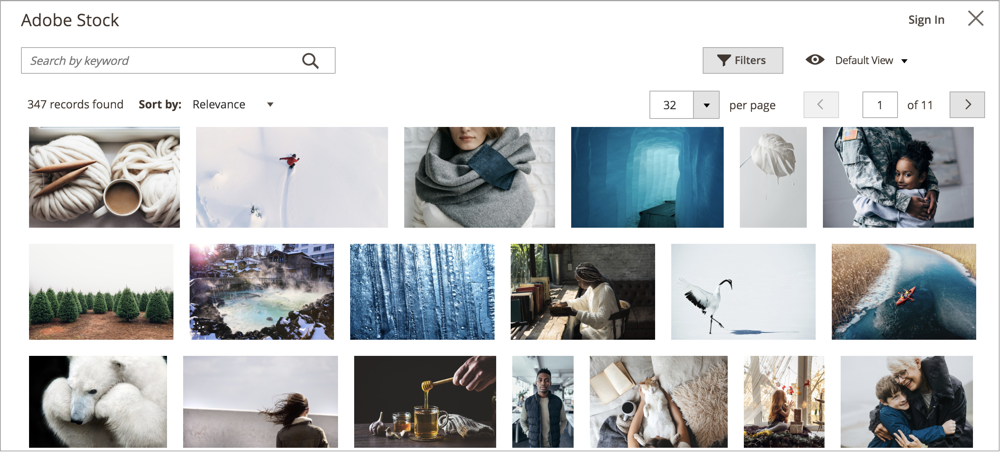

# Utilisation d’images Adobe Stock

Les images [Adobe Stock](https://stock.adobe.com) peuvent être utilisées au lieu de télécharger votre propre contenu d’image. Un cas d’utilisation courant consiste à charger et à placer du contenu d’image lors de la création d’une page.

[[!DNL Media Gallery]](media-gallery.md) fournit une intégration directe à Adobe Stock, ce qui facilite la licence de vos images directement à partir de la page de la galerie.

## Accès à la grille de recherche Adobe Stock

Le panneau de recherche Adobe Stock est accessible lorsque vous [ajoutez ou modifiez une page](page-add.md), lorsque vous [ créez ou modifiez une catégorie](../catalog/category-create.md) ou lorsque vous [insérez des images via l’éditeur de contenu](editor-insert-image.md).

**_Pour rechercher des ressources Adobe Stock et ajouter une image de stock à une page :_**

1. Sur la barre latérale _Admin_, accédez à **[!UICONTROL Content]** > _[!UICONTROL Elements]_>**[!UICONTROL Pages]**.

1. Cliquez sur **[!UICONTROL Add a New Page]**.

   Si vous souhaitez modifier une page existante, vous pouvez utiliser la colonne _[!UICONTROL Action]_pour cliquer sur **[!UICONTROL Select]**et choisir **[!UICONTROL Edit]**.

1. Développez la section  de **[!UICONTROL Content]** et procédez comme suit :

   - Si l’éditeur [WYSIWYG est activé](editor.md), cliquez sur **[!UICONTROL Show/Hide Editor]**, puis sur **[!UICONTROL Insert Image]**.

   - Si [ Page Builder est activé](../page-builder/setup.md), développez le panneau **[!UICONTROL Media]** et faites glisser un espace réservé **[!UICONTROL Image]** vers le conteneur cible. Cliquez ensuite sur **[!UICONTROL Select from Gallery]**.

     {width="600" zoomable="yes"}

1. Cliquez sur **[!UICONTROL Search Adobe Stock]**.

**_Pour rechercher des ressources Adobe Stock et ajouter une image de stock à une catégorie :_**

1. Sur la barre latérale _Admin_, accédez à **[!UICONTROL Catalog]** > **[!UICONTROL Categories]**.

1. Cliquez sur **[!UICONTROL Add Root Category]** ou **[!UICONTROL Add Subcategory]**.

   Si vous souhaitez ajouter l’image à une catégorie existante, cliquez sur le nom de la catégorie dans la liste située à gauche.

1. Développez la section **[!UICONTROL Content]** et sous _[!UICONTROL Category Image]_, cliquez sur **[!UICONTROL Select from Gallery]**.

1. Cliquez sur **[!UICONTROL Search Adobe Stock]**.

Pour rechercher des ressources Adobe Stock et ajouter une image de stock à partir de l’éditeur WYSIWYG :

1. cliquez sur **[!UICONTROL Show/Hide Editor]**.

1. Cliquez sur **[!UICONTROL Insert Image]**.

1. Cliquez sur **[!UICONTROL Search Adobe Stock]**.

   {width="600" zoomable="yes"}

## Filtrage et recherche de ressources Adobe Stock

La [grille de recherche Adobe Stock](#access-the-adobe-stock-search-grid) fournit des fonctionnalités de requêtage et de filtrage pour vous aider à trouver l’image parfaite pour vos [!DNL Commerce] magasins.

Par défaut, les résultats de recherche affichés proviennent d’une galerie de quelques centaines de résultats organisée par Adobe Stock. Lorsque vous appliquez votre propre recherche par mot-clé, vous recherchez les millions de ressources disponibles via Adobe Stock.

### Recherche de ressources Adobe Stock par mots-clés

1. [Accédez à la grille de recherche Adobe Stock](#access-the-adobe-stock-search-grid).

1. Saisissez votre recherche de mot-clé dans le champ de saisie **[!UICONTROL Search by keyword]** en haut à gauche et cliquez sur la loupe ou appuyez sur **Entrée**.

   {width="600" zoomable="yes"}

### Filtrage des ressources Adobe Stock

1. [Exécutez une recherche de mots-clés pour les ressources Adobe Stock](#search-for-adobe-stock-assets-by-keywords).

1. Cliquez sur **[!UICONTROL Filters]**.

   Plusieurs filtres sont disponibles pour affiner les résultats de la recherche :

   | Filtrer | Description |
   |---|---|
   | [!UICONTROL Subcategory] | Filtre pour les images qui sont **Photos** ou **Illustrations** |
   | [!UICONTROL Orientation] | Filtrage des images par taille, forme et aspect |
   | [!UICONTROL Color] | Utilisation d’une palette de couleurs pour filtrer les images par couleur |
   | [!UICONTROL Price] | Filtrer les images en fonction de leur coût |
   | [!UICONTROL Safe search] | Activation ou désactivation de la recherche sécurisée |
   | [!UICONTROL Isolated Assets] | Limitez l’affichage aux _ressources isolées_ uniquement, dont les sujets apparaissent seuls sur un arrière-plan plein |

   {style="table-layout:auto"}

   {width="600" zoomable="yes"}

1. Cliquez sur **[!UICONTROL Apply Filters]**.

   La grille de résultats de recherche est mise à jour avec votre recherche affinée.

## Affichage des détails d’une image

Les détails de chaque image peuvent être affichés. D’autres actions spécifiques aux images, telles que [l’enregistrement des aperçus d’image](adobe-stock-save-preview.md) ou [l’enregistrement (et éventuellement l’octroi de licences) des images](adobe-stock-license-image.md), sont disponibles via cette vue détaillée.

1. [Accédez à la grille de recherche Adobe Stock](#access-the-adobe-stock-search-grid).

1. Cliquez sur une image dans les résultats de la recherche.

   D’autres détails d’image s’affichent, tels que :

   - Une version plus grande de l’image
   - Métadonnées d’image, telles que _[!UICONTROL Dimensions]_,_[!UICONTROL File type]_, _[!UICONTROL Category]_,_[!UICONTROL File]_ et _Mots-clés_
   - Images connexes, telles que des images de la même _série_ ou _modèle_
   - Boutons d’action, tels que [[!UICONTROL Save Preview]](adobe-stock-save-preview.md) et [[!UICONTROL Save (and optionally license) Image]](adobe-stock-license-image.md)

     {width="600" zoomable="yes"}

## Connectez-vous à votre compte Adobe

Pour accéder à une image et éliminer le filigrane Adobe Stock, vous devez [vous connecter avec un compte d’Adobe](https://helpx.adobe.com/manage-account/using/access-adobe-id-account.html) et acheter des crédits pour acquérir des droits de licence d’utilisation d’une image.

1. [Accédez à la grille de recherche Adobe Stock](#access-the-adobe-stock-search-grid).

1. Cliquez sur **[!UICONTROL Sign In]** en haut à droite.

   Une nouvelle fenêtre de navigateur vous guide tout au long du [processus de connexion à l’Adobe](https://helpx.adobe.com/manage-account/using/access-adobe-id-account.html).

   Une fois le processus de connexion terminé, l’état des images sous licence s’affiche sous forme d’étiquette dans les résultats de recherche.

   {width="600" zoomable="yes"}

### Affichage de l’état des résultats de recherche sous licence

[Connectez-vous à votre compte d’Adobe](#log-in-to-your-adobe-account).

Une étiquette s’affiche sur toutes les images sous licence associées à votre compte d’Adobe, indiquant clairement quelles images vous possédez sous licence.

{width="600" zoomable="yes"}

### Enregistrement des images dans le stockage multimédia

Les images recherchées à l’aide de l’intégration Adobe Stock peuvent être enregistrées dans le [!DNL Commerce] [stockage de médias](media-storage.md) pour une réutilisation facile dans votre boutique [!DNL Commerce].

Vous pouvez enregistrer deux types d&#39;images : un [aperçu d&#39;image](adobe-stock-save-preview.md) ou une [image sous licence](adobe-stock-license-image.md).

#### Enregistrer un aperçu d’image

Un aperçu d’image est une version mise en filigrane d’une ressource Adobe Stock. Les aperçus d’images sont gratuits et vous permettent de tester différentes images avant de décider d’acheter une licence pour des images spécifiques et de les utiliser dans vos magasins de production.

1. [Accédez à la grille de recherche Adobe Stock](#access-the-adobe-stock-search-grid).

1. Pour [afficher les détails de l’image](#view-image-details), cliquez sur une image dans la grille de recherche.

1. Cliquez sur **[!UICONTROL Save Preview]**.

   Cette action vous invite à spécifier un nom de fichier utilisé pour enregistrer l’image dans le stockage multimédia. Un nom de fichier par défaut est fourni, mais vous pouvez le personnaliser selon vos préférences.

   {width="500" zoomable="yes"}

1. Cliquez sur **[!UICONTROL Confirm]**.

   La page redirige vers le stockage de médias et l’aperçu enregistré s’affiche.

#### Enregistrer une image sous licence

Les ressources Adobe Stock que vous souhaitez utiliser pour vos magasins de production [!DNL Commerce] doivent être sous licence. L’obtention de licences vous garantit un accès légal à l’image et élimine le filigrane Adobe Stock présent sur tous les [aperçus d’image](adobe-stock-save-preview.md). Pour acquérir sous licence des images ou enregistrer des images déjà sous licence, vous devez être connecté à votre compte Adobe.

1. [Connectez-vous à votre compte d’Adobe](#log-in-to-your-adobe-account).

1. Pour [afficher les détails de l’image](#view-image-details), cliquez sur une image dans la grille de recherche.

1. Selon l’état actuel des licences de l’image, effectuez l’une des opérations suivantes :

   - Si l’image est déjà sous licence, cliquez sur **[!UICONTROL Save]**.

   - Si l’image n’est pas _sous licence_, cliquez sur **[!UICONTROL License and Save]**.

     >[!NOTE]
     >
     >Vous devez disposer des [crédits Adobe Stock](https://helpx.adobe.com/stock/help/credit-packs.html) disponibles dans votre compte pour obtenir une licence pour l’image.

   Cette action vous invite à spécifier un nom de fichier utilisé pour enregistrer l’image dans le [stockage multimédia](media-storage.md). Un nom de fichier par défaut est fourni, mais vous pouvez le personnaliser selon vos préférences.

1. Cliquez sur **[!UICONTROL Confirm]**.

   La page redirige vers le stockage de médias et l’aperçu enregistré s’affiche.
