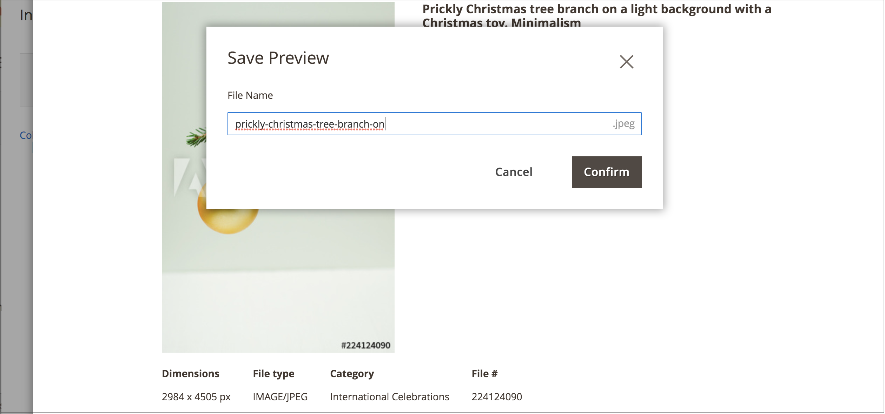

# Enregistrement d’un aperçu d’image Adobe Stock

Un aperçu d’image est une version mise en filigrane d’une ressource Adobe Stock. Les aperçus d’image sont gratuits et vous permettent de tester différentes images avant de décider d’ [acheter une licence][stock-license] pour des images spécifiques et de les utiliser dans vos magasins de production.

Lorsque vous êtes prêt à acquérir sous licence une image, le nouveau [[!DNL Media Gallery]](media-gallery.md) fournit une intégration directe avec Adobe Stock, ce qui facilite la licence de l’image directement à partir de la page de la galerie.

## Conditions préalables

Cette fonctionnalité nécessite la configuration et le module [Intégration Adobe Stock][adobe-stock-integration].

## Enregistrement d’une image d’aperçu

1. [Accédez à la grille de recherche Adobe Stock][access-search].

1. Pour [afficher les détails de l’image][view-details], cliquez sur une image dans la grille de recherche.

1. Cliquez sur **[!UICONTROL Save Preview]**.

   Cette action vous invite à spécifier un nom de fichier utilisé pour enregistrer l’image dans le [stockage multimédia][media-storage]. Un nom de fichier par défaut est fourni, mais vous pouvez le personnaliser selon vos préférences.

   {width="500" zoomable="yes"}

1. Cliquez sur **[!UICONTROL Confirm]**.

   La page redirige vers le stockage de médias et l’aperçu enregistré s’affiche.

[stock-license]: adobe-stock-license-image.md
[access-search]: adobe-stock-manage.md#access-the-adobe-stock-search-grid
[view-details]: adobe-stock-manage.md#view-image-details
[media-storage]: media-storage.md
[adobe-stock-integration]: adobe-stock.md
