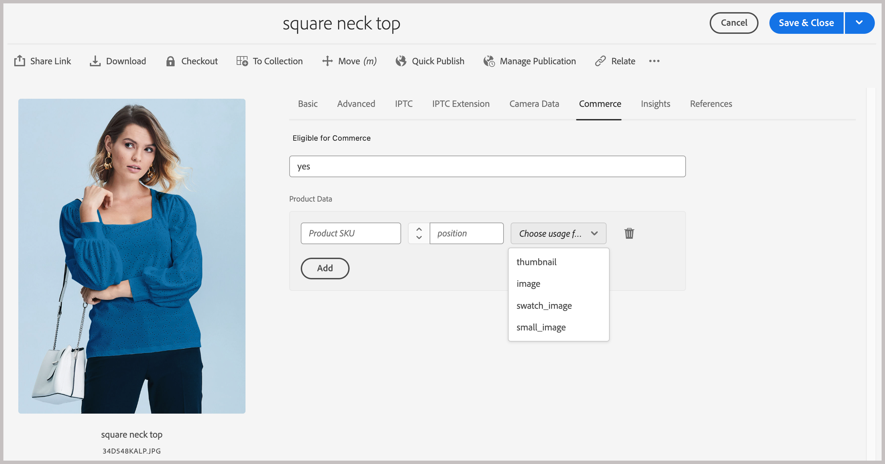

# Installation du package AEM Assets

Adobe fournit un modèle de projet, `commerce-assets`, pour ajouter des ressources d’espace de noms et de schéma de métadonnées Commerce à la configuration de l’environnement Experience Manager Assets as a Cloud Service. Déployez ce modèle sur votre environnement en tant que package Maven. Configurez ensuite les métadonnées Commerce dans l’environnement de création AEM Assets pour terminer la configuration.

Le modèle ajoute les ressources suivantes à l’environnement de création AEM Assets.

- Un [espace de noms personnalisé](https://github.com/ankumalh/assets-commerce/blob/main/ui.config/jcr_root/apps/commerce/config/org.apache.sling.jcr.repoinit.RepositoryInitializer~commerce-namespaces.cfg.json), `Commerce` pour identifier les propriétés liées à Commerce.

- Un type de métadonnées personnalisé `commerce:isCommerce` avec le libellé `Eligible for Commerce` pour baliser les ressources Commerce associées à un projet Adobe Commerce.

- Un `commerce:productmetadata` de type de métadonnées personnalisé et un composant d’interface utilisateur correspondant pour ajouter une propriété *[!UICONTROL Product Data]*. Les données de produit incluent les propriétés de métadonnées pour associer une ressource Commerce aux SKU de produit et pour spécifier les `role` d’image et les attributs de `position` de la ressource.

  {width="600" zoomable="yes"}

- Formulaire de schéma de métadonnées avec un onglet Commerce contenant les champs `Does it exist in Adobe Commerce?` et `Product Data` pour le balisage des ressources Commerce. Le formulaire fournit également des options pour afficher ou masquer les champs `roles` et `order` (position) de l’interface utilisateur d’AEM Assets.

  Onglet {width="600" zoomable="yes"}

- Un [exemple de ressource Commerce balisée et approuvée](https://github.com/ankumalh/assets-commerce/blob/main/ui.content/src/main/content/jcr_root/content/dam/wknd/en/activities/hiking/equipment_6.jpg/.content.xml) `equipment_6.jpg` pour prendre en charge la synchronisation initiale des ressources. Seules les ressources Commerce approuvées peuvent être synchronisées d’AEM Assets vers Adobe Commerce.

>[!NOTE]
>Pour plus d’informations sur le modèle de projet `commerce-assets` AEM, consultez le [Lisez-moi](https://github.com/ankumalh/assets-commerce).

Pour utiliser ce projet AEM et mettre à jour la configuration de l’environnement, vous avez besoin des ressources et autorisations suivantes :

- [Accès au programme et aux environnements AEM Assets Cloud Manager](https://experienceleague.adobe.com/en/docs/experience-manager-cloud-service/content/onboarding/journey/cloud-manager#access-sysadmin-bo) avec les rôles Responsable de programme et de déploiement .

- Un [environnement de développement AEM local](https://experienceleague.adobe.com/en/docs/experience-manager-learn/cloud-service/local-development-environment-set-up/overview) et une connaissance du processus de développement local d’AEM.

- Découvrez la structure de projet [AEM et comment déployer ](https://experienceleague.adobe.com/fr/docs/experience-manager-cloud-service/content/implementing/developing/aem-project-content-package-structure) packages de contenu personnalisés à l’aide de Cloud Manager.

## Installation du package `commerce-assets`

1. Dans Cloud Manager, créez des environnements de production et d’évaluation pour votre projet AEM Assets, si nécessaire.

1. Configurez un pipeline de déploiement, si nécessaire.

1. À partir de GitHub, téléchargez le code standard du [projet Commerce-Assets AEM](https://github.com/ankumalh/assets-commerce).

1. À partir de votre [environnement de développement AEM local](https://experienceleague.adobe.com/en/docs/experience-manager-learn/cloud-service/local-development-environment-set-up/overview), installez le code personnalisé dans la configuration de votre environnement AEM Assets sous la forme d’un package Maven ou en copiant manuellement le code dans la configuration du projet existant.

1. Validez les modifications et envoyez votre branche de développement local au référentiel Git de Cloud Manager.

1. Dans Cloud Manager, [déployez votre code pour mettre à jour l’environnement AEM](https://experienceleague.adobe.com/en/docs/experience-manager-cloud-service/content/implementing/using-cloud-manager/deploy-code#deploying-code-with-cloud-manager).

## Configuration d’un profil de métadonnées

Dans l’environnement de création d’AEM Assets, définissez les valeurs par défaut des métadonnées des ressources Commerce en créant un profil de métadonnées. Appliquez ensuite le nouveau profil aux dossiers AEM Asset pour utiliser automatiquement ces paramètres par défaut. Cette configuration simplifie le traitement des ressources en réduisant les étapes manuelles.

1. Dans l’espace de travail Adobe Experience Manager , accédez à l’espace de travail Créer une administration de contenu pour AEM Assets en cliquant sur l’icône Adobe Experience Manager .

   {width="600" zoomable="yes"}

1. Ouvrez les outils d’administration en sélectionnant l’icône en forme de marteau.

   {width="600" zoomable="yes"}

1. Ouvrez la page de configuration du profil en cliquant sur **[!UICONTROL Metadata Profiles]**.

1. **[!UICONTROL Create]** un profil de métadonnées pour l’intégration de Commerce.

   {width="600" zoomable="yes"}

1. Ajoutez un onglet pour les métadonnées Commerce.

   1. Sur la gauche, cliquez sur **[!UICONTROL Settings]**.

   1. Cliquez sur **[!UICONTROL +]** dans la section d’onglet, puis spécifiez le **[!UICONTROL Tab Name]**, `Commerce`.

1. Ajoutez le champ `Does it exist in Commerce?` au formulaire et définissez la valeur par défaut sur `yes`.

   {width="600" zoomable="yes"}

1. Enregistrez la mise à jour.

1. Appliquez le profil de métadonnées `Commerce integration` au dossier dans lequel les ressources Commerce sont stockées.

   1. Sur la page [!UICONTROL  Metadata Profiles], sélectionnez le profil d’intégration de Commerce.

   1. Dans le menu d’actions, sélectionnez **[!UICONTROL Apply Metadata Profiles to Folders]**.

   1. Sélectionnez le dossier contenant les ressources Commerce.

      Créez un dossier Commerce s’il n’existe pas.

   1. Cliquez sur **[!UICONTROL Apply]**.

>[!TIP]
>
>Vous pouvez synchroniser automatiquement les ressources Commerce lors de leur chargement dans l’environnement AEM Assets en mettant à jour le profil de métadonnées afin de définir la valeur par défaut du champ de _[!UICONTROL Review Status]_sur `Approved`. Le type de propriété du champ `Review Status` est `./jcr:content/metadata/dam:status`.

## Étape suivante

[Installation des packages Adobe Commerce](aem-assets-configure-commerce.md)
