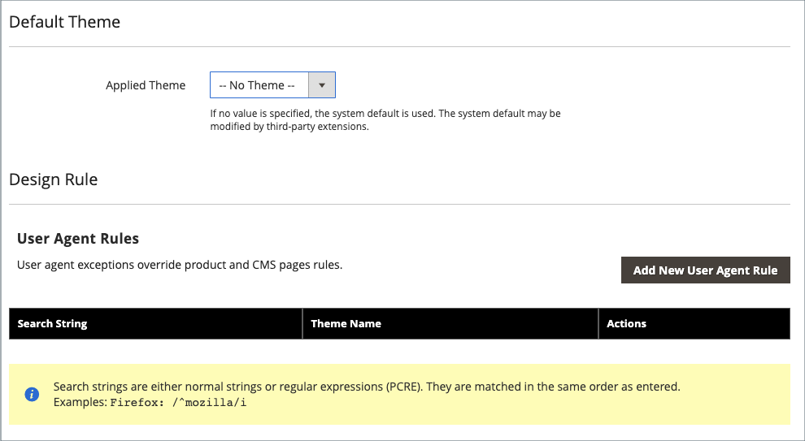

# Configuration de la conception

La configuration de la conception facilite la modification des règles liées à la conception et des paramètres de configuration en affichant les paramètres sur une seule page.

{width="700" zoomable="yes"}

## Modification de la configuration de la conception

1. Dans la barre latérale _Admin_, accédez à **[!UICONTROL Content]** > _[!UICONTROL Design]_>**[!UICONTROL Configuration]**.

1. Recherchez la vue de magasin que vous souhaitez configurer, puis cliquez sur **[!UICONTROL Edit]** dans la colonne _[!UICONTROL Action]_.

   La page affiche les paramètres de conception actuels de la vue du magasin.

1. Pour modifier le thème par défaut, définissez **[!UICONTROL Applied Theme]** sur le thème que vous souhaitez appliquer à l’affichage.

   Si aucun thème n’est spécifié, le thème système par défaut est utilisé. Certaines extensions tierces modifient le thème système par défaut.

1. [!BADGE PaaS uniquement]{type=Informative url="https://experienceleague.adobe.com/fr/docs/commerce/user-guides/product-solutions" tooltip="S’applique uniquement aux projets Adobe Commerce on Cloud (infrastructure PaaS gérée par Adobe) et aux projets On-premise."} Si le thème doit être utilisé uniquement pour un appareil spécifique, définissez la **[!UICONTROL User Agent Rules]** .

   {width="400" zoomable="yes"}

   Pour chaque type d’appareil sur lequel vous souhaitez spécifier un thème :

   - Cliquez sur **[!UICONTROL Add New User Agent Rule]**.

   - Par **[!UICONTROL Search String]**, saisissez l’ID du navigateur pour l’appareil spécifique.

     Une chaîne de recherche peut être soit une expression normale, soit une expression régulière compatible Perl (PCRE) (voir [Agent utilisateur](https://en.wikipedia.org/wiki/User_agent) pour plus d’informations). La chaîne de recherche suivante identifie Firefox :

         /^mozilla/i
     
   - Par **[!UICONTROL Theme Name]**, choisissez le thème à utiliser pour l’appareil spécifié.

   >[!NOTE]
   >
   >Vous pouvez ajouter autant de règles que vous le souhaitez pour les appareils que vous souhaitez désigner. Les chaînes de recherche sont mises en correspondance dans l’ordre dans lequel elles sont saisies.

1. Sous _[!UICONTROL Other Settings]_, développez chaque section et suivez les instructions des rubriques liées pour modifier les paramètres si nécessaire.

   - [[!UICONTROL Pagination]](../catalog/navigation-product-listings.md#pagination-controls) [!BADGE PaaS uniquement]{type=Informative url="https://experienceleague.adobe.com/fr/docs/commerce/user-guides/product-solutions" tooltip="S’applique uniquement aux projets Adobe Commerce on Cloud (infrastructure PaaS gérée par Adobe) et aux projets On-premise."}
   - [[!UICONTROL HTML Head]](page-setup.md#html-head) [!BADGE PaaS uniquement]{type=Informative url="https://experienceleague.adobe.com/fr/docs/commerce/user-guides/product-solutions" tooltip="S’applique uniquement aux projets Adobe Commerce on Cloud (infrastructure PaaS gérée par Adobe) et aux projets On-premise."}
   - [[!UICONTROL Header]](page-setup.md#header) [!BADGE PaaS uniquement]{type=Informative url="https://experienceleague.adobe.com/fr/docs/commerce/user-guides/product-solutions" tooltip="S’applique uniquement aux projets Adobe Commerce on Cloud (infrastructure PaaS gérée par Adobe) et aux projets On-premise."}
   - [[!UICONTROL Footer]](page-setup.md#footer) [!BADGE PaaS uniquement]{type=Informative url="https://experienceleague.adobe.com/fr/docs/commerce/user-guides/product-solutions" tooltip="S’applique uniquement aux projets Adobe Commerce on Cloud (infrastructure PaaS gérée par Adobe) et aux projets On-premise."}
   - [[!UICONTROL Search Engine Robots]](../merchandising-promotions/seo-overview.md#search-engine-robots) [!BADGE PaaS uniquement]{type=Informative url="https://experienceleague.adobe.com/fr/docs/commerce/user-guides/product-solutions" tooltip="S’applique uniquement aux projets Adobe Commerce on Cloud (infrastructure PaaS gérée par Adobe) et aux projets On-premise."}
   - [[!UICONTROL Product Image Watermarks]](../catalog/product-image.md#watermarks)
   - [[!UICONTROL Transactional Emails]](../systems/email-templates.md#configure-email-templates)

   {width="500" zoomable="yes"}

1. Cliquez ensuite sur **[!UICONTROL Save Configuration]**.
