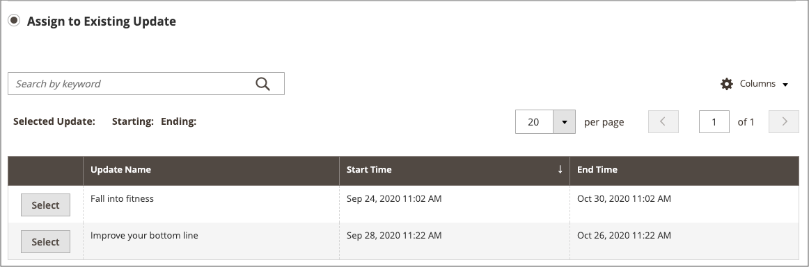

# Ajouter un élément à une campagne

{{ee-feature}}

L’exemple suivant ajoute une image promotionnelle à la page de catégorie pendant la campagne. Vous pouvez également procéder de la même manière pour une page de produit ou une page CMS.

## Ajouter l’élément de campagne pour une catégorie

1. Dans la barre latérale _Admin_, accédez à **[!UICONTROL Catalog]** > **[!UICONTROL Categories]**.

1. Recherchez la catégorie que vous souhaitez utiliser dans la campagne et ouvrez-la en mode d’édition.

1. Cliquez sur **[!UICONTROL Schedule New Update]**.

1. Sélectionnez **[!UICONTROL Assign to Existing Campaign]**.

1. Dans la liste, sélectionnez la campagne à modifier.

   {width="600" zoomable="yes"}

1. Développez  **[!UICONTROL Content]**.

1. Par **[!UICONTROL Category Image]**, cliquez sur **[!UICONTROL Upload]** et sélectionnez l’image qui apparaîtra sur la page des catégories au cours de la campagne.

   {width="600" zoomable="yes"}

1. Cliquez ensuite sur **[!UICONTROL Save]**.

## Valider l’élément

1. Dans la barre latérale _Admin_, accédez à **[!UICONTROL Content]** > _[!UICONTROL Content Staging]_>**[!UICONTROL Dashboard]**.

1. Recherchez la campagne dans la liste ou la chronologie affichée et ouvrez-la pour accéder aux détails :

   - Pour afficher une liste, cliquez sur **[!UICONTROL Select]** puis **[!UICONTROL View/Edit]** dans la colonne _[!UICONTROL Action]_.
   - Pour un affichage chronologique, cliquez une fois pour afficher le résumé, puis cliquez sur **[!UICONTROL View/Edit]**.

   {width="600" zoomable="yes"}

1. Développez  **[!UICONTROL Categories]** pour afficher la liste des catégories attribuées.

1. Pour passer en revue les pages de la catégorie lorsque la campagne est active, revenez au tableau de bord, cliquez de nouveau sur la campagne, puis cliquez sur **[!UICONTROL Preview]**.
