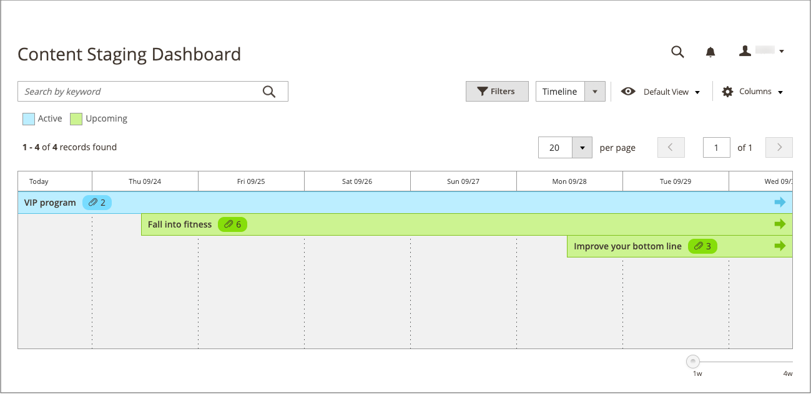

# Tableau de bord d’évaluation du contenu

{{ee-feature}}

Le tableau de bord [!UICONTROL Content Staging] fournit un aperçu de toutes les campagnes actives et à venir. Le format du tableau de bord peut être modifié d’une grille en chronologie. Vous pouvez également utiliser des filtres pour rechercher des campagnes, personnaliser la disposition des colonnes et enregistrer différentes vues de la grille. Pour plus d’informations sur les commandes de l’espace de travail, voir [Espace de travail d’administration](../getting-started/admin-workspace.md).

{width="600" zoomable="yes"}

## Affichage du tableau de bord d’évaluation

1. Dans la barre latérale _Admin_, accédez à **[!UICONTROL Content]** > _[!UICONTROL Content Staging]_>**[!UICONTROL Dashboard]**.

1. Pour modifier le format du tableau de bord, définissez le contrôle **[!UICONTROL View As]** sur `list`, `Grid` ou `Timeline`.

   {width="600" zoomable="yes"}

   Lorsque la chronologie s’affiche, le curseur dans le coin inférieur droit peut être utilisé pour ajuster l’affichage d’une à quatre semaines. Chaque colonne représente un jour.

1. Si la chronologie s’affiche, faites glisser le curseur vers la position `4w` tout à droite pour afficher une période plus longue.

   {width="600" zoomable="yes"}

1. Pour afficher des informations générales sur la campagne, cliquez sur un élément de la page.

   - Pour ouvrir la campagne, cliquez sur **[!UICONTROL View/Edit]**.

   - Pour voir à quoi ressemble la campagne pour les clients du magasin ce jour-là, cliquez sur **[!UICONTROL Preview]**.

   {width="600" zoomable="yes"}

## Descriptions des colonnes du tableau de bord d’évaluation

| Colonne | Description |
|--- |--- |
| [!UICONTROL Status] | Statut de la campagne. `Active` ou `Upcoming`. |
| [!UICONTROL Update Name] | Nom de la campagne. |
| [!UICONTROL Includes] | Définit le nombre d’objets inclus dans la campagne. |
| [!UICONTROL Start Time] | Date de début de la campagne. |
| [!UICONTROL End Time] | Date de fin de la campagne. |
| [!UICONTROL Description] | Description supplémentaire de chaque campagne. |
| [!UICONTROL Action] | Les actions pouvant être appliquées à un enregistrement individuel sont les suivantes :  **[!UICONTROL View/Edit]**- Ouvre la campagne en mode d’édition. **[!UICONTROL Preview]** - Affiche la campagne en mode Aperçu. |

{style="table-layout:auto"}

## Modification d’une campagne

Les objets de campagne existants peuvent être modifiés à partir du tableau de bord d&#39;évaluation, à l&#39;exception des campagnes de règles de prix qui n&#39;ont pas de dates de fin.

>[!NOTE]
>
>Si une campagne active est initialement créée sans date de fin, la campagne ne peut pas être modifiée ultérieurement pour inclure une date de fin. Dans ce cas, il est nécessaire de créer une campagne en double et de saisir la date de fin nécessaire.

{width="600" zoomable="yes"}

Dans cet exemple, la campagne comprend deux catégories et trois produits individuels.

Pour modifier les objets de cette campagne, procédez comme suit.

1. Dans la barre latérale _Admin_, accédez à **[!UICONTROL Content]** > _[!UICONTROL Content Staging]_>**[!UICONTROL Dashboard]**.

1. Recherchez la campagne dans la liste ou la chronologie affichée et ouvrez-la pour accéder aux détails :

   - Pour afficher une liste, cliquez sur **[!UICONTROL Select]** puis **[!UICONTROL View/Edit]** dans la colonne _[!UICONTROL Action]_.
   - Pour un affichage chronologique, cliquez une fois pour afficher le résumé, puis cliquez sur **[!UICONTROL View/Edit]**.

1. Mettez à jour l’un des paramètres de la section _[!UICONTROL General]_selon vos besoins.

1. Développez  toute section contenant un élément à modifier.

   {width="600" zoomable="yes"}

1. Cliquez sur **[!UICONTROL Save]**.
