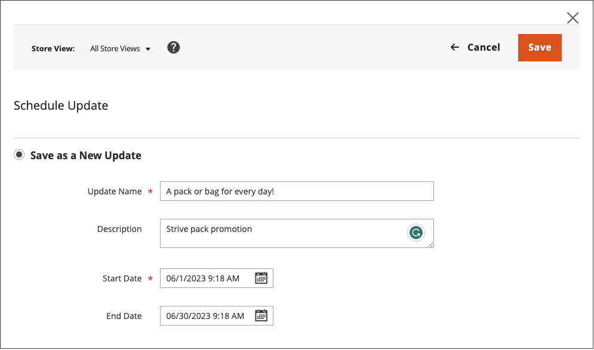

# Planifier une mise à jour du contenu

{{ee-feature}}

L&#39;exemple suivant montre comment planifier une modification temporaire du prix d&#39;un produit. Vous pouvez ainsi planifier et prévisualiser les modifications, et afficher les mises à jour planifiées sur le calendrier. Bien que cet exemple n’inclue qu’une seule modification, une campagne peut inclure plusieurs modifications de produits, de règles de prix, de pages CMS et d’autres entités planifiées pour avoir lieu en même temps. Suivez une méthode similaire pour spécifier les dates de début et de fin pour l’attribut [!UICONTROL Set Product As New].

>[!NOTE]
>Vous devez créer une mise à jour planifiée pour spécifier une date de début (et de fin) pour [!UICONTROL Set Product As New]. Par [!UICONTROL Special Price] et [!UICONTROL Design Change], les champs de date de début et de fin sont supprimés d’Adobe Commerce et disponibles dans Magento Open Source uniquement.
>
>Toutes les mises à jour planifiées sont appliquées de manière consécutive, ce qui signifie que toute entité ne peut avoir qu’une seule mise à jour planifiée à la fois. Toute mise à jour planifiée est appliquée à toutes les vues de magasin au cours de sa période. Par conséquent, une entité ne peut pas avoir une mise à jour planifiée différente pour différentes vues de magasin en même temps. Toutes les valeurs d’attribut d’entité dans toutes les vues de magasin, qui ne sont pas affectées par la mise à jour planifiée actuelle, sont extraites des valeurs par défaut, et non de la mise à jour planifiée précédente.

## Planifier une mise à jour d’un produit

1. Dans la grille de _[!UICONTROL Products]_, ouvrez un produit en mode d’édition.

1. Dans la zone _[!UICONTROL Scheduled Changes]_&#x200B;en haut de la page, cliquez sur **[!UICONTROL Schedule New Update]**.

   {width="600" zoomable="yes"}

1. Lorsque l’option **[!UICONTROL Save as a New Update]** est sélectionnée, définissez les paramètres de base de la mise à jour :

   - Par **[!UICONTROL Update Name]**, saisissez un nom pour la nouvelle campagne d’évaluation de contenu.

   - Saisissez un bref **[!UICONTROL Description]** de la mise à jour et de son utilisation.

   - Utilisez l’outil Calendrier () pour choisir les **Date de début** et **Date de fin** de la campagne.

     Pour créer une campagne ouverte, ne spécifiez pas de date de fin (laissez vide). Pour cet exemple, la campagne doit commencer au trait de minuit pour la nouvelle année, le 1er janvier 2021 à 00 h 00 (heure du Pacifique).

     Pour une campagne de règles de prix créée sans date de fin, une date de fin ne peut pas être ajoutée ultérieurement. Dans ce cas, il est nécessaire de créer une campagne et de définir la date de début à la date à laquelle vous souhaitez que l’ancienne campagne se termine et que la nouvelle campagne démarre. À cette date de début, l’ancienne campagne se termine et la nouvelle campagne commence telle que définie.

     {width="600" zoomable="yes"}

     >[!NOTE]
     >
     >La date de début et de fin de la campagne doivent être définies à l’aide du fuseau horaire **_par défaut_** Administrateur, converti à partir du fuseau horaire local de chaque site web. Par exemple, lorsque vous disposez de plusieurs sites web dans différents fuseaux horaires, mais que vous souhaitez démarrer une campagne selon un fuseau horaire américain (par défaut), vous devez planifier une mise à jour distincte pour chaque fuseau horaire local. Dans ce cas, définissez **[!UICONTROL Start Date]** et **[!UICONTROL End Date]** comme convertis de chaque fuseau horaire du site web local vers le fuseau horaire par défaut de l’administrateur.

1. Faites défiler jusqu’à _[!UICONTROL Price]_&#x200B;et cliquez sur **[!UICONTROL Advanced Pricing]**.

1. Saisissez un **[!UICONTROL Special Price]** pour le produit pendant la campagne planifiée et cliquez sur **[!UICONTROL Done]**.

1. Cliquez ensuite sur **[!UICONTROL Save]**.

   La modification planifiée s’affiche en haut de la page des produits, avec les dates de début et de fin de la campagne.

   {width="600" zoomable="yes"}

## Modifier la modification planifiée

1. Dans la zone _Modifications planifiées_ en haut de la page, cliquez sur **[!UICONTROL View/Edit]**.

1. Apportez les modifications nécessaires à la mise à jour planifiée.

1. Cliquez sur **[!UICONTROL Save]**.

## Prévisualiser la modification planifiée

Dans la zone _Modifications planifiées_ en haut de la page, cliquez sur **[!UICONTROL Preview]**.

La prévisualisation ouvre un nouvel onglet du navigateur et montre comment le produit apparaît lors de la campagne planifiée.

>[!NOTE]
>
>L’aperçu de l’évaluation d’une mise à jour planifiée commence toujours à partir de la vue du magasin **par défaut**, qui émule l’expérience de navigation du client dans la campagne de mise à jour de l’évaluation.

Pour plus d’informations sur l’utilisation des outils de contenu de prévisualisation pour modifier la date et la portée de la prévisualisation, voir [Prévisualisation d’une campagne](content-staging-preview.md). Vous pouvez également partager un lien vers l’aperçu du magasin avec vos collègues.
