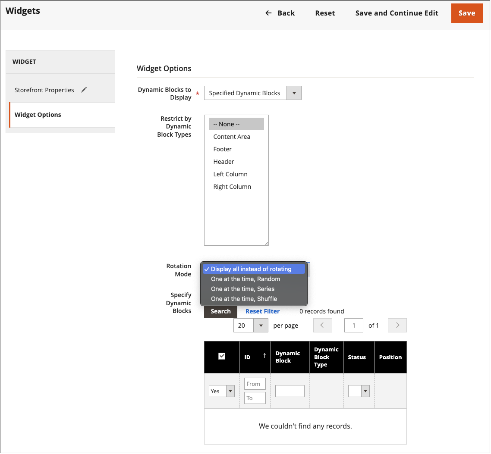

# Ajouter un bloc dynamique tournant

{{ee-feature}}

Pour présenter un diaporama de contenu interactif, vous pouvez ajouter plusieurs [blocs dynamiques](dynamic-blocks.md) à un élément de rotation. L’outil [widget](widgets.md) est utilisé pour placer le/la rotation à un emplacement spécifique sur une seule page ou sur plusieurs pages dans votre magasin.

{width="700" zoomable="yes"}

## Etape 1 : créer des blocs dynamiques individuels

Pour [créer les blocs dynamiques](dynamic-blocks.md) que vous souhaitez placer dans le pivoteur, suivez les instructions suivantes :

## Étape 2 : Ajout d’un widget de rotation de bloc dynamique

1. Sur la barre latérale _Admin_, accédez à **[!UICONTROL Content]** > _[!UICONTROL Elements]_>**[!UICONTROL Widgets]**.

1. Dans le coin supérieur droit, cliquez sur **[!UICONTROL Add Widget]**.

1. Sous _Settings_, définissez **[!UICONTROL Type]** sur `Dynamic Blocks Rotator`.

1. Sélectionnez le **[!UICONTROL Design Theme]** actif du magasin.

   Ce paramètre identifie le package actuel ou [theme](themes.md) qui détermine la mise en page du magasin.

1. Cliquez sur **[!UICONTROL Continue]**.

   {width="600" zoomable="yes"}

## Étape 3 : Remplir les options

1. Sous _Storefront Properties_, définissez les options suivantes :

   - Saisissez un **[!UICONTROL Title]** pour le rotation.

   - Dans la liste **[!UICONTROL Assign to Store Views]**, sélectionnez les [vues du magasin](../getting-started/websites-stores-views.md) où le Rotation est disponible.

   - (Facultatif) Saisissez un nombre **[!UICONTROL Sort Order]** pour déterminer la position du/de la personne effectuant le rotation dans le conteneur cible. Il est relatif aux autres widgets qui peuvent être affectés au même conteneur.

   {width="600" zoomable="yes"}

1. Sous _Options de mise en page_, cliquez sur **[!UICONTROL Add Layout Update]** et procédez comme suit :

   - Définissez **[!UICONTROL Display on]** sur la page, ou le type de page, où doit apparaître le composant de rotation.

      - `Categories` - Affiche le curseur sur les pages de catégorie [anchor](../catalog/navigation-layered.md) ou non-anchor. Options : catégories d’ancre / catégories autres que l’ancre
      - `Products` : affiche le composant pivotant sur un type spécifique de page de produit ou sur toutes les pages de produit. Options : tous les types de produits / [Produit simple](../catalog/product-create-simple.md) / [Produit virtuel](../catalog/product-create-virtual.md) / [Produit groupé](../catalog/product-create-bundle.md) / [Produit téléchargeable](../catalog/product-create-downloadable.md) / [Carte cadeau](../catalog/product-gift-card-create.md) / [Produit configurable](../catalog/product-create-configurable.md) / [Produit groupé](../catalog/product-create-grouped.md)
      - `Generic Pages` : affiche le séparateur sur toutes les pages, une page spécifique ou uniquement sur les pages avec une disposition spécifique. Options : `All Pages` / `Specified Page` / `Page Layouts`

     Dans l’exemple, le rotation doit être placé sur un `Specified Page`.

   - Sélectionnez l’ **[!UICONTROL Page]** spécifique où doit apparaître le rotation.

   - Définissez **[!UICONTROL Container]** sur la partie de la [mise en page](page-layout.md#standard-page-layouts) où doit s’afficher le curseur.

     Si d’autres widgets sont affectés au même conteneur, ils s’affichent dans l’ordre de tri.

   - Acceptez `Dynamic Block Template` comme valeur par défaut **[!UICONTROL Template]**.

     Ce paramètre détermine le modèle utilisé pour mettre en forme le composant de rotation, selon que le composant de rotation doit être autonome ou placé dans le texte existant.

     {width="600" zoomable="yes"}

   - Cliquez sur **[!UICONTROL Save and Continue Edit]**.

1. Dans le panneau de gauche, choisissez **[!UICONTROL Widget Options]**.

1. Pour le **[!UICONTROL Dynamic Blocks to Display]**, acceptez `Specified Dynamic Blocks`.

   Ce paramètre détermine le type de blocs dynamiques inclus dans le rotation.

   - `Specified Dynamic Blocks` - Inclut uniquement des blocs dynamiques spécifiques.
   - `Cart Price Rule Related` - Inclut uniquement les blocs dynamiques associés à une règle de prix de panier.
   - `Catalog Price Rule Related` - Inclut uniquement les blocs dynamiques associés à une règle de prix de catalogue.

1. Pour **[!UICONTROL Restrict the Dynamic Block Types]** qui peut être utilisé avec le widget, sélectionnez `Content Area`.

   Ce paramètre limite la bannière à une partie spécifique de la mise en page.

   - `Content Area` - Place le bloc dynamique dans la zone de contenu principale de la page.
   - `Footer` - Place le bloc dynamique dans le pied de page.
   - `Header` - Place le bloc dynamique dans l’en-tête de la page.
   - `Left Column` - Place le bloc dynamique dans la colonne gauche de la mise en page, le cas échéant.
   - `Right Column` - Place le bloc dynamique dans la colonne de droite de la mise en page, le cas échéant.

1. Définissez **[!UICONTROL Rotation Mode]** sur l’une des options suivantes :

   - `Display all instead of rotating` - Affiche une pile de blocs dynamiques, où tous sont visibles.
   - `One at a time, Random` - Affiche les blocs dynamiques spécifiés dans un ordre aléatoire. Lorsque la page est actualisée, un bloc dynamique différent (aléatoire) s’affiche.
   - `One at the time, Series` - Affiche les blocs dynamiques spécifiés dans la séquence dans laquelle ils ont été ajoutés. Lorsque la page est actualisée, le bloc dynamique suivant de la séquence s’affiche.
   - `One at the time, Shuffle` : affiche un bloc dynamique à la fois dans un ordre variable. Cette option est similaire à l’option `One at a time, Random`, sauf que le même bloc dynamique n’est pas répété.

     {width="600" zoomable="yes"}

1. Dans la grille **[!UICONTROL Specify Dynamic Blocks]**, cochez la case de chaque bloc dynamique que vous souhaitez inclure dans le composant de rotation.

1. Une fois l’opération terminée, cliquez sur **[!UICONTROL Save]**.
