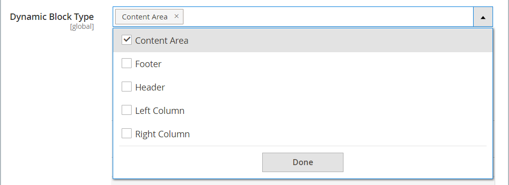

# Blocs dynamiques

{{ee-feature}}

Créez un contenu riche et interactif piloté par la logique des [règles de prix](../merchandising-promotions/introduction.md#price-rules) et des [segments client](../customers/customer-segments.md). Les [blocs dynamiques](../page-builder/dynamic-block.md) existants peuvent être ajoutés directement à l&#39; [!DNL Page Builder] [étape](../page-builder/workspace.md). Pour obtenir un exemple détaillé et détaillé de l’utilisation des blocs dynamiques, consultez le [tutoriel 2 : blocs](../page-builder/2-blocks.md).

>[!NOTE]
>
>L’option _[!UICONTROL Banner]_du menu [[!UICONTROL Content]](content-menu.md) a été abandonnée dans la version 2.3.1 et supprimée dans la version 2.4.0. Sa fonctionnalité est remplacée par des blocs dynamiques.

![[!DNL Page Builder] - bloc dynamique avec règle de prix et segment client](../page-builder/assets/pb-tutorial2-dynamic-block-storefront.png){width="600" zoomable="yes"}

## Etape 1 : créer un bloc dynamique

1. Sur la barre latérale _Admin_, accédez à **[!UICONTROL Content]** > _[!UICONTROL Elements]_>**[!UICONTROL Dynamic Blocks]**.

   {width="600" zoomable="yes"}

1. Dans le coin supérieur droit, cliquez sur **[!UICONTROL Add Dynamic Block]**.

   {width="600" zoomable="yes"}

1. Le cas échéant, définissez **[!UICONTROL Store View]** sur une vue de magasin spécifique où le bloc dynamique doit apparaître.

1. Pour activer le bloc dynamique, définissez **[!UICONTROL Enable Dynamic Block]** sur `Yes`.

1. Pour une référence interne, saisissez un **[!UICONTROL Dynamic Block Name]** descriptif.

1. Définissez **[!UICONTROL Dynamic Block Type]** sur la zone de la page où vous souhaitez que le bloc dynamique s&#39;affiche et cliquez sur **[!UICONTROL Done]**.

   {width="500" zoomable="yes"}

1. Dans la liste **[!UICONTROL Customer Segment]**, cochez la case de chaque segment que vous souhaitez voir le bloc dynamique et cliquez sur **[!UICONTROL Done]** pour enregistrer le paramètre.

   {width="500" zoomable="yes"}

   >[!NOTE]
   >
   >- Si aucun segment n&#39;est créé, le bloc dynamique est visible par tous.
   >- Si le client n&#39;appartient à aucun segment et que le bloc dynamique est créé pour tous les segments, le contenu du bloc dynamique est toujours affiché.
   >- Si tous les segments de clients affectés à un bloc dynamique sont supprimés, leur contenu est alors visible par tous.

### Utilisation des audiences Real-Time CDP dans les blocs dynamiques

Si vous [ avez ](../customers/audience-activation.md#install-the-extension) installé et [configuré](../customers/audience-activation.md#configure-the-extension) avec l’extension [!DNL Audience Activation], une section intitulée **[!UICONTROL Audiences]** s’affiche.

{width="600" zoomable="yes"}

Dans la liste **[!UICONTROL Real-Time CDP Audience]**, cochez la case de chaque audience que vous souhaitez voir le bloc dynamique et cliquez sur **[!UICONTROL Done]** pour enregistrer le paramètre.

## Etape 2 : compléter le contenu

Utilisez l’ [!DNL Page Builder] [espace de travail](../page-builder/workspace.md) pour terminer le contenu.

![[!DNL Page Builder] - espace de travail de bloc dynamique](../page-builder/assets/pb-dynamic-block-workspace.png){width="600" zoomable="yes"}

## Étape 3 : sélection d’une promotion associée

1. Faites défiler l’écran vers le bas et développez  **[!UICONTROL Related Promotions]**.

1. Cliquez sur le type de promotion que vous souhaitez associer au bloc dynamique :

   - **[!UICONTROL Add Cart Price Rules]** (voir [ Règles de prix du panier](../merchandising-promotions/price-rules-cart.md))

   - **[!UICONTROL Add Catalog Price Rules]** (voir [Règles de prix de catalogue](../merchandising-promotions/price-rules-catalog.md))

   >[!NOTE]
   >
   >Les règles de prix du catalogue ne sont pas prises en charge pour les audiences Real-Time CDP.

1. Dans la liste des règles disponibles, cochez la case de chaque règle à utiliser, puis cliquez sur **[!UICONTROL Add Selected]**.

1. Une fois le bloc dynamique terminé, cliquez sur **[!UICONTROL Save]**.

## Etape 4 : Ajouter le bloc dynamique à une page

1. Ouvrez la page dans laquelle vous souhaitez que le bloc dynamique s&#39;affiche.

1. Utilisez le type de contenu [[!UICONTROL Add Dynamic Block]](../page-builder/dynamic-block.md) pour ajouter le bloc dynamique à la scène.

## Descriptions des champs et des outils

| Champ | Description |
|--- |--- |
| [!UICONTROL Store View] | Spécifie les vues de magasin où le bloc dynamique doit être disponible. |
| [!UICONTROL Enable Dynamic Block] | Active ou désactive le bloc dynamique. Options : Oui/Non |
| [!UICONTROL Dynamic Block Name] | Nom descriptif qui identifie le bloc dynamique dans l’Admin. |
| [!UICONTROL Dynamic Block Type] | Identifie l’emplacement dans la [mise en page standard](layout-updates.md) où le bloc dynamique est placé. Options :  **[!UICONTROL Content Area]**- Place le bloc dynamique dans la [zone de contenu](layout-updates.md) principale de la page. **[!UICONTROL Footer]** - Place le bloc dynamique dans la page [footer](page-setup.md#footer).  **[!UICONTROL Header]**- Place le bloc dynamique dans la page [header](page-setup.md#header). **[!UICONTROL Left Column]** - Place le bloc dynamique dans la [barre latérale gauche](page-layout.md#standard-page-layouts) d’une disposition à deux ou trois colonnes.  **[!UICONTROL Right Column]**- Place le bloc dynamique dans la [barre latérale droite](page-layout.md#standard-page-layouts) d’une disposition à deux ou trois colonnes. |
| Segment de client | Associe un segment de client au bloc dynamique pour déterminer les clients qui peuvent le voir. |
| Audience Real-Time CDP | Associe une [audience Real-Time CDP](../customers/audience-activation.md) au bloc dynamique pour déterminer les clients qui peuvent la voir. |

{style="table-layout:auto"}

### Contenu

| Champ | Description |
|--- |--- |
| [!UICONTROL Layout] | Ajoutez des lignes, des colonnes ou des onglets à la scène. |
| [!UICONTROL Elements] | Ajoutez du texte, des en-têtes, des boutons, des séparateurs et du code d’HTML à n’importe quel conteneur de mises en page sur la scène. |
| [!UICONTROL Media] | Ajoutez des images, des vidéos, des bannières, des curseur et des zones Google à n’importe quel conteneur de mises en page existant sur la scène. |
| [!UICONTROL Add Content] | Ajoutez des blocs existants, des blocs dynamiques et des produits à la scène. |

{style="table-layout:auto"}

### Promotions connexes

| Champ | Description |
|--- |--- |
| [!UICONTROL Related Cart Price Rule] | **[!UICONTROL Add Cart Price Rules]** - Associez une [règle de prix de panier](../merchandising-promotions/price-rules-cart.md) existante au bloc dynamique comme promotion. |
| [!UICONTROL Related Catalog Price Rule] | **[!UICONTROL Add Catalog Price Rules]** - Associez une [règle de prix de catalogue](../merchandising-promotions/price-rules-catalog.md) existante au bloc dynamique comme promotion. |

{style="table-layout:auto"}
