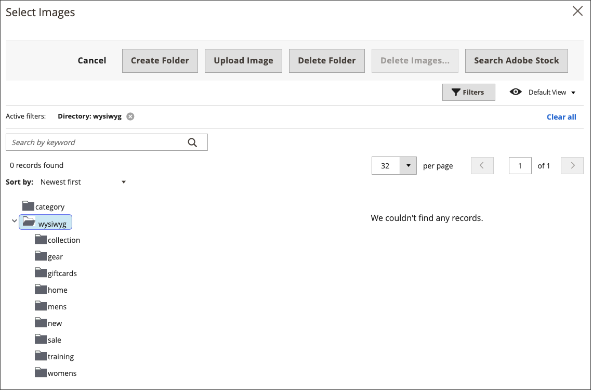
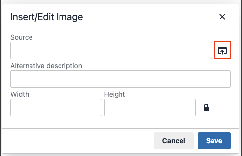

# Insérer une image dans l’éditeur

Dans l’éditeur, vous pouvez insérer une image à l’aide de trois types de sources :

- Ajoutez une image qui a été téléchargée sur le [espace de stockage multimédia](media-storage.md)
- Lien vers une image résidant sur un autre serveur
- Utilisation de l’intégration Adobe Stock pour rechercher et utiliser des ressources Adobe Stock

{width="650" zoomable="yes"}

1. Ouvrez une page, un bloc ou un bloc dynamique en mode d’édition.

1. Accédez à la section _[!UICONTROL Content]_&#x200B;et cliquez sur n’importe quel élément prenant en charge l’éditeur.

1. Positionnez le curseur à l&#39;endroit où vous souhaitez que l&#39;image apparaisse.

1. Dans la barre d’outils de l’éditeur, cliquez sur l’icône _Insérer une image_.

   {width="700" zoomable="yes"}

   Cette action ouvre la boîte de dialogue _[!UICONTROL Insert/edit image]_.

1. Pour **&#x200B;**, cliquez sur l’icône _Rechercher_ et utilisez la méthode correspondant à l’emplacement de la ressource d’image que vous souhaitez utiliser :

   {width="250" zoomable="yes"}

   - **Charger une nouvelle image** : utilisez cette méthode pour charger un nouveau fichier image.

      - Dans l’arborescence, sélectionnez le dossier dans lequel vous souhaitez ajouter le nouveau fichier image.

      - Cliquez sur **[!UICONTROL Choose Files]**.

      - Recherchez et choisissez le fichier image.

      - Cliquez sur la miniature du nouveau fichier, puis sur **[!UICONTROL Add Selected]**.

   - **Sélectionner une ressource existante** : utilisez cette méthode pour sélectionner une ressource image existante dans la galerie ou le stockage de médias.

      - Utilisez l’arborescence pour accéder à l’image.

      - Cliquez sur la miniature, puis sur **[!UICONTROL Add Selected]**.

   - **Rechercher et sélectionner une image Adobe Stock** : utilisez cette méthode pour rechercher une image dans Adobe Stock.

     >[!NOTE]
     >
     >Cette méthode nécessite une intégration [&#128279;](adobe-stock.md) configurée pour votre administrateur.

      - Cliquez sur **[!UICONTROL Search Adobe Stock]** et recherchez une image.

      - Enregistrez l’aperçu ou l’image sous licence dans la galerie.

        Voir [Utilisation d’images Adobe Stock](adobe-stock-manage.md) pour plus d’informations sur l’utilisation des ressources [Adobe Stock](https://stock.adobe.com).

      - Sélectionnez la miniature de la ressource dans la galerie et cliquez sur **[!UICONTROL Add Selected]**.

1. Par **[!UICONTROL Image Description]**, saisissez une brève description de l’image.

1. Saisissez la largeur et la hauteur **[!UICONTROL Dimensions]**, en pixels, pour le rendu de l’image sur la page.

   Gardez la case à cocher **[!UICONTROL Constrain proportions]** sélectionnée pour conserver automatiquement les proportions de l’image.

1. Cliquez sur **[!UICONTROL Insert]** pour terminer le processus.
