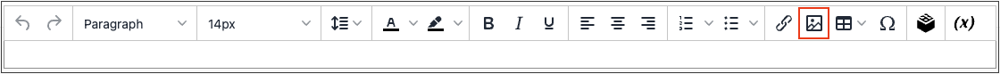

# Insérer une image dans l’éditeur

Dans l’éditeur, vous pouvez insérer une image à l’aide de trois types de source :

- Ajoutez une image qui a été téléchargée dans le [stockage multimédia](media-storage.md)
- Lien vers une image résidant sur un autre serveur
- Utilisation de l’intégration Adobe Stock pour rechercher et utiliser des ressources Adobe Stock

{width="650" zoomable="yes"}

1. Ouvrez une page, un bloc ou un bloc dynamique en mode d’édition.

1. Accédez à la section _[!UICONTROL Content]_et cliquez sur un élément prenant en charge l’éditeur.

1. Placez le curseur à l’endroit où vous souhaitez que l’image s’affiche.

1. Dans la barre d’outils de l’éditeur, cliquez sur l’icône _Insérer l’image_ .

   {width="700" zoomable="yes"}

   Cette action ouvre la boîte de dialogue _[!UICONTROL Insert/edit image]_.

1. Pour **Source**, cliquez sur l&#39;icône _Rechercher_ et utilisez la méthode correspondant à l&#39;emplacement de la ressource d&#39;image que vous souhaitez utiliser :

   {width="250" zoomable="yes"}

   - **Télécharger une nouvelle image** : utilisez cette méthode pour charger un nouveau fichier image.

      - Sélectionnez le dossier dans l’arborescence où vous souhaitez ajouter le nouveau fichier image.

      - Cliquez sur **[!UICONTROL Choose Files]**.

      - Recherchez et sélectionnez le fichier image.

      - Cliquez sur la miniature du nouveau fichier et cliquez sur **[!UICONTROL Add Selected]**.

   - **Sélectionner une ressource existante** : utilisez cette méthode pour sélectionner une ressource d’image existante dans le stockage/la galerie de médias.

      - Utilisez l’arborescence pour accéder à l’image.

      - Cliquez sur la miniature et sur **[!UICONTROL Add Selected]**.

   - **Recherchez et sélectionnez une image Adobe Stock** : utilisez cette méthode pour trouver une image à partir d’Adobe Stock.

     >[!NOTE]
     >
     >Cette méthode nécessite une [intégration Adobe Stock](adobe-stock.md) configurée pour votre administrateur.

      - Cliquez sur **[!UICONTROL Search Adobe Stock]** et recherchez une image.

      - Enregistrez l’aperçu ou l’image sous licence dans la galerie.

        Voir [Utilisation d’images Adobe Stock](adobe-stock-manage.md) pour plus d’informations sur l’utilisation des ressources [Adobe Stock](https://stock.adobe.com).

      - Sélectionnez la miniature de la ressource dans la galerie et cliquez sur **[!UICONTROL Add Selected]**.

1. Pour **[!UICONTROL Image Description]**, saisissez une brève description de l’image.

1. Saisissez la largeur et la hauteur **[!UICONTROL Dimensions]**, en pixels, pour le rendu de l’image sur la page.

   Laissez la case **[!UICONTROL Constrain proportions]** cochée pour conserver automatiquement les proportions de l’image.

1. Cliquez sur **[!UICONTROL Insert]** pour terminer le processus.
