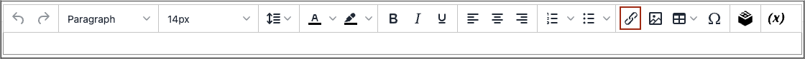

# Insérer un lien dans l&#39;éditeur

Pour insérer facilement un lien, utilisez le bouton _Lien_ de la barre d’outils [éditeur](editor.md). Il ne nécessite aucune connaissance d’HTML et le résultat est le même.

1. Sélectionnez le texte dans lequel vous souhaitez créer le lien.

1. Cliquez sur l’icône _Insérer/modifier le lien_ dans la barre d’outils de l’éditeur.

   {width="700" zoomable="yes"}

   Cette action ouvre la boîte de dialogue _[!UICONTROL Insert link]_.

   {width="250" zoomable="yes"}

1. Par **[!UICONTROL Url]**, saisissez l’une des options suivantes :

   - Clé URL d’une page de votre boutique.

   - URL complète d’une page externe à lier.

1. Si nécessaire, modifiez la **[!UICONTROL Text to display]**.

   La valeur par défaut est le texte que vous avez sélectionné pour le lien. Vous pouvez le modifier dans la zone de texte.

1. Par **[!UICONTROL Title]**, saisissez le texte de l’info-bulle à afficher lorsqu’une personne survole le lien avec la souris.

1. Définissez **[!UICONTROL Target]** sur l’une des options suivantes :

   - `Open link in the same window`

   - `Open in a new window`

1. Pour créer le lien, cliquez sur **[!UICONTROL OK]**.
