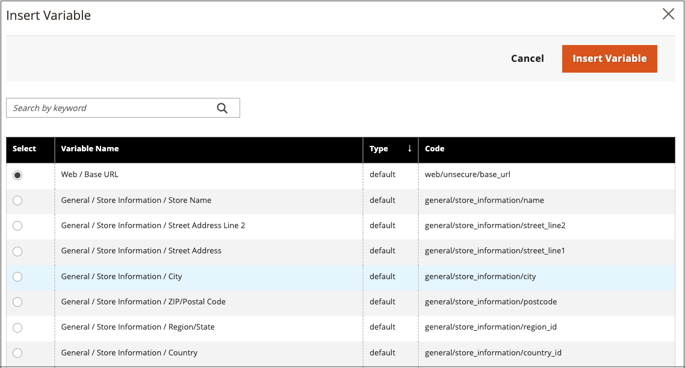

# Insérer une variable dans l’éditeur

Votre boutique comprend de nombreuses [variables](../systems/variables-predefined.md) prédéfinies qui peuvent être intégrées au contenu de la page et à d’autres communications. En outre, vous pouvez inclure vos propres [variables personnalisées](../systems/variables-custom.md) qui sont spécifiques à vos besoins.

1. Ouvrez une page, un bloc ou un bloc dynamique en mode d’édition.

1. Accédez à la section _[!UICONTROL Content]_&#x200B;et cliquez sur n’importe quel élément prenant en charge l’éditeur.

1. Placez le curseur à l’endroit où vous souhaitez que la variable apparaisse, puis cliquez sur l’icône _Insérer une variable_.

   {width="700" zoomable="yes"}

   Si le [!UICONTROL Page Builder] n’est pas activé et que vous préférez travailler avec le code HTML, cliquez sur **[!UICONTROL Show / Hide Editor]**. Placez le point d&#39;insertion dans le texte à l&#39;endroit où vous souhaitez que la variable apparaisse. Cliquez ensuite sur **[!UICONTROL Insert Variable]**.

1. Dans la liste des variables disponibles, choisissez celle de votre choix et cliquez sur **[!UICONTROL Insert Variable]**.

   {width="600" zoomable="yes"}

1. Une fois vos modifications de contenu terminées, cliquez sur **[!UICONTROL Save]**.
