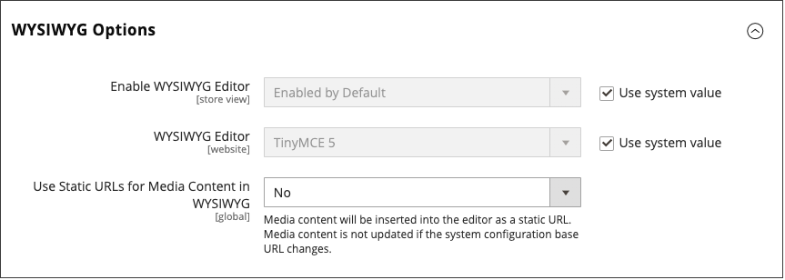

# Éditeur WYSIWYG

L’éditeur vous permet de saisir et de mettre en forme le contenu lorsque vous travaillez dans une vue _What You See Is What You Get_ (WYSIWYG) du contenu. Si vous préférez travailler directement avec le code HTML sous-jacent, vous pouvez facilement changer de mode. L’éditeur peut être utilisé pour créer du contenu pour les [pages](pages.md), [blocs](blocks.md) et [descriptions de produits](../catalog/product-content.md). Lorsque vous travaillez sur des détails de produit, accédez à l’éditeur en cliquant sur **[!UICONTROL Show / Hide Editor]**.

{width="700" zoomable="yes"}

Les rubriques suivantes fournissent des informations détaillées sur l’utilisation de l’éditeur :

- [Insertion d’un lien](editor-insert-link.md)
- [Insertion d’une image](editor-insert-image.md)
- [Insertion d’un widget](editor-widget.md)
- [Insérer une variable](editor-insert-variable.md)

## Configuration de l’éditeur

L’éditeur WYSIWYG est activé par défaut et peut être utilisé pour modifier le contenu des pages et des blocs CMS, ainsi que celui des produits et des catégories. À partir de la configuration, vous pouvez activer ou désactiver l’éditeur et choisir d’utiliser des URL statiques plutôt que [dynamiques](../catalog/catalog-urls.md#dynamic-url) pour le contenu multimédia dans les descriptions de produits et de catégories.

{width="600" zoomable="yes"}

Pour obtenir une description détaillée de toutes les options de WYSIWYG, voir [Gestion de contenu](../configuration-reference/general/content-management.md) dans le _Guide de référence de configuration_.

1. Dans la barre latérale _Admin_, accédez à **[!UICONTROL Stores]** > _[!UICONTROL Settings]_>**[!UICONTROL Configuration]**.

1. Dans le panneau de gauche sous _[!UICONTROL General]_, choisissez **[!UICONTROL Content Management]**.

1. Développez  **[!UICONTROL WYSIWYG Options]**.

1. Définissez **[!UICONTROL Enable WYSIWYG Editor]** sur vos préférences.

   L’éditeur est activé par défaut.

1. Définissez l’**[!UICONTROL Static URLs for Media Content in WYSIWYG]** sur votre préférence pour tout le [contenu multimédia](../catalog/catalog-urls.md#static-url) saisi avec l’éditeur WYSIWYG.

1. Cliquez ensuite sur **[!UICONTROL Save Config]**.
