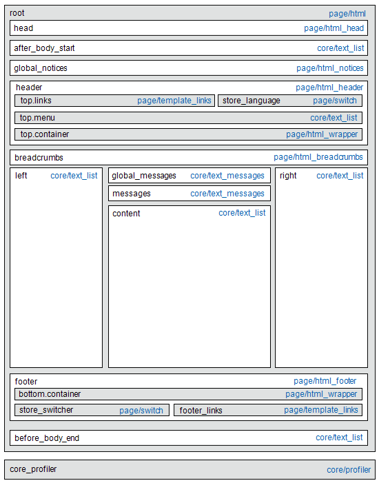

# Mises à jour de la mise en page

Avant de commencer à utiliser des mises à jour de mise en page personnalisées, il est important de comprendre comment les pages de votre magasin sont construites et la différence entre les termes *mise en page* et *mise à jour de mise en page*. La mise en page fait référence à la composition visuelle et structurelle de la page. La mise à jour de la mise en page fait référence à un ensemble spécifique d’instructions XML qui peuvent remplacer ou personnaliser la manière dont la page est créée.

La disposition XML de votre magasin [!DNL Commerce] est une structure hiérarchique de conteneurs et de blocs. Certains éléments apparaissent sur chaque page, d’autres uniquement sur des pages spécifiques. Pour en savoir plus sur la mise en page, les conteneurs et les blocs, consultez la [présentation des mises en page](https://developer.adobe.com/commerce/frontend-core/guide/layouts/) du _Guide du développeur Frontend_.

L’outil [Widget](widgets.md) est un moyen facile d’ajouter un [bloc de contenu](blocks.md) existant à la disposition par défaut d’une page. Pour les mises à jour plus avancées, vous devez enregistrer le code de mise à jour de mise en page XML sur le serveur, puis référencer le fichier comme mise à jour de mise en page personnalisée depuis l’administrateur. Pour une présentation du processus, voir [Utiliser les mises à jour de mise en page](layout-updates.md#place-a-block-using-layout-updates).

Dans le diagramme suivant, les noms qui font référence aux conteneurs sont en noir et les types de blocs, ou chemins de classe de bloc, en bleu.

{width="500" zoomable="yes"}

| Type de bloc | Description |
|--- |--- |
| `page/html` | Le nom de ce bloc est `root` et il est l&#39;un des rares blocs racine de la mise en page. Vous pouvez également créer votre propre bloc et lui donner le nom `root`, qui est le nom standard des blocs de ce type. Il ne peut y avoir qu’un seul bloc de ce type par page. |
| `page/html_head` | Le nom du bloc est `head` et il est enfant du bloc racine. Il ne peut y avoir qu’un seul bloc de ce type par page et il ne doit pas être supprimé. |
| `page/html_notices` | Le nom du bloc est `global_notices` et il est enfant du bloc racine. Si ce bloc est supprimé de la mise en page, les informations globales n&#39;apparaissent pas sur la page. Il ne peut y avoir qu’un seul bloc de ce type par page. |
| `page/html_header` | Le nom du bloc est `header` et il est enfant du bloc racine. Ce bloc correspond à l&#39;en-tête visuel en haut de la page et contient plusieurs blocs standard. Il ne peut y avoir qu’un seul bloc de ce type par page et il ne doit pas être supprimé. |
| `page/html_wrapper` | Bien qu’il soit inclus dans la mise en page par défaut, ce bloc est obsolète et n’est inclus que pour garantir une compatibilité ascendante. N’utilisez pas de blocs de ce type. |
| `page/html_breadcrumbs` | Le nom de ce bloc est `breadcrumbs` et il est un enfant du bloc d&#39;en-tête. Ce bloc affiche le chemin de navigation de la page active. Il ne peut y avoir qu’un seul bloc de ce type par page. |
| `page/html_footer` | Le nom du bloc est `footer` et il est enfant du bloc racine. Le bloc de pied de page correspond au pied de page visuel en bas de la page et contient plusieurs blocs standard. Il ne peut y avoir qu’un seul bloc de ce type par page et il ne doit pas être supprimé. |
| `page/template_links` | La mise en page standard comporte deux blocs de ce type. Le bloc `top.links` est un enfant du bloc d’en-tête et correspond au menu de navigation supérieur. Le bloc `footer_links` est un enfant du bloc de pied de page et correspond au menu de navigation du bas.   **_Remarque :_**&#x200B;Il est possible de manipuler les liens de modèle, comme illustré dans les exemples. |
| `page/switch` | Il existe deux blocs de ce type dans une disposition standard. Le bloc `store_language` est un enfant du bloc d’en-tête et correspond au sélecteur de langues supérieur. Le bloc `store_switcher` est un enfant du bloc de pied de page et correspond au sélecteur de magasin inférieur. |
| core/messages | Il existe deux blocs de ce type dans une disposition standard. Le bloc `global_messages` affiche les messages globaux. Le bloc `messages` est utilisé pour afficher tous les autres messages. Si vous supprimez ces blocs, le client ne voit aucun message. |
| `core/text_list` | Ce type de bloc est largement utilisé dans [!DNL Commerce] comme espace réservé pour le rendu des blocs enfants. |
| `core/profiler` | Il n&#39;y a qu&#39;une seule instance de ce type de bloc par page. Il est utilisé pour le profileur interne [!DNL Commerce] et ne doit pas être utilisé à d’autres fins. |

{style="table-layout:auto"}

## Placer un bloc à l’aide des mises en page

Les [mises à jour de mise en page](layout-updates.md) permettent de personnaliser la mise en page d’une page. Les mises à jour de mise en page offrent plus de flexibilité qu’un [widget](widgets.md), mais nécessitent un accès au serveur et une connaissance de base du langage XML.

Les étapes suivantes montrent comment utiliser une mise à jour de mise en page pour placer un bloc sur une page. Pour obtenir des exemples spécifiques et de l’aide sur la syntaxe, reportez-vous à la section [Tâches courantes de personnalisation de la mise en page](https://developer.adobe.com/commerce/frontend-core/guide/layouts/) du _Guide du développeur Frontend_.

### Etape 1 : création du bloc

1. Créez le [block](block-add.md) que vous souhaitez placer.

1. Prenez note du `block_id`, car il est utilisé dans les instructions de mise à jour de mise en page.

### Etape 2 : Composer la mise en page au format XML

1. Composez les instructions de mise en page au format XML à [Référencer un bloc CMS](https://developer.adobe.com/commerce/frontend-core/guide/layouts/xml-manage/).

1. Enregistrez les [instructions de mise en page](https://developer.adobe.com/commerce/frontend-core/guide/layouts/xml-instructions/) sur le serveur dans le dossier de mise en page où les fichiers XML sont enregistrés pour le thème.

   Par exemple :

   `<theme_dir>/<Namespace>_<Module>/layout`

   La poignée de mise en page est le nom de fichier qui commence par `cms_page_view_selectable_`, suivi de la clé URL de la page CMS, de l’option de mise à jour de la mise en page et du suffixe de fichier `xml`. Dans l’exemple suivant, `customer-service` est la clé URL de la page et `ChatTool` est l’option que vous choisissez pour appliquer la mise à jour de la mise en page à la page.

   `cms_page_view_selectable_`&lt;`customer-service`>`_`&lt;`ChatTool`>`.xml`

   | Élément | Description |
   |--- |--- |
   | Identifiant de page CMS | La clé URL de la page avec toute barre oblique (`/`) remplacée par un trait de soulignement (`_`). |
   | Nom de mise à jour de la mise en page | L’option qui apparaît pour la _mise à jour de mise en page personnalisée_. |

   {style="table-layout:auto"}

### Étape 3 : référencer la mise en page à partir de la page

1. Sur la barre latérale _Admin_, accédez à **[!UICONTROL Content]** > _[!UICONTROL Elements]_>**[!UICONTROL Pages]**.

1. Recherchez la page où vous souhaitez placer le bloc et ouvrez-le en mode d&#39;édition.

1. Faites défiler l’écran vers le bas et développez la section  sur **[!UICONTROL Design]** .

1. Pour afficher toutes les mises à jour de mise en page disponibles associées à la page, cliquez sur le menu **[!UICONTROL Custom Layout Update]** .

   {width="400" zoomable="yes"}

1. Sélectionnez la mise à jour de mise en page à appliquer à la page.

### Étape 4 : enregistrer et actualiser le cache

1. Une fois l’opération terminée, cliquez sur **[!UICONTROL Save & Close]**.

1. Dans le message situé en haut de l’espace de travail, cliquez sur **[!UICONTROL Cache Management]** et actualisez tous les éléments de cache non valides.
