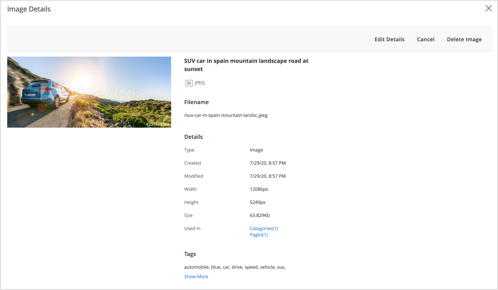

# Gestion des ressources de la galerie multimédia

La nouvelle [Galerie de médias](media-gallery.md) fournit des outils pour gérer les fichiers multimédias chargés et les ressources que vous acquérez au moyen d’une [Intégration d’Adobe Stock](adobe-stock.md). Si vous avez enregistré une Adobe Stock [aperçu d’image](adobe-stock-save-preview.md), vous pouvez également [license](adobe-stock-license-image.md) image dans la nouvelle galerie de médias.

## Chargement d’une ressource

1. Sur le _Administration_ barre latérale, accédez à **[!UICONTROL Content]** > _[!UICONTROL Media]_>**[!UICONTROL Media Gallery]**.

1. Cliquez sur **[!UICONTROL Upload Image]**.

1. Sélectionnez le fichier à charger.

   La ressource sélectionnée est automatiquement téléchargée vers le dossier sélectionné (ou vers la racine de stockage si aucun dossier n’est sélectionné).

## Affichage des détails de la ressource

1. Sur le _Administration_ barre latérale, accédez à **[!UICONTROL Content]** > _[!UICONTROL Media]_>**[!UICONTROL Media Gallery]**.

1. Cliquez sur les trois points sous la ressource ({width="10" zoomable="no"}), puis cliquez sur **[!UICONTROL View Details]**.

   {width="600" zoomable="yes"}

   Les détails de la ressource s’affichent dans le panneau des diapositives. Ils incluent les informations sur l’emplacement d’utilisation de la ressource :

   - **[!UICONTROL Categories]**
   - **[!UICONTROL Products]**
   - **[!UICONTROL Pages]**
   - **[!UICONTROL Blocks]**

   {width="600" zoomable="yes"}

   Pour afficher les détails, cliquez sur le bouton **[!UICONTROL Used In]** liens . La grille de l’exemple suivant affiche toutes les catégories dans lesquelles une ressource spécifique est utilisée.

   {width="600" zoomable="yes"}

   Il est également possible de supprimer la ressource de la variable _Afficher les détails_ .

## Modification d’une ressource

1. Sur le _Administration_ barre latérale, accédez à **[!UICONTROL Content]** > _[!UICONTROL Media]_>**[!UICONTROL Media Gallery]**.

1. Cliquez sur les trois points sous la ressource ({width="10" zoomable="no"}), puis cliquez sur **[!UICONTROL Edit]**.

   {width="600" zoomable="yes"}

1. Si nécessaire, modifiez l’une des valeurs de métadonnées suivantes :

   - **[!UICONTROL Title]**
   - **[!UICONTROL Description]**
   - **[!UICONTROL Tags/Keywords]**

   Ces données sont enregistrées dans la base de données et dans les métadonnées du fichier. Actuellement, les formats XMP et IPTC sont pris en charge.

   Vous pouvez télécharger l’image avec les métadonnées mises à jour.

## Utilisation d’une ressource

Les ressources peuvent être utilisées de manière intensive dans l’ensemble de l’administrateur, comme [ajout ou modification d’une page](page-add.md), [créer ou modifier une catégorie](../catalog/category-create.md), ou [insérer des images depuis l’éditeur de contenu](editor-insert-image.md).

1. Accédez à la nouvelle galerie de médias à partir d’une zone qui vous permet d’utiliser des ressources multimédia.

1. Sélectionnez la ressource et cliquez sur **[!UICONTROL Add Selected]**.

## Suppression de ressources

1. Sur le _Administration_ barre latérale, accédez à **[!UICONTROL Content]** > _[!UICONTROL Media]_>**[!UICONTROL Media Gallery]**.

1. Cliquez sur **[!UICONTROL Delete Images...]** et cochez la case correspondant à chaque ressource à supprimer.

1. Dans la boîte de dialogue de confirmation, cliquez sur **[!UICONTROL Delete Image]**.

   {width="500" zoomable="yes"}

## Recherche de ressources

1. Sur le _Administration_ barre latérale, accédez à **[!UICONTROL Content]** > _[!UICONTROL Media]_>**[!UICONTROL Media Gallery]**.

1. Utilisez la variable **[!UICONTROL Search by keywords]** entrée pour effectuer une recherche d’image par mots-clés/balises.

   La recherche dans l’exemple suivant trouve des ressources qui contiennent une balise spécifique (`mountain`).

   {width="600" zoomable="yes"}

>[!NOTE]
>
>Pour savoir comment mettre à jour les balises d’image, reportez-vous à la section _[Modification d’une ressource](#edit-an-asset)_ .

## Filtrage des ressources

>[!NOTE]
>
>La variable _Utilisé dans_ Cette fonctionnalité requiert les éléments suivants : [!UICONTROL Media Gallery Image Optimization] est activé dans la variable [paramètres de configuration](media-gallery-image-optimization.md).

1. Sur le _Administration_ barre latérale, accédez à **[!UICONTROL Content]** > _[!UICONTROL Media]_>**[!UICONTROL Media Gallery]**.

1. Cliquez sur le bouton **[!UICONTROL Filters]** .

   {width="600" zoomable="yes"}

1. Définissez les options de filtrage.

   Vous pouvez filtrer les ressources en fonction de leur utilisation par les entités :

   - **[!UICONTROL Used in Categories]**
   - **[!UICONTROL Used in Products]**
   - **[!UICONTROL Used in Pages]**
   - **[!UICONTROL Used in Blocks]**

   Vous pouvez également filtrer les ressources par **[!UICONTROL Store View]**, **[!UICONTROL License Status]**, et **[!UICONTROL Content Status]**. Définir la plage de dates pour **[!UICONTROL Uploaded Date]** et/ou **[!UICONTROL Modification Date]** pour filtrer les ressources en fonction des dates du fichier.

1. Cliquez sur **[!UICONTROL Apply Filters]** pour voir les résultats.

   Le filtrage de l’exemple suivant recherche les ressources utilisées dans une catégorie spécifique (`cars`) et sont activés.

   {width="600" zoomable="yes"}

## Recherche de doublons d’image

1. Cliquez sur le bouton **[!UICONTROL Filters]** et sélectionnez l’option **[!UICONTROL Show duplicates]** .

1. Pour afficher les résultats, cliquez sur **[!UICONTROL Apply Filters]**.
