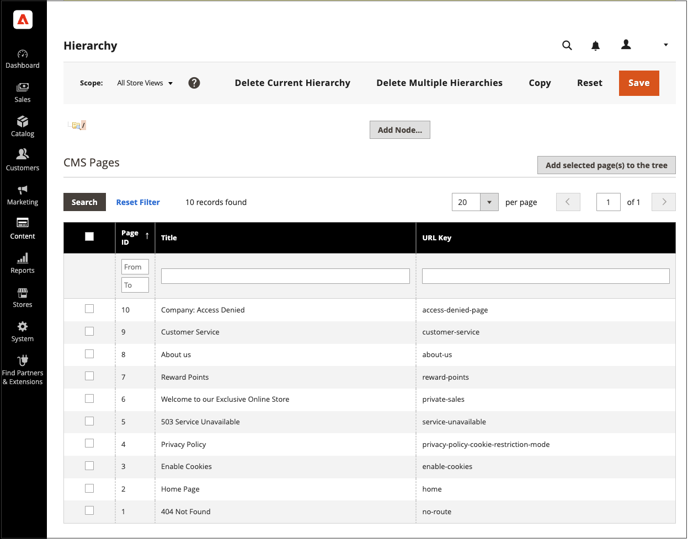

# Hiérarchie de page

{{ee-feature}}

Le système de hiérarchie des pages de la boutique vous permet d’organiser vos pages de contenu et d’ajouter de la pagination, de la navigation et des menus. La page Politique de confidentialité dans les exemples de données est un exemple de page avec un menu à gauche. Si vous publiez régulièrement une grande quantité de contenu, vous pouvez utiliser une hiérarchie de page pour organiser votre contenu afin de faciliter la recherche d’articles intéressants pour les personnes.

Le système de hiérarchie de pages utilise des nœuds pour identifier les éléments de contenu associés et pour organiser les pages de contenu en relations parent/enfant. Un nœud parent est semblable à un dossier qui peut contenir des nœuds et des pages enfants. La position relative de chaque nœud et de chaque page dans la hiérarchie s’affiche sous la forme d’une structure _arborescence_. Un nœud peut contenir d’autres nœuds et pages de contenu, et une seule page de contenu peut être associée à plusieurs nœuds et autres pages de contenu dans des relations parent/enfant ou voisin.

{width="600" zoomable="yes"}

## Configuration de la hiérarchie des pages

Les paramètres de configuration activent le système de hiérarchie de page et les métadonnées, et déterminent la disposition du menu par défaut.

Hiérarchie de page CMS {width="600" zoomable="yes"}

1. Dans la barre latérale _Admin_, accédez à **[!UICONTROL Stores]** > _[!UICONTROL Settings]_>**[!UICONTROL Configuration]**.

1. Dans le panneau de gauche sous _[!UICONTROL General]_, choisissez **[!UICONTROL Content Management]**.

1. Développez  **[!UICONTROL CMS Page Hierarchy]** et apportez les modifications nécessaires.

1. Cliquez ensuite sur **[!UICONTROL Save Config]**.

| Champ | Description |
|--- |--- |
| [!UICONTROL Enable Hierarchy Functionality] | Active l’utilisation de la hiérarchie de page pour vos pages de contenu. Options : `Yes` / `No` |
| [!UICONTROL Enable Hierarchy Metadata] | Lorsque cette option est activée, vous pouvez associer des métadonnées à des pages dans la hiérarchie. Options : `Yes` / `No` |
| [!UICONTROL Default Layout for Hierarchy Menu] | Détermine le style de menu par défaut. Options : `Content` / `Left Column` / `Right Column` |

{style="table-layout:auto"}

## Ajouter un nœud de hiérarchie

L’exemple suivant montre comment créer un nœud avec une navigation simple vers les pages de contenu associées. Bien qu’un nœud ne soit pas associé à une page de contenu, il dispose d’une clé d’URL qui peut être référencée ailleurs sur votre site.

Par exemple, vous pouvez créer un nœud appelé _Communiqués de presse_ qui permet d’accéder à des communiqués de presse individuels. Vous pouvez ensuite inclure le lien sur votre page _À propos de nous_ au nœud . Vous pouvez également créer un nœud pour une collection de numéros précédents de votre newsletter.

Pour créer un lien vers un nœud, utilisez l’outil [Widget](widgets.md) afin de créer un lien de nœud de hiérarchie CMS et placez le widget dans un bloc de contenu ou une page.

{width="600" zoomable="yes"}

### Étape 1 : créer un nœud

1. Dans la barre latérale _Admin_, accédez à **[!UICONTROL Content]** > _[!UICONTROL Elements]_>**[!UICONTROL Hierarchy]**.

   {width="600" zoomable="yes"}

1. Au-dessus de la grille, cliquez sur **[!UICONTROL Add Node...]**.

1. Sous _[!UICONTROL Page Properties]_, saisissez un **[!UICONTROL Title]**pour le nœud et un **[!UICONTROL URL Key]**approprié.

   La clé URL fournit une adresse web unique pour le nœud . Il doit s’agir de caractères minuscules, avec des tirets pour séparer les mots, au lieu d’espaces.

   {width="500" zoomable="yes"}

1. Cliquez sur **[!UICONTROL Save]**.

   Le nœud s’affiche sous la forme d’un dossier dans l’arborescence à gauche de la page.

### Étape 2 : ajouter des pages au nœud

1. Dans l’arborescence, cliquez pour sélectionner le nœud.

1. Cliquez sur **[!UICONTROL Add Selected Pages(s) to Tree]**.

   Vous pouvez faire défiler l’écran vers le haut pour voir que chaque page sélectionnée s’affiche dans l’arborescence sous le dossier de nœuds.

### Étape 3 : définir la structure

1. Si nécessaire, faites glisser les pages pour qu’elles reflètent l’ordre dans lequel elles doivent apparaître dans le menu.

   {width="500" zoomable="yes"}

1. Cliquez sur le nœud en haut de la hiérarchie.

   La section _[!UICONTROL Page Properties]_affiche désormais des informations sur le nœud .

1. Sous **[!UICONTROL Render Metadata in HTML Head]**, procédez comme suit :

   {width="400" zoomable="yes"}

   - Pour identifier le nœud en tant que haut de la hiérarchie, définissez **[!UICONTROL First]** sur `Yes`.

   - Pour afficher un contrôle de pagination, définissez **[!UICONTROL Next/Previous]** sur `Yes`.

   - Pour organiser les pages de la hiérarchie sous la forme d’un livre, définissez **[!UICONTROL Enable Chapter/Section]** sur `Yes`.

     Si vous ne souhaitez pas inclure le nœud dans la liasse, laissez la `No` par défaut.

   - Pour affecter le nœud à une partie spécifique de la liasse, définissez **[!UICONTROL Chapter/Section]** sur l’une des options suivantes :

      - `No` - Ne définit pas le nœud comme chapitre/section.
      - `Chapter` - Attribue le nœud actif en tant que chapitre.
      - `Section` - Attribue le nœud actif en tant que section.
      - `Both` - Attribue le nœud actif en tant que chapitre et section.

### Étape 4 : ajouter des contrôles de pagination

1. Sous _Options de pagination pour les pages imbriquées_, définissez **[!UICONTROL Enable Pagination]** sur `Yes`.

1. Par **[!UICONTROL Frame]**, saisissez le nombre de liens de page à inclure dans le contrôle de pagination.

   Si d’autres pages de la hiérarchie peuvent être incluses dans le contrôle de pagination.

1. Par **[!UICONTROL Frame Skip]**, saisissez le nombre de pages que vous souhaitez ignorer avant (ou arrière) pour le prochain ensemble de liens de pagination.

### Étape 5 : choisir la disposition du menu

Si vous souhaitez que le nœud apparaisse dans le menu, procédez comme suit :

1. Sous _Options du menu de navigation de page_, définissez **[!UICONTROL Show in navigation menu]** sur `Yes`.

   Ce paramètre détermine si un menu de navigation est généré pour la hiérarchie de la page.

   {width="300" zoomable="yes"}

1. Pour spécifier l’emplacement du menu par rapport au contenu, définissez le **[!UICONTROL Menu Layout]** :

   - `Content` - La disposition du menu se trouve dans le contenu.
   - `Use Default` - Utilise le style de menu spécifié dans la [configuration](../configuration-reference/general/content-management.md).
   - `Left Column` - Le menu s’affiche à gauche du contenu.
   - `Right Column` - Le menu s’affiche à droite du contenu.

1. Pour spécifier le niveau de détail inclus dans le menu, définissez **[!UICONTROL Menu Detalization]** sur l’une des options suivantes :

   - `Only Children` - Inclut uniquement les sous-pages du menu.
   - `Neighbours and Children` - Inclut les sous-pages et les autres pages qui se trouvent au même niveau de la hiérarchie.

1. Pour déterminer la profondeur du menu, saisissez la **[!UICONTROL Maximal Depth]** du nombre maximal de niveaux à inclure.

1. Pour mettre en forme le menu, choisissez une **[!UICONTROL List Type]** :

   - `Unordered` - Les options de menu ne sont pas numérotées et peuvent être mises en forme avec ou sans puces. Options pour le type de liste non trié : Par défaut / Cercle / Disque / Carré
   - `Ordered` - Les options de menu sont numérotées et peuvent être mises en forme sous forme de chiffres numériques, alphabétiques ou romains, en majuscules ou en minuscules.

1. Définissez **[!UICONTROL List Style]** sur l’une des options suivantes :

   - `Circle`
   - `Disc`
   - `Square`

1. Si vous souhaitez également que le nœud soit visible dans le menu de navigation, faites défiler l’écran jusqu’à _Options du menu de navigation principal_ et définissez **[!UICONTROL Show in Navigation menu]** sur `Yes`.

   {width="250" zoomable="yes"}

1. Cliquez sur **[!UICONTROL Save]**.
