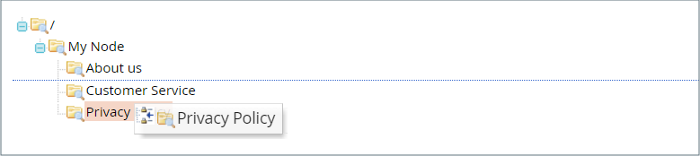

# Hiérarchie des pages

{{ee-feature}}

Le système de hiérarchie des pages de magasin vous permet d’organiser vos pages de contenu et d’ajouter de la pagination, de la navigation et des menus. La page Politique de confidentialité des exemples de données est un exemple de page avec un menu à gauche. Si vous publiez régulièrement une grande quantité de contenu, vous pouvez utiliser une hiérarchie de pages pour organiser votre contenu afin de faciliter la recherche d’articles intéressants pour les visiteurs.

Le système de hiérarchie des pages utilise des noeuds pour identifier les éléments de contenu associés et pour organiser les pages de contenu en relations parents/enfants. Un noeud parent est comme un dossier pouvant contenir des noeuds enfants et des pages. La position relative de chaque noeud et page dans la hiérarchie est affichée sous la forme d’une _tree_ structure. Un noeud peut contenir d’autres noeuds et pages de contenu, et une seule page de contenu peut être associée à plusieurs noeuds et à d’autres pages de contenu dans une relation parent/enfant ou voisine.

{width="600" zoomable="yes"}

## Configurer la hiérarchie des pages

Les paramètres de configuration activent le système de hiérarchie de pages et les métadonnées, et déterminent la mise en page du menu par défaut.

{width="600" zoomable="yes"}

1. Sur le _Administration_ barre latérale, accédez à **[!UICONTROL Stores]** > _[!UICONTROL Settings]_>**[!UICONTROL Configuration]**.

1. Dans le panneau de gauche, sous _[!UICONTROL General]_, choisissez **[!UICONTROL Content Management]**.

1. Développer  **[!UICONTROL CMS Page Hierarchy]**  et apportez les modifications nécessaires.

1. Lorsque vous avez terminé, cliquez sur **[!UICONTROL Save Config]**.

| Champ | Description |
|--- |--- |
| [!UICONTROL Enable Hierarchy Functionality] | Active l’utilisation de la hiérarchie de pages pour vos pages de contenu. Options : `Yes` / `No` |
| [!UICONTROL Enable Hierarchy Metadata] | Lorsque cette option est activée, vous pouvez associer des métadonnées à des pages de la hiérarchie. Options : `Yes` / `No` |
| [!UICONTROL Default Layout for Hierarchy Menu] | Détermine le style de menu par défaut. Options : `Content` / `Left Column` / `Right Column` |

{style="table-layout:auto"}

## Ajouter un noeud de hiérarchie

L’exemple suivant montre comment créer un noeud avec une navigation simple vers les pages de contenu associées. Bien qu’un noeud ne soit associé à aucune page de contenu, il dispose d’une clé d’URL qui peut être référencée ailleurs dans votre site.

Par exemple, vous pouvez créer un noeud appelé _Versions de presse_ qui a accès à des communiqués de presse individuels. Vous pouvez ensuite inclure le lien sur votre _À propos de nous_ au noeud . Vous pouvez également créer un noeud pour un ensemble de problèmes antérieurs de votre newsletter.

Pour créer un lien vers un noeud, utilisez la méthode [Widget](widgets.md) pour créer un lien de noeud de hiérarchie CMS et placer le widget dans un bloc de contenu ou une page.

{width="600" zoomable="yes"}

### Étape 1 : création d’un noeud

1. Sur le _Administration_ barre latérale, accédez à **[!UICONTROL Content]** > _[!UICONTROL Elements]_>**[!UICONTROL Hierarchy]**.

   {width="600" zoomable="yes"}

1. Au-dessus de la grille, cliquez sur **[!UICONTROL Add Node...]**.

1. Sous _[!UICONTROL Page Properties]_, saisissez une **[!UICONTROL Title]**pour le noeud et un **[!UICONTROL URL Key]**.

   La clé URL fournit une adresse web unique pour le noeud. Il doit s’agir de caractères en minuscules, précédés de caractères pour séparer les mots et non d’espaces.

   {width="500" zoomable="yes"}

1. Cliquez sur **[!UICONTROL Save]**.

   Le noeud apparaît sous la forme d’un dossier dans l’arborescence à gauche de la page.

### Étape 2 : Ajouter des pages au noeud

1. Dans l&#39;arborescence, cliquez sur pour sélectionner le noeud.

1. Cliquez sur **[!UICONTROL Add Selected Pages(s) to Tree]**.

   Vous pouvez faire défiler la page vers le haut pour voir que chaque page sélectionnée s’affiche dans l’arborescence sous le dossier de noeud.

### Etape 3 : définir la structure

1. Si nécessaire, faites glisser les pages pour qu’elles reflètent l’ordre dans lequel elles doivent apparaître dans le menu.

   {width="500" zoomable="yes"}

1. Cliquez sur le noeud en haut de la hiérarchie.

   La variable _[!UICONTROL Page Properties]_affiche désormais des informations sur le noeud .

1. Sous **[!UICONTROL Render Metadata in HTML Head]**, procédez comme suit :

   {width="400" zoomable="yes"}

   - Pour identifier le noeud en haut de la hiérarchie, définissez **[!UICONTROL First]** to `Yes`.

   - Pour afficher une commande de pagination, définissez **[!UICONTROL Next/Previous]** to `Yes`.

   - Pour organiser les pages de la hiérarchie sous la forme d’un livre, définissez **[!UICONTROL Enable Chapter/Section]** to `Yes`.

     Si vous ne souhaitez pas inclure le noeud dans le livre, laissez la valeur par défaut `No`.

   - Pour affecter le noeud à une partie spécifique du livre, définissez **[!UICONTROL Chapter/Section]** à l’une des options suivantes :

      - `No` - Ne définit pas le noeud en tant que chapitre/section.
      - `Chapter` : affecte le noeud actif en tant que chapitre.
      - `Section` - Attribue le noeud actif sous la forme d’une section.
      - `Both` - Attribue le noeud actif comme chapitre et section.

### Étape 4 : Ajouter des contrôles de pagination

1. Sous _Options de pagination des pages imbriquées_, définit **[!UICONTROL Enable Pagination]** to `Yes`.

1. Pour **[!UICONTROL Frame]**, saisissez le nombre de liens de page à inclure dans la commande de pagination.

   S’il existe d’autres pages dans la hiérarchie qui peuvent être incluses dans la commande de pagination.

1. Pour **[!UICONTROL Frame Skip]**, saisissez le nombre de pages que vous souhaitez ignorer (ou revenir) pour le prochain ensemble de liens de pagination.

### Etape 5 : choisissez la disposition du menu

Si vous souhaitez que le noeud apparaisse dans le menu, procédez comme suit :

1. Sous _Options du menu de navigation_, définit **[!UICONTROL Show in navigation menu]** to `Yes`.

   Ce paramètre détermine si un menu de navigation est généré pour la hiérarchie des pages.

   {width="300" zoomable="yes"}

1. Pour spécifier l’emplacement du menu par rapport au contenu, définissez la variable **[!UICONTROL Menu Layout]**:

   - `Content` - La mise en page du menu se trouve dans le contenu.
   - `Use Default` : utilise le style de menu spécifié dans la variable [configuration](../configuration-reference/general/content-management.md).
   - `Left Column` - Le menu s’affiche à gauche du contenu.
   - `Right Column` - Le menu s’affiche à droite du contenu.

1. Pour spécifier le niveau de détail inclus dans le menu, définissez **[!UICONTROL Menu Detalization]** à l’une des options suivantes :

   - `Only Children` - Inclut uniquement les sous-pages dans le menu.
   - `Neighbours and Children` - Inclut des sous-pages et d’autres pages qui se trouvent au même niveau dans la hiérarchie.

1. Pour déterminer la profondeur du menu, saisissez la variable **[!UICONTROL Maximal Depth]** pour le nombre maximal de niveaux à inclure.

1. Pour mettre en forme le menu, choisissez une **[!UICONTROL List Type]**:

   - `Unordered` - Les options de menu ne sont pas numérotées et peuvent être formatées avec ou sans puces. Options pour le type de liste non ordonné : Par défaut / Cercle / Disque / Carré
   - `Ordered` - Les options du menu sont numérotées et peuvent être formatées sous la forme de chiffres numériques, alphabétiques ou romains, en majuscules ou en minuscules.

1. Définir **[!UICONTROL List Style]** à l’une des options suivantes :

   - `Circle`
   - `Disc`
   - `Square`

1. Si vous souhaitez également que le noeud soit visible dans le menu de navigation, faites défiler l’écran jusqu’à _Options du menu de navigation principal_ et défini **[!UICONTROL Show in Navigation menu]** to `Yes`.

   {width="250" zoomable="yes"}

1. Cliquez sur **[!UICONTROL Save]**.
