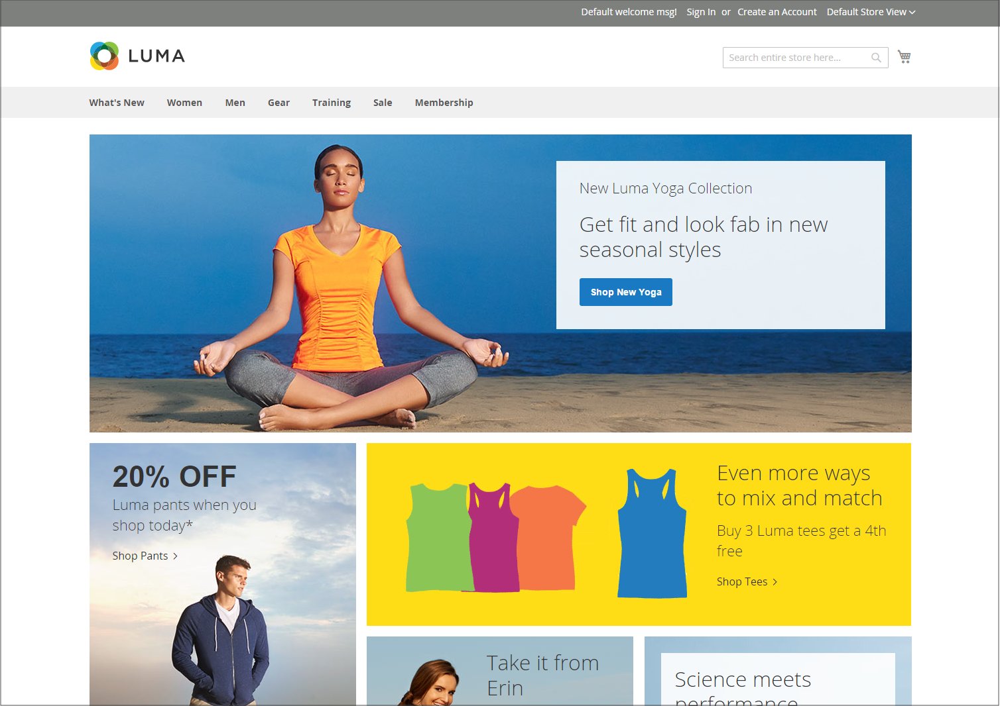

# Exemples de disposition de storefront

Les dimensions de la colonne sont déterminées par la feuille de style du thème. Certains thèmes appliquent une largeur fixe en pixels à la mise en page, tandis que d’autres utilisent des pourcentages pour faire réagir la page à la largeur de la fenêtre ou de l’appareil.

La plupart des thèmes du bureau ont une largeur fixe pour la colonne principale et toute l’activité a lieu dans cette zone fermée. Selon la résolution de votre écran, il y a un espace vide de chaque côté de la colonne principale.

## Une colonne

La zone de contenu d’une mise en page d’une colonne s’étend sur toute la largeur de la colonne principale. Cette disposition est souvent utilisée pour une page d’accueil dotée d’une grande bannière ou d’un curseur, ou pour les pages qui ne nécessitent pas de navigation, telles qu’une page de connexion, une page de démarrage, une vidéo ou une publicité pleine page.

{width="700" zoomable="yes"}

## Deux colonnes avec barre gauche

La zone de contenu de cette disposition est divisée en deux colonnes. La colonne de contenu principale flotte à droite et la barre latérale flotte à gauche.

{width="700" zoomable="yes"}

## Deux colonnes avec barre de droite

Cette disposition est une image miroir de l’autre disposition à deux colonnes. Cette fois, la barre latérale flotte à droite et la colonne de contenu principale flotte à gauche.

{width="700" zoomable="yes"}

## Trois colonnes

Une disposition à trois colonnes comporte une zone de contenu principale avec deux colonnes latérales. La barre latérale gauche et la colonne de contenu principale sont encapsulées et flottent en tant qu’unité à gauche. L&#39;autre barre latérale flotte à droite.

{width="700" zoomable="yes"}
