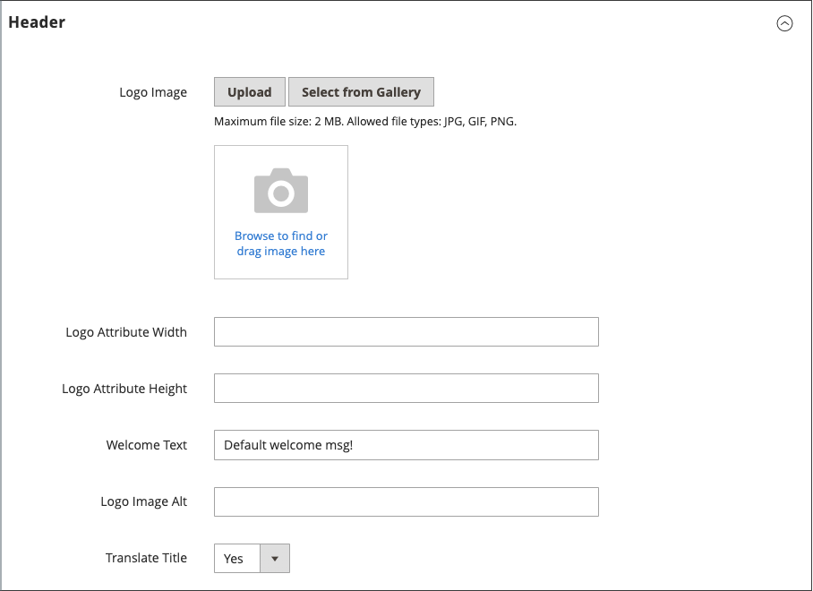

# Configuration de la page

Les sections principales de la page sont contrôlées, en partie, par un ensemble de balises HTML standard. Certaines de ces balises peuvent être utilisées pour déterminer la sélection de polices, de couleurs, de tailles, de couleurs d’arrière-plan et d’images utilisées dans chaque section de la page. D’autres paramètres contrôlent les éléments de la page, tels que le logo dans l’en-tête et l’avis de copyright dans le pied de page. Ces sections correspondent à la structure sous-jacente de la page HTML et la plupart des propriétés de base peuvent être définies à partir de l’Administration.

- [HTML Head](#html-head)
- [En-tête](#header)
- [Pied de page](#footer)

{width="700" zoomable="yes"}

## HTML Head

Les paramètres de la section HTML Head correspondent à la balise `<head>` d’une page HTML et peuvent être configurés pour chaque vue du magasin. Outre les métadonnées pour le titre, la description et les mots-clés de la page, la section comprend un lien vers la favicon et divers scripts. Les instructions pour les robots des moteurs de recherche et l’affichage de l’avis de démonstration du magasin sont également configurés dans cette section.

### Configurer HTML Head

1. Dans la barre latérale _Admin_, accédez à **[!UICONTROL Content]** > _[!UICONTROL Design]_>**[!UICONTROL Configuration]**.

1. Recherchez la vue de magasin que vous souhaitez configurer, puis cliquez sur **[!UICONTROL Edit]** dans la colonne _[!UICONTROL Action]_.

1. Sous _Autres paramètres_, développez  la section **[!UICONTROL HTML Head]**.

   {width="500" zoomable="yes"}

1. Mettez à jour la [favicon](../getting-started/storefront-branding.md#add-a-favicon) si nécessaire.

1. Mettez à jour les paramètres de titre de la page en fonction de vos besoins :

   - **[!UICONTROL Default Page Title]**
   - **[!UICONTROL Page Title Prefix]**
   - **[!UICONTROL Page Title Suffix]**

   Vous pouvez utiliser un suffixe et/ou un préfixe avec le titre par défaut pour créer un titre en deux ou trois parties. Vous pouvez ajouter une barre verticale ou deux-points comme séparateur entre le préfixe ou le suffixe et le titre par défaut.

1. Ajoutez ou modifiez des métadonnées qui prennent en charge l’optimisation du moteur de recherche (SEO) et aident à orienter les clients vers votre boutique à partir des résultats de recherche :

   - **[!UICONTROL Default Meta Description]**
   - **[!UICONTROL Default Meta Keywords]**

1. Saisissez les **[!UICONTROL Scripts and Style Sheets]** nécessaires.

   >[!NOTE]
   >
   >Tous les JavaScript saisis dans le champ [!UICONTROL Scripts and Style Sheets] doivent être whitelistés dans les paramètres de la politique de sécurité du contenu (CSP), sinon ils ne seront pas exécutés sur les pages de passage en caisse. Pour plus d’informations, voir [&#x200B; Politique de sécurité du contenu &#x200B;](https://developer.adobe.com/commerce/php/development/security/content-security-policies).

1. Activez ou désactivez l’[avis de magasin de démonstration](../getting-started/storefront-branding.md#set-the-store-demo-notice) si nécessaire.

1. Cliquez ensuite sur **[!UICONTROL Save Configuration]**.

### Descriptions des champs d’en-tête HTML

| Champ | Champ d’application | Description |
|--- |--- |--- |
| [!UICONTROL Favicon Icon] | Affichage de la boutique | Charge la petite image qui apparaît dans la barre d’adresse et l’onglet du navigateur. Types de fichiers autorisés : ICO, PNG, APNG, GIF et JPG (JPEG). Tous les navigateurs ne prennent pas en charge ces formats. |
| [!UICONTROL Default Page Title] | Affichage de la boutique | Titre qui s’affiche dans la barre de titre de chaque page lorsqu’elle est affichée dans un navigateur. Le titre par défaut est utilisé pour toutes les pages, sauf si un autre titre est spécifié pour des pages individuelles. |
| [!UICONTROL Page Title Prefix] | Affichage de la boutique | Vous pouvez ajouter un préfixe avant le titre pour créer un titre en deux ou trois parties. Une barre verticale ou deux-points peut être utilisée comme séparateur à la fin du préfixe pour le différencier du texte du titre principal. |
| [!UICONTROL Page Title Suffix] | Affichage de la boutique | Vous pouvez ajouter un suffixe après le titre pour créer un titre en deux ou trois parties. Une barre verticale ou deux-points peut être utilisée comme séparateur à la fin du préfixe pour le différencier du texte du titre principal. |
| [!UICONTROL Default Meta Description] | Affichage de la boutique | La description fournit un résumé de votre site pour les listes de moteurs de recherche et ne doit pas comporter plus de 160 caractères. |
| [!UICONTROL Default Meta Keywords] | Affichage de la boutique | Une série de mots-clés qui décrivent votre boutique, séparés chacun par une virgule. |
| [!UICONTROL Scripts and Style Sheets] | Affichage de la boutique | Contient des scripts qui doivent être inclus dans HTML avant la balise `<head>` de fermeture. Par exemple, tout JavaScript tiers devant être placé avant la balise `<body>` peut être saisi ici. |
| [!UICONTROL Display Demo Store Notice] | Affichage de la boutique | Contrôle l’affichage de l’avis de magasin de démonstration en haut de la page. Options : `Yes` / `No` |

{style="table-layout:auto"}

## En-tête

La configuration d’en-tête identifie le chemin d’accès au logo de votre boutique et spécifie le texte de remplacement et le message de bienvenue du logo.

{width="400" zoomable="yes"}

### Configurer l’en-tête

1. Dans la barre latérale _Admin_, accédez à **[!UICONTROL Content]** > _[!UICONTROL Design]_>**[!UICONTROL Configuration]**.

1. Recherchez la vue de magasin que vous souhaitez configurer, puis cliquez sur **[!UICONTROL Edit]** dans la colonne _[!UICONTROL Action]_.

1. Sous _Autres paramètres_, développez  la section **[!UICONTROL Header]**.

1. Apportez les modifications nécessaires à l’affichage du magasin :

   - Paramètres [Logo](../getting-started/storefront-branding.md#upload-your-logo)
   - Paramètres [Message de bienvenue](../getting-started/storefront-branding.md#change-the-welcome-message)

1. Cliquez ensuite sur **[!UICONTROL Save Configuration]**.

### Descriptions des champs d’en-tête

| Champ | Champ d’application | Description |
|--- |--- |--- |
| [!UICONTROL Logo Image] | Affichage de la boutique | Identifie le chemin d’accès au logo qui apparaît dans l’en-tête. Types de fichiers pris en charge : PNG, GIF, JPG (JPEG) |
| [!UICONTROL Logo Attribute Width] | Affichage de la boutique | Largeur de l’image de logo en pixels. |
| [!UICONTROL Logo Attribute Height] | Affichage de la boutique | Hauteur de l’image de logo en pixels. |
| [!UICONTROL Welcome Text] | Affichage de la boutique | Le message de bienvenue s’affiche dans l’en-tête de la page et inclut le nom des clients connectés. |
| [!UICONTROL Logo Image Alt] | Affichage de la boutique | Texte de remplacement associé au logo. |
| [!UICONTROL Translate Title] | Affichage de la boutique | Détermine si le `Page Title` ou le `Meta Title` doit être traduit. |

{style="table-layout:auto"}

## Pied de page

La section Configuration du pied de page vous permet de mettre à jour l’[avis de copyright](../getting-started/storefront-branding.md#change-the-copyright-notice) qui s’affiche au bas de la page, et de saisir divers scripts qui doivent être positionnés avant la balise de `<body>` de fermeture.

{width="400" zoomable="yes"}

### Configurer le pied de page

1. Dans la barre latérale _Admin_, accédez à **[!UICONTROL Content]** > _[!UICONTROL Design]_>**[!UICONTROL Configuration]**.

1. Recherchez la vue de magasin que vous souhaitez configurer, puis cliquez sur **[!UICONTROL Edit]** dans la colonne _[!UICONTROL Action]_.

1. Sous _Autres paramètres_, développez  la section **[!UICONTROL Footer]**.

1. Apportez les modifications nécessaires aux paramètres **[!UICONTROL Copyright]** et **[!UICONTROL Miscellaneous HTML]**.

   >[!NOTE]
   >
   >Tous les JavaScript saisis dans le champ [!UICONTROL Miscellaneous HTML] doivent être whitelistés dans les paramètres de la politique de sécurité du contenu (CSP), sinon ils ne seront pas exécutés sur les pages de passage en caisse. Pour plus d’informations, voir [&#x200B; Politique de sécurité du contenu &#x200B;](https://developer.adobe.com/commerce/php/development/security/content-security-policies).

1. Cliquez ensuite sur **[!UICONTROL Save Configuration]**.

## Descriptions des champs de pied de page

| Champ | Champ d’application | Description |
|--- |--- |--- |
| [!UICONTROL Miscellaneous HTML] | Affichage de la boutique | Zone de saisie dans laquelle vous pouvez charger divers scripts sur le serveur, qui doit être placée juste avant la balise de fermeture `<body>`. |
| [!UICONTROL Copyright] | Affichage de la boutique | Énoncé de copyright qui s’affiche au bas de chaque page. Pour inclure le symbole de copyright, utilisez l’entité de caractères HTML `\&copy;` comme suit : `\&copy; 2021 Commerce Demo Store. All Rights Reserved.` Veillez à remplacer l’exemple d’avis de copyright par le vôtre. |
| [!UICONTROL Display Report Bugs Link] | Affichage de la boutique | Détermine si le lien de rapport de bogue (pris en charge pour certains thèmes) est activé ou désactivé. |

{style="table-layout:auto"}
