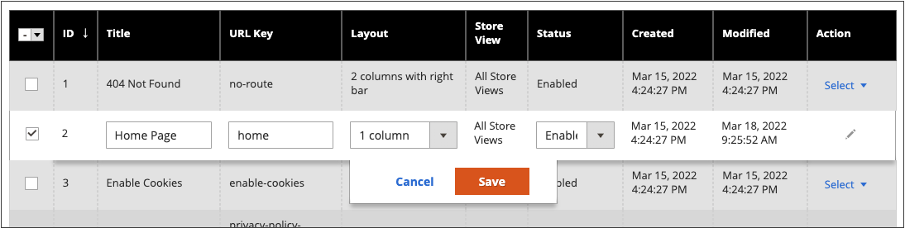

# Contrôles de l’espace de travail de page

L’espace de travail de page comprend des outils pour vous aider à trouver rapidement les pages dont vous avez besoin, ainsi que des commandes pour effectuer des opérations de maintenance de routine sur une ou plusieurs pages. Vous pouvez également mettre rapidement à jour les propriétés de page à partir de la grille.

{width="700" zoomable="yes"}

## Mise à jour rapide des propriétés de page

1. Dans la barre latérale _Admin_, accédez à **[!UICONTROL Content]** > _[!UICONTROL Elements]_>**[!UICONTROL Pages]**.
1. Cliquez sur n’importe quelle ligne de la grille.

   {width="600" zoomable="yes"}

   Pour sélectionner plusieurs enregistrements, cochez la case de chaque ligne à mettre à jour.

1. Mettez à jour l’une des propriétés suivantes :

   - **[!UICONTROL Title]**
   - **[!UICONTROL URL Key]**
   - **[!UICONTROL Status]**
   - **[!UICONTROL Layout]**

1. Cliquez ensuite sur **[!UICONTROL Save]**.

## Contrôles Workspace

| Contrôle | Description |
|--- |--- |
| [!UICONTROL Add New Page] | Ajoute une page. |
| [!UICONTROL Search] | Lance une recherche catalogue en fonction des filtres actuels. |
| [!UICONTROL Actions] | Répertorie toutes les actions qui peuvent être appliquées aux éléments sélectionnés dans la liste. Pour appliquer une action à une ou plusieurs pages, cochez la case située dans la première colonne de chaque enregistrement soumis à l&#39;action. Options : `Delete` / `Disable` / `Enable` / `Edit` |
| [!UICONTROL Select] | Le contrôle de l’en-tête de la première colonne peut être utilisé pour sélectionner plusieurs enregistrements comme cible de l’action. Cochez la case située dans la première colonne de chaque enregistrement que vous souhaitez sélectionner. Options : `Select All` / `Deselect All` |
| [!UICONTROL Save Edits] | Applique l&#39;action courante aux enregistrements sélectionnés. |
| [!UICONTROL Edit] | Ouvre l&#39;enregistrement en édition. Vous pouvez accomplir la même chose en cliquant n’importe où sur la ligne. |

{style="table-layout:auto"}

## Colonnes

| Colonne | Description |
|--- |--- |
| [!UICONTROL Select] | La case à cocher de la première colonne permet de sélectionner plusieurs enregistrements. Options : `Select All` / `Deselect All` |
| [!UICONTROL ID] | L’identifiant est un nombre incrémentiel attribué à chaque page. |
| [!UICONTROL Title] | Titre qui s’affiche en haut de la page. |
| [!UICONTROL URL Key] | La clé URL est similaire à un nom de fichier et identifie la page dans l’URL. |
| [!UICONTROL Layout] | Détermine si la page s’affiche avec des barres latérales à droite ou à gauche de la zone de contenu principale. Options : `1 column` / `2 columns with left bar` / `2 columns with right bar` / `3 columns` / `Empty` |
| [!UICONTROL Store View] | Permet d’associer la page à une vue de magasin spécifique. |
| [!UICONTROL Status] | Indique si la page est en ligne ou hors ligne. Options : `Enabled` / `Disabled` |
| [!UICONTROL Created] | Date de création de la page. |
| [!UICONTROL Modified] | Date de la dernière modification de la page. |
| [!UICONTROL Action] | Les actions pouvant être appliquées à un enregistrement individuel sont les suivantes :  **[!UICONTROL Edit]**- Ouvre la page en mode d’édition. **[!UICONTROL Delete]** - Supprime la page. **[!UICONTROL View]**: affiche la page en mode Aperçu. |

{style="table-layout:auto"}

## Autres colonnes

| Colonne | Description |
|--- |--- |
| [!UICONTROL Custom design from/to] | Indique les dates de début et de fin auxquelles la conception sélectionnée est appliquée à la page.  (Magento Open Source uniquement). |
| [!UICONTROL Custom Theme] | Applique un thème personnalisé à la page |
| [!UICONTROL Custom Layout] | Détermine la disposition personnalisée de la page |
| [!UICONTROL Meta Title] | Méta-titre de la page |
| [!UICONTROL Meta Keywords] | Mots-clés méta de la page |
| [!UICONTROL Meta Description] | Méta-description de la page |

{style="table-layout:auto"}

## Recherche de page

La zone Rechercher dans le coin supérieur gauche de la grille _[!UICONTROL Pages]_&#x200B;permet de rechercher des pages spécifiques par mot-clé. Pour une recherche plus avancée, vous pouvez [filtrer](../getting-started/admin-grid-controls.md) la recherche par plusieurs paramètres.

### Recherche par mot-clé

1. Saisissez un terme de recherche dans la zone de recherche de la page.

1. Pour afficher les résultats, cliquez sur l’icône Rechercher ().

   Les résultats incluent toutes les pages qui contiennent le mot-clé .

### Filtrer les résultats de la recherche

1. Si nécessaire, cliquez sur **[!UICONTROL Clear All]** pour effacer les critères de recherche précédents.

1. Pour afficher la sélection des filtres de recherche, cliquez sur le **[!UICONTROL Filters]** !Onglet ([Icône d’entonnoir](../assets/icon-filter-search.png)).

1. Renseignez autant de filtres que nécessaire pour décrire les pages que vous souhaitez rechercher.

1. Cliquez sur **[!UICONTROL Apply Filters]** pour afficher les résultats.

### Filtres de recherche

| Filtre | Description |
|--- |--- |
| [!UICONTROL ID] | Filtrer la recherche par ID d’enregistrement de page. |
| [!UICONTROL Title] | Filtrez la recherche en fonction du titre de la page. |
| [!UICONTROL URL Key] | Filtrez la recherche en fonction de la clé URL. |
| [!UICONTROL Created] | Filtrez la recherche en fonction de la date de création de la page. |
| [!UICONTROL Modified] | Filtrez la recherche en fonction de la date de la dernière modification de la page. |
| [!UICONTROL Store View] | Filtrez la recherche en fonction de la vue du magasin. Options : `All available` / `Store Views` |
| [!UICONTROL Layout] | Filtrez la recherche en fonction de la mise en page. Options : `1 column` / `2 columns with left bar` / `2 columns with right bar` / `3 columns` / `Empty` |
| [!UICONTROL Status] | Filtrez la recherche sur le statut de la page. Options : `Disabled` / `Published` |
| [!UICONTROL Custom design from / to] | Filtrez la recherche par date de début et de fin lorsque la conception sélectionnée est appliquée à la page.  (Magento Open Source uniquement). |
| [!UICONTROL Asset] | Filtrer la recherche en fonction du titre de page des ressources |
| [!UICONTROL Custom Layout] | Filtrez la recherche en fonction d’une mise en page personnalisée. Options : `1 column` / `2 columns with left bar` / `2 columns with right bar` / `3 columns` / `Empty` / `Page -- Full Width` / `Category -- Full Width` / `Product -- Full Width` |
| [!UICONTROL Custom Theme] | Filtrez la recherche en fonction d’un thème personnalisé. Options par défaut : `Magento Blank` / `Magento Luma` |
| [!UICONTROL Meta Keywords] | Filtrez la recherche en fonction des méta-mots-clés de la page. |
| [!UICONTROL Meta Title] | Filtrez la recherche en fonction du méta-titre de la page. |
| [!UICONTROL Meta Description] | Filtrez la recherche en fonction de la méta-description de la page. |

{style="table-layout:auto"}

### Outils de recherche

| Outil | Description |
|--- |--- |
| [!UICONTROL Apply Filters] | Applique tous les filtres aux résultats de la recherche. |
| [!UICONTROL Cancel] | Annule la recherche en cours. |
| [!UICONTROL Clear All] | Efface tous les filtres de recherche. |

{style="table-layout:auto"}

## Actions de page

Les pages peuvent être modifiées, désactivées, activées et supprimées. Pour appliquer une action à une page individuelle, cochez la case située dans la première colonne. Pour sélectionner ou désélectionner toutes les pages, utilisez la commande de sélection en haut de la colonne.

{width="400" zoomable="yes"}

### Action unique

Utilisez la colonne _[!UICONTROL Action]_&#x200B;à l’extrémité droite pour appliquer l’une des actions suivantes à la page :

- [!UICONTROL Edit] : ouvre la page en mode d’édition.
- [!UICONTROL Delete] - supprime la page (confirmation requise)
- [!UICONTROL View] : ouvre une page directement sur le storefront

{width="600" zoomable="yes"}

### Actions en masse

Appliquez simultanément l’une des actions suivantes à plusieurs pages sélectionnées à l’aide du sélecteur _[!UICONTROL Action]_&#x200B;dans le coin supérieur gauche :

- [!UICONTROL Delete] - supprime les pages (confirmation requise)
- [!UICONTROL Disable] : désactive les pages du storefront
- [!UICONTROL Enable] : active les pages sur le storefront
- [!UICONTROL Edit] : ouvre les colonnes de la grille en mode d’édition (**[!UICONTROL Title]**, **[!UICONTROL URL Key]**, **[!UICONTROL Layout]** et **[!UICONTROL Status]**)

## Disposition Grille de page

La sélection des colonnes et leur ordre dans la grille peuvent être modifiés en fonction de vos préférences. Pour conserver la nouvelle disposition des colonnes, vous pouvez l’enregistrer en tant que vue.

### Modifier la sélection des colonnes

Dans le coin supérieur droit, cliquez sur le contrôle _Colonnes_ () et procédez comme suit :

- Cochez la case de n’importe quelle colonne à ajouter à la grille.

- Décochez la case de toute colonne que vous souhaitez supprimer de la grille.

### Déplacer une colonne

1. Cliquez sur l’en-tête de la colonne et maintenez la touche enfoncée.

1. Faites glisser la colonne vers sa nouvelle position et relâchez-la.

### Enregistrer une vue

1. Cliquez sur la commande _Affichage_ (), puis sur **[!UICONTROL Save View As]**.

1. Saisissez le nom de la vue.

1. Pour enregistrer la vue, cliquez sur la _flèche_ ().

   Le nom de la vue apparaît désormais comme vue actuelle.

### Modifier la vue

Cliquez sur la commande _Affichage_ () et effectuez l&#39;une des opérations suivantes :

- Choisissez la vue que vous souhaitez utiliser.

- Modifiez le nom d’une vue en cliquant sur l’icône Modifier () et en mettant à jour le nom.

  {width="600" zoomable="yes"}

## Modifications planifiées

{{ee-feature}}

Les modifications de page peuvent être appliquées selon le calendrier et regroupées avec d’autres modifications de contenu. Vous pouvez créer une campagne basée sur les modifications planifiées d’une page ou appliquer les modifications à une campagne existante. Pour plus d’informations, voir [Évaluation du contenu](content-staging.md).

Lors de la configuration des plannings pour les changements de page et de la modification des campagnes, tenez compte des points suivants :

- Toutes les mises à jour planifiées sont appliquées consécutivement, ce qui signifie que toute entité ne peut avoir qu’une seule mise à jour planifiée à un moment donné. Toute mise à jour planifiée est appliquée à toutes les vues de magasin au cours de sa période. Par conséquent, une entité ne peut pas avoir une mise à jour planifiée différente pour différentes vues de magasin en même temps. Toutes les valeurs d’attribut d’entité dans toutes les vues de magasin, qui ne sont pas affectées par la mise à jour planifiée actuelle, sont extraites des valeurs par défaut, et non de la mise à jour planifiée précédente.

- Si une campagne est liée à plusieurs pages, elle ne peut être modifiée qu’à partir du [Tableau de bord d’évaluation de contenu](content-staging-dashboard.md).

- Si une campagne active est initialement créée sans date de fin, la campagne ne peut pas être modifiée ultérieurement pour inclure une date de fin. Dans ce cas, il est nécessaire de créer une campagne en double et de saisir la date de fin nécessaire.

- La date de début et la date de fin de la campagne doivent être définies à l’aide du fuseau horaire **_par défaut_** Administrateur, converti à partir du fuseau horaire local de chaque site web. Prenons l’exemple où plusieurs sites web se trouvent dans des fuseaux horaires différents et où vous souhaitez lancer une campagne basée sur un fuseau horaire américain. Dans ce cas, vous devez planifier une mise à jour distincte pour chaque fuseau horaire local, et définir **[!UICONTROL Start Date]** et **[!UICONTROL End Date]** dans convertis de chaque fuseau horaire local du site web vers le fuseau horaire par défaut de l’administrateur.

- Vous pouvez planifier et prévisualiser les modifications apportées aux mises à jour de produits. Pour plus d’informations, voir [Planification d’une mise à jour](content-staging-scheduled-update.md).

>[!NOTE]
>
>L’onglet [!UICONTROL Custom Design Update] a été supprimé dans  Adobe Commerce et ne peut pas être modifié directement sur la page. Vous devez créer une mise à jour planifiée pour ces activations.

{width="600" zoomable="yes"}

