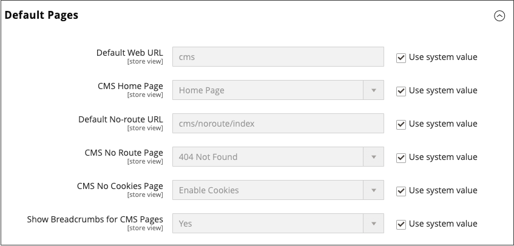

# Pages

Le contenu peut être considéré en termes de durée de conservation, comme n’importe quel produit d’un magasin. Saviez-vous que la durée de conservation du contenu des médias sociaux est inférieure à 24 heures? La durée de conservation potentielle du contenu que vous créez peut vous aider à décider où investir vos ressources.

Le contenu ayant une longue durée de conservation est parfois appelé _contenu permanent_. Parmi les exemples de contenu sans cesse renouvelé, citons les témoignages de clients, les _comment_ des instructions et les questions fréquentes (FAQ). En revanche, le contenu périssable par nature comprend les événements, les actualités du secteur et les communiqués de presse.

{width="700" zoomable="yes"} de magasin Luma

## Pages de contenu principal

Le magasin de démonstration [!DNL Commerce] contient des exemples de pages de contenu de base pour vous aider à commencer. Toutes ces pages peuvent être modifiées en fonction de vos besoins. Examinez les pages suivantes de votre boutique et assurez-vous que le contenu véhicule votre message, votre voix et votre marque.

### Accueil

La page de démonstration [Accueil](../getting-started/storefront.md#home-page) comprend une bannière, un carrousel d’images, plusieurs blocs statiques avec des liens et une liste de nouveaux produits.

### Politique de confidentialité

La page de la boutique [Politique de confidentialité](../getting-started/privacy-policy.md) doit être mise à jour avec vos propres informations. En règle générale, votre politique de confidentialité doit expliquer à vos clients le type de renseignements que votre entreprise recueille et la façon dont ils sont utilisés.

### 404 Introuvable

La page 404 Page introuvable est nommée en fonction du code de réponse renvoyé lorsqu’une page est introuvable. Les redirections d’URL réduisent le nombre de fois où cette page s’affiche. Cependant, pour les moments où cela est nécessaire, vous pouvez tout aussi bien profiter de l&#39;occasion pour offrir quelques liens vers des produits que le client pourrait trouver intéressants.

### Accès refusé

{{b2b-feature}}

La page [ Accès refusé ](../b2b/account-company-roles-permissions.md) s’affiche lorsque les autorisations affectées à un utilisateur de l’entreprise empêchent l’accès à la page.

### Activer les cookies

La page [Activer les cookies](../getting-started/compliance-cookie-law.md) s’affiche lorsque les visiteurs de votre site n’ont pas activé de cookies dans leurs navigateurs. La page fournit des instructions détaillées et illustrées pour activer les cookies pour les navigateurs les plus populaires.

### Service non disponible

La page Service [503 non disponible](../configuration-reference/general/general.md) est nommée en fonction du code de réponse renvoyé lorsque le serveur n’est pas disponible.

### À propos de nous

La page À propos de nous est liée depuis le pied de page de votre boutique. Vous pouvez inclure des images, des vidéos, des liens vers des communiqués de presse et des annonces. L’exemple de page comporte une image à droite et une image décorative pour indiquer la fin de la page.

### Service à la clientèle

La page du service client est un autre nœud de la hiérarchie de la page. Les deux en-têtes de la page ont un contenu qui ne devient visible que lorsque le client clique sur l’en-tête.

{width="700" zoomable="yes"}

## Configurer les pages par défaut

La configuration _Pages par défaut_ détermine la page de destination associée à l’[URL de base](../stores-purchase/store-urls.md) et la page d’accueil correspondante. Il détermine également la page qui s’affiche lorsqu’une erreur _Page introuvable_ se produit et si un [chemin de navigation](../catalog/navigation-breadcrumb-trail.md) s’affiche en haut de chaque page.

1. Dans la barre latérale _Admin_, accédez à **[!UICONTROL Stores]** > _[!UICONTROL Settings]_>**[!UICONTROL Configuration]**.

1. Dans le panneau de gauche sous _[!UICONTROL General]_, choisissez **[!UICONTROL Web]**.

1. Développez  la section **[!UICONTROL Default Pages]** .

   {width="500" zoomable="yes"}

   | Champ | [Portée](../getting-started/websites-stores-views.md#scope-settings) | Description |
   |--- |--- |--- |
   | [!UICONTROL Default Web URL] | Affichage de la boutique | Indique la page de destination associée à l’URL de base. Par défaut, ce champ est défini sur `cms` pour indiquer une page du système de gestion de contenu [!DNL Commerce]. Vous pouvez également utiliser un autre type de page de destination, tel qu’un blog. Par exemple, si un blog est installé sur le serveur à l’adresse `magento/blog`, vous pouvez saisir le nom du dossier `blog` comme chemin d’accès relatif à la sélection de pages. |
   | [!UICONTROL CMS Home Page] | Affichage de la boutique | Pour choisir la page d’accueil de la boutique, il vous suffit de sélectionner la page CMS dans la liste. Par défaut, la page d’accueil de CMS répertorie l’ensemble de la sélection de pages CMS disponibles pour votre boutique. |
   | [!UICONTROL Default No-route URL] | Affichage de la boutique | Contient l’URL de la page par défaut qui doit apparaître lorsqu’une erreur `404 Page not Found` se produit. La valeur par défaut est `cms/noroute/index`. |
   | [!UICONTROL CMS No Route Page] | Affichage de la boutique | Indique une page CMS spécifique à afficher lorsqu’une erreur 404 Page introuvable se produit. La page par défaut est `404 Not Found`. |
   | [!UICONTROL CMS No Cookies Page] | Affichage de la boutique | Indique une page CMS spécifique qui s’affiche lorsque les cookies ne sont pas activés pour le navigateur. Cette page explique pourquoi les cookies sont utilisés et comment les activer pour chaque navigateur. La page par défaut est `Enable Cookies`. |
   | [!UICONTROL Show Breadcrumbs for CMS Pages] | Affichage de la boutique | Détermine si un chemin de navigation s’affiche sur toutes les pages CMS du catalogue. Options : `Yes` / `No` |

   {style="table-layout:auto"}

1. Par **[!UICONTROL Default Web URL]**, saisissez le chemin d’accès relatif au dossier dans l’installation [!DNL Commerce] qui contient la page de destination.

   Le paramètre par défaut, `cms`, indique une page du système de gestion de contenu [!DNL Commerce].

   >[!NOTE]
   >
   >Pour une vue de magasin spécifique, décochez la case **[!UICONTROL Use Default]** en regard de _[!UICONTROL Default Web URL]_&#x200B;et de tout autre paramètre par défaut à modifier.

1. Définissez **[!UICONTROL CMS Home Page]** sur la page CMS à utiliser comme page d’accueil. D’autres pages créées peuvent être utilisées comme page d’accueil, par exemple :

   - Bienvenue dans la boutique en ligne exclusive
   - Points de récompense
   - À propos de nous
   - Service à la clientèle
   - Activer les cookies
   - Politique de confidentialité
   - Société : accès refusé

1. Par **[!UICONTROL Default No-route URL]**, saisissez le chemin d’accès relatif au dossier dans l’installation [!DNL Commerce] où la page est redirigée lorsqu’une erreur _404 Page introuvable_ se produit.

   La valeur par défaut est `cms/index/noRoute`.

1. Définissez la **[!UICONTROL CMS No Route Page]** sur la page CMS qui s’affiche lorsqu’une erreur _404 Page introuvable_ se produit.

1. Définissez **[!UICONTROL CMS No Cookies Page]** sur la page CMS qui s’affiche lorsque les cookies sont désactivés dans le navigateur. Cette page explique pourquoi les cookies sont utilisés et comment les activer pour chaque navigateur. La page par défaut est `Enable Cookies`.

1. Si vous souhaitez qu’un chemin de navigation s’affiche en haut de toutes les pages CMS, définissez **[!UICONTROL Show Breadcrumbs for CMS Pages]** sur `Yes`.

1. Cliquez ensuite sur **[!UICONTROL Save Config]**.
