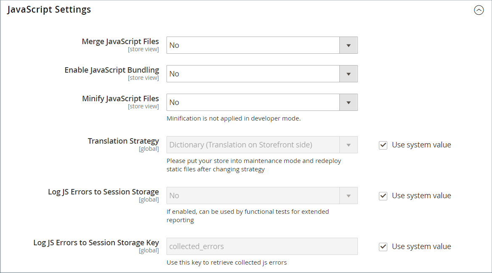

# Ressources de thème

Les _fichiers statiques_ sont la collection de ressources, telles que les fichiers CSS, les polices, les images et JavaScript, qui est utilisée par un thème. L’emplacement des fichiers statiques est spécifié dans la configuration [URL de base](../stores-purchase/store-urls.md). Vous pouvez ajouter une signature numérique à l’URL de chaque fichier statique afin de permettre aux navigateurs de détecter si une version plus récente est disponible. La version la plus récente du fichier est utilisée si la signature diffère de ce qui est stocké dans le cache du navigateur.

Pour une installation standard, les ressources associées à un thème sont organisées dans le dossier `web` à l’emplacement suivant sous la racine [!DNL Commerce].

`[commerce_root]/app/design/frontend/Magento/[theme_name]/web`

## Ajout d’une signature numérique aux URL de fichier statique

1. Sur la barre latérale _Admin_, accédez à **[!UICONTROL Stores]** > _[!UICONTROL Settings]_>**[!UICONTROL Configuration]**.

1. Dans le panneau de gauche, développez **[!UICONTROL Advanced]** et choisissez **[!UICONTROL Developer]**.

1. Développez la section  sur **[!UICONTROL Static Files Settings]** .

   {width="500" zoomable="yes"}

1. Définissez **[!UICONTROL Sign Static Files]** sur `Yes`.

1. Une fois l’opération terminée, cliquez sur **[!UICONTROL Save Config]**.

| Type de fichier | Description |
|--- |--- |
| CSS | Contrôlez le style visuel associé à l’habillage. Exemple d&#39;emplacement sur le serveur : `[commerce]/app/design/frontend/Magento/[theme]/web/css` |
| Polices | Indiquez les polices qui peuvent être utilisées par le thème. Emplacement sur le serveur : `[commerce]/app/design/frontend/Magento/[theme]/web/fonts` |
| Images | Fournissez les ressources graphiques utilisées par le thème, notamment les boutons, les textures d’arrière-plan, etc. Exemple d&#39;emplacement sur le serveur : `[commerce]/app/design/frontend/Magento/[theme]/web/images` |
| JS | routines JavaScript spécifiques à un thème et fonctions appelables. Exemple d&#39;emplacement sur le serveur : `[commerce]/app/design/frontend/Magento/[theme]/web/js` |

{style="table-layout:auto"}

## Fusion de fichiers CSS

Pour optimiser votre site et réduire le temps de chargement des pages, vous pouvez réduire le nombre de fichiers CSS distincts en les fusionnant dans un seul fichier condensé. Si vous ouvrez un fichier CSS fusionné, un flux continu de texte s’affiche, avec des sauts de ligne supprimés. Vous ne pouvez pas modifier le fichier fusionné. Il est donc préférable d’attendre que vous ne soyez plus en mode de développement et que vous n’apportez plus de modifications fréquentes au CSS.

>[!NOTE]
>
>Les fichiers CSS peuvent être fusionnés à partir du panneau _Admin_ uniquement lorsque vous travaillez en [mode développeur](../systems/developer-tools.md#operation-modes).

1. Sur la barre latérale _Admin_, accédez à **[!UICONTROL Stores]** > _[!UICONTROL Settings]_>**[!UICONTROL Configuration]**.

1. Dans le panneau de gauche, **[!UICONTROL Advanced]** et sélectionnez **[!UICONTROL Developer]**.

1. Développez la section  sur **[!UICONTROL CSS Settings]** .

   {width="500" zoomable="yes"}

   Pour obtenir des descriptions détaillées de ces options de configuration, voir [Paramètres CSS](../configuration-reference/advanced/developer.md#css-settings) dans la _référence de configuration_.

1. Définissez **[!UICONTROL Merge CSS Files]** sur `Yes`.

1. Une fois l’opération terminée, cliquez sur **[!UICONTROL Save Config]**.

## Fusionner les fichiers JavaScript

Plusieurs fichiers JavaScript peuvent être fusionnés en un seul fichier condensé afin de réduire le temps de chargement de la page. Si vous ouvrez un fichier JavaScript fusionné, un flux continu de texte s’affiche et les sauts de ligne sont supprimés. Si le processus de développement est terminé et que le code ne contient aucune erreur, vous pouvez envisager de fusionner les fichiers.

>[!NOTE]
>
>Les fichiers JavaScript peuvent être fusionnés à partir du panneau _Admin_ uniquement lorsque vous travaillez en [mode Développeur](../systems/developer-tools.md#operation-modes).

1. Sur la barre latérale _Admin_, accédez à **[!UICONTROL Stores]** > _[!UICONTROL Settings]_>**[!UICONTROL Configuration]**.

1. Dans le panneau de gauche, **[!UICONTROL Advanced]** et sélectionnez **[!UICONTROL Developer]**.

1. Développez la section  sur **[!UICONTROL JavaScript Settings]** .

   {width="600" zoomable="yes"}

   Pour obtenir des descriptions détaillées sur ces options de configuration, voir [Paramètres JavaScript](../configuration-reference/advanced/developer.md#javascript-settings) dans la _référence sur la configuration_.

1. Définissez **[!UICONTROL Merge JavaScript Files]** sur `Yes`.

1. Une fois l’opération terminée, cliquez sur **[!UICONTROL Save Config]**.
