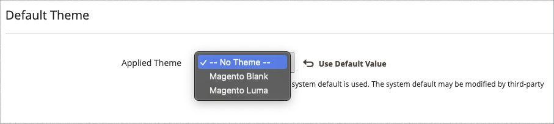

# Thèmes

Un thème est un ensemble de fichiers qui détermine la présentation visuelle de votre boutique. Lorsque vous installez [!DNL Commerce] pour la première fois, les éléments de conception du magasin sont basés sur le thème _Default_. Outre le thème par défaut initial fourni avec votre installation [!DNL Commerce], il existe un large éventail de thèmes disponibles que vous pouvez utiliser _en l’état_ ou modifier selon vos besoins.

Un thème réactif ajuste la disposition de la page en fonction du port d’affichage de l’appareil. L’exemple de thème _Luma_ a une disposition flexible et réactive qui peut être affichée sur un bureau, une tablette ou un appareil mobile.

[!DNL Commerce] thèmes comprennent les fichiers de disposition, les fichiers de modèle, les fichiers de traduction et les habillages. Une apparence est un ensemble de fichiers CSS, d’images et JavaScript qui, ensemble, créent la présentation visuelle et les interactions que vos clients expérimentent lorsqu’ils visitent votre boutique. Les thèmes et les habillages peuvent être modifiés et personnalisés par un développeur ou un professionnel du design maîtrisant la conception de thèmes Commerce et ayant accès à votre serveur. Pour en savoir plus, consultez le [_Guide du développeur Frontend_](https://developer.adobe.com/commerce/frontend-core/guide/themes/).

{width="600" zoomable="yes"}

## Le thème par défaut

Le thème réactif `Magento Blank` effectue le rendu de l’affichage de votre storefront pour différents appareils et incorpore les bonnes pratiques pour les ordinateurs de bureau, les tableaux et les appareils mobiles. Certains thèmes sont conçus pour être utilisés uniquement avec des appareils spécifiques. Lorsque [!DNL Commerce] détecte un ID de navigateur spécifique, ou un agent utilisateur, il utilise le thème configuré pour le navigateur spécifique. La chaîne de recherche peut également inclure des expressions régulières compatibles avec Perl (PCRE).

{width="700" zoomable="yes"}

### Filtrer la grille de thème

1. Dans la barre latérale _Admin_, accédez à **[!UICONTROL Content]** > _[!UICONTROL Design]_>**[!UICONTROL Themes]**.

1. Cliquez sur **[!UICONTROL Filters]**.

1. Saisissez une plage d’identifiants, un nom de thème (ou un titre), un chemin de dossier ou un thème parent.

1. Cliquez sur **[!UICONTROL Apply Filters]** pour mettre à jour la liste des thèmes.

## Afficher les paramètres du thème actuel

1. Dans la barre latérale _Admin_, accédez à **[!UICONTROL Content]** > _[!UICONTROL Design]_>**[!UICONTROL Themes]**.

1. Dans la liste des thèmes installés, recherchez le thème que vous souhaitez examiner, puis cliquez sur la ligne pour afficher les paramètres.

1. Pour afficher un exemple de page, cliquez sur le **[!UICONTROL Theme Preview Image]**.

{width="600" zoomable="yes"}

## Appliquer un thème par défaut

1. Dans la barre latérale _Admin_, accédez à **[!UICONTROL Content]** > _[!UICONTROL Design]_>**[!UICONTROL Configuration]**.

1. Recherchez la vue de magasin que vous souhaitez configurer, puis cliquez sur **[!UICONTROL Edit]** dans la colonne _[!UICONTROL Action]_.

1. Sous _[!UICONTROL Default Theme]_, définissez **[!UICONTROL Applied Theme]**&#x200B;sur celui que vous souhaitez utiliser pour l’affichage actuel.

   {width="600" zoomable="yes"}

1. Cliquez ensuite sur **[!UICONTROL Save Configuration]**.

## Ajout d’une règle d’agent utilisateur

1. Dans la barre latérale _Admin_, accédez à **[!UICONTROL Content]** > _[!UICONTROL Design]_>**[!UICONTROL Configuration]**.

1. Sous _[!UICONTROL Design Rule]_, cliquez sur **[!UICONTROL Add New User Agent Rule]**.

   {width="600" zoomable="yes"}

1. Par **[!UICONTROL Search String]**, saisissez l’ID du navigateur pour l’appareil spécifique.

   Les chaînes de recherche correspondent dans l’ordre dans lequel elles sont saisies. Par exemple, pour Firefox, saisissez :

   `/^mozilla/i`

1. Pour entrer des périphériques supplémentaires, répétez le processus.

1. Cliquez ensuite sur **[!UICONTROL Save Configuration]**.
