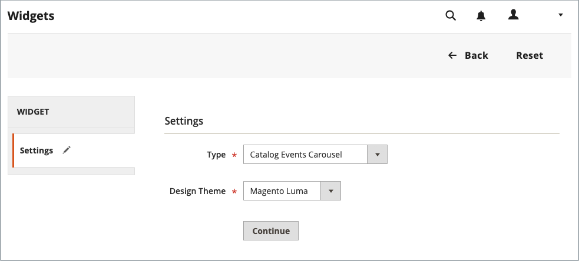

# Widget de carrousel d’événements de catalogue

{{ee-feature}}

Un widget de carrousel d’événements de catalogue affiche un curseur des événements à venir avec un indicateur de compte à rebours pour chaque événement. Vous pouvez choisir les pages et la zone de la mise en page dans lesquelles vous souhaitez que le carrousel apparaisse, ainsi que contrôler la largeur et le nombre d’événements qui s’affichent simultanément. Le résultat obtenu dépend de votre thème, de son emplacement pour qu’il apparaisse sur la page et des options que vous choisissez.

{width="700" zoomable="yes"}

## Étape 1 : activer le widget de carrousel de catalogue

Avant de commencer, suivez les [instructions](../merchandising-promotions/event-configure.md) pour configurer le widget _Événement de catalogue_ afin qu’il soit activé pour le storefront.

{width="500" zoomable="yes"}

## Étape 2 : créer le widget

1. Dans la barre latérale _Admin_, accédez à **[!UICONTROL Content]** > _[!UICONTROL Elements]_>**[!UICONTROL Widgets]**.

1. Dans le coin supérieur droit, cliquez sur **[!UICONTROL Add Widget]**.

1. Dans la section _[!UICONTROL Settings]_, procédez comme suit :

   - Définissez **[!UICONTROL Type]** sur `Catalog Events Carousel`.

   - Choisissez le **[!UICONTROL Design Theme]** utilisé par le magasin.

1. Cliquez sur **[!UICONTROL Continue]**.

   {width="500" zoomable="yes"}

1. Dans la section _[!UICONTROL Storefront Properties]_, procédez comme suit :

   - Par **[!UICONTROL Widget Title]**, saisissez un titre descriptif pour le widget.

     Ce titre est visible uniquement depuis l’_Admin_.

   - Par **[!UICONTROL Assign to Store Views]**, sélectionnez les vues de la boutique dans lesquelles vous souhaitez que le widget soit visible.

     Vous pouvez sélectionner une vue de magasin spécifique, ou `All Store Views`. Pour sélectionner plusieurs vues, maintenez la touche Ctrl (PC) ou Commande (Mac) enfoncée et cliquez sur chaque option.

   - (Facultatif) Par **[!UICONTROL Sort Order]**, saisissez un nombre pour déterminer l’ordre dans lequel cet élément apparaît avec les autres dans la même partie de la page. (`0` = premier, `1` = deuxième, `3` = troisième, etc.)

     {width="600" zoomable="yes"}

## Étape 3 : choisir l&#39;emplacement

1. Dans la section _Mises à jour de la disposition_, cliquez sur **[!UICONTROL Add Layout Update]**.

1. Définissez **[!UICONTROL Display On]** sur `Specified Page`.

1. Définissez **[!UICONTROL Page]** sur `CMS Home Page`.

1. Définissez **[!UICONTROL Container]**’une des options suivantes :

   - `Main Content Area`
   - `Sidebar Additional`
   - `Sidebar Main`

   >[!NOTE]
   >
   >Les résultats varient en fonction du thème et de la mise en page. Vous devez également spécifier le _[!UICONTROL Catalog Events Carousel Default Template]_&#x200B;dans la configuration des catégories.

1. Si vous souhaitez que le carrousel d’événements apparaisse à un autre emplacement du storefront, cliquez sur **[!UICONTROL Add Layout Update]** et répétez ces étapes pour cet emplacement.

   {width="600" zoomable="yes"}

1. Cliquez sur **[!UICONTROL Save and Continue Edit]**.

   Pour l’instant, vous pouvez ignorer le message pour actualiser le cache.

## Étape 4 : configurer les options

1. Dans le panneau de gauche, choisissez **[!UICONTROL Widget Options]**.

1. Par **[!UICONTROL Frame Size]**, saisissez le nombre d’événements que vous souhaitez répertorier simultanément dans le curseur.

   Pour afficher un seul événement à la fois, saisissez `1`.

1. Par **[!UICONTROL Scroll]**, saisissez le nombre de listes d’événements que vous souhaitez faire défiler par clic.

   Pour passer à l’événement suivant, saisissez `1`.

1. Pour une largeur personnalisée, saisissez le nombre de pixels pour la **[!UICONTROL Block Custom Width]**.

   Dans l’exemple de page suivant, la largeur personnalisée est définie sur 250 pixels.

   {width="400" zoomable="yes"}

1. Cliquez ensuite sur **[!UICONTROL Save]**.

1. Lorsque vous êtes invité à actualiser le cache, cliquez sur le lien du message en haut de la page et suivez les instructions.
