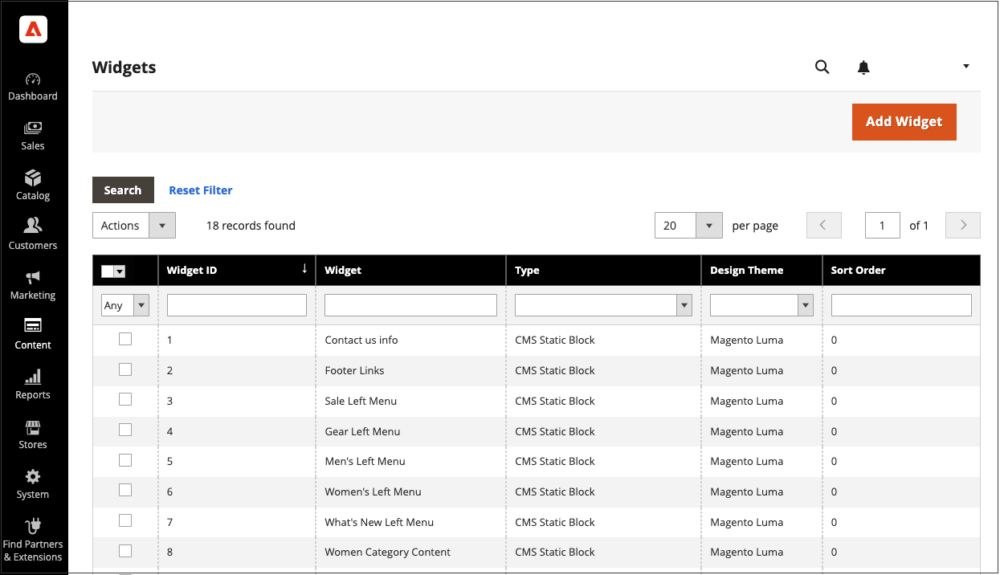

# Widget de liste de nouveaux produits

La liste des nouveaux produits est un exemple de contenu dynamique. Elle se compose de données actives qui sont extraites de votre catalogue de produits. Par défaut, la liste _Nouveaux produits_ comprend les huit premiers des produits les plus récemment ajoutés. Cependant, il peut également être configuré pour inclure uniquement les produits au cours d’une période spécifiée.

{width="700" zoomable="yes"}

## Étape 1 : définir chaque produit comme nouveau

 Cette étape s’applique uniquement à Magento Open Source.

 Pour les magasins Adobe Commerce, voir [Planification d’une mise à jour](content-staging-scheduled-update.md) puis passez à l’étape 2 de cette page.

_[!UICONTROL Set Product as New]_&#x200B;paramètre de période ne peut être configuré que dans les mises à jour planifiées.

La définition d’un produit sur nouveau ajoute le produit à la liste _Nouveaux produits_. Vous pouvez revenir en arrière à tout moment lorsque vous ne souhaitez plus l’inclure dans la liste.

1. Dans la barre latérale _Admin_, accédez à **[!UICONTROL Catalog]** > **[!UICONTROL Products]**.

1. Recherchez chaque produit que vous souhaitez mettre en avant et ouvrez en mode d’édition.

1. Par **[!UICONTROL Set Product as New]**, activez/désactivez l’option pour définir le produit comme nouveau produit ou non.

   {width="400" zoomable="yes"}

1. Cliquez ensuite sur **[!UICONTROL Save]**.

1. Lorsque vous êtes invité à réindexer et à actualiser le cache de page, cliquez sur les liens en haut de la page et suivez les instructions.

## Étape 2 : créer le widget

Le code qui détermine le contenu de la liste Nouveaux produits et son emplacement dans votre boutique est généré par l’outil Widget.

1. Dans la barre latérale _Admin_, accédez à **[!UICONTROL Content]** > _[!UICONTROL Elements]_>**[!UICONTROL Widgets]**.

1. Dans le coin supérieur droit, cliquez sur **[!UICONTROL Add Widget]**.

1. Dans la section _[!UICONTROL Settings]_, procédez comme suit :

   - Définissez **[!UICONTROL Type]** sur `Catalog New Products List`.

   - Choisissez le **[!UICONTROL Design Theme]** utilisé par le magasin.

1. Cliquez sur **[!UICONTROL Continue]**.

   {width="600" zoomable="yes"}

1. Dans la section _[!UICONTROL Storefront Properties]_, procédez comme suit :

   - Par **[!UICONTROL Widget Title]**, saisissez un titre descriptif pour le widget. (Ce titre est visible uniquement à partir de l’_Admin_.)

   - Par **[!UICONTROL Assign to Store Views]**, sélectionnez les vues du magasin où le widget est visible.

     Vous pouvez sélectionner une vue de magasin spécifique, ou `All Store Views`. Pour sélectionner plusieurs vues, maintenez la touche Ctrl (PC) ou Commande (Mac) enfoncée et cliquez sur chaque option.

   - (Facultatif) Par **[!UICONTROL Sort Order]**, saisissez un nombre pour déterminer l’ordre dans lequel cet élément apparaît avec les autres dans la même partie de la page. (`0` = premier, `1` = deuxième, `3` = troisième, etc.)

   {width="600" zoomable="yes"}

## Étape 3 : choisir l&#39;emplacement

1. Dans la section _[!UICONTROL Layout Updates]_, cliquez sur **[!UICONTROL Add Layout Update]**.

1. Définir **[!UICONTROL Display On]** sur `Specified Page.`

1. Définissez **[!UICONTROL Page]** sur `CMS Home Page`.

1. Définissez **[!UICONTROL Block Reference]** sur `Main Content Area`.

1. Définissez **[!UICONTROL Template]** sur l’une des options suivantes :

   - `New Product List Template`
   - `New Products Grid Template`

     {width="600" zoomable="yes"}

1. Cliquez sur **[!UICONTROL Save and Continue Edit]**.

   Pour l’instant, vous pouvez ignorer le message pour actualiser le cache.

## Étape 4 : configurer la liste

1. Dans le panneau de gauche, choisissez **[!UICONTROL Widget Options]**.

1. Définissez **[!UICONTROL Display Products]** sur l’une des options suivantes :

   - `All Products` - Répertorie les produits en séquence, en commençant par le plus récemment ajouté.
   - `New Products` - Répertorie uniquement les produits identifiés comme _nouveaux_. Un produit est considéré comme nouveau pendant la période spécifiée dans _[!UICONTROL Set Product As New From/To]_. La liste est vide si la période expire sans qu’aucun nouveau produit ne soit défini.

1. Pour fournir un contrôle de navigation aux listes comportant plusieurs pages, définissez **[!UICONTROL Display Page Control]** sur `Yes`.

   Par **[!UICONTROL Number of Products per Page]**, saisissez le nombre de produits que vous souhaitez afficher sur chaque page.

1. Définissez l’option **[!UICONTROL Number of Products to Display]** sur le nombre de nouveaux produits que vous souhaitez inclure dans la liste.

   Le paramètre par défaut est `10`.

1. Par **[!UICONTROL Cache Lifetime (Seconds)]**, choisissez la fréquence à laquelle vous souhaitez actualiser la liste des nouveaux produits.

   Par défaut, le cache est défini sur 86 400 secondes (24 heures).

   {width="600" zoomable="yes"}

1. Cliquez ensuite sur **[!UICONTROL Save]**.

1. Lorsque vous êtes invité à actualiser le cache, cliquez sur le lien du message en haut de la page et suivez les instructions.

## Étape 5 : Prévisualiser votre travail

1. Dans la barre latérale _Admin_, accédez à **[!UICONTROL Content]** > _[!UICONTROL Elements]_>**[!UICONTROL Pages]**.

1. Recherchez la page dans la grille où la liste _Nouveaux produits_ doit apparaître et cliquez sur le lien **[!UICONTROL Preview]** dans la colonne _[!UICONTROL Action]_.
