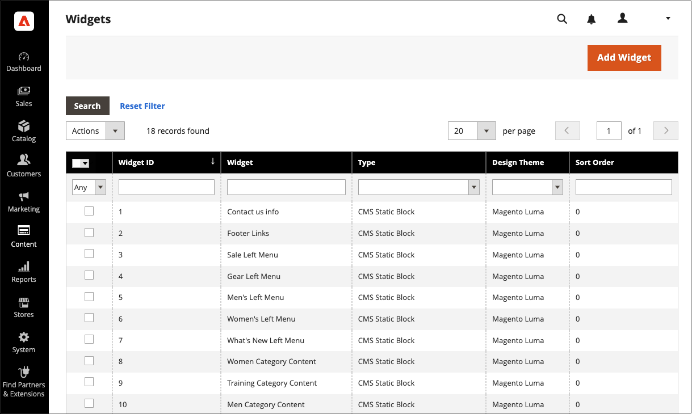
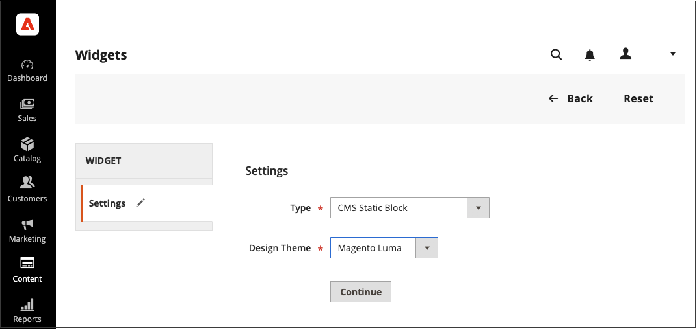

# Utilisation d’un widget pour positionner un bloc

Le _bloc statique_ [widget](widgets.md) vous permet de placer un [bloc de contenu](blocks.md) existant presque n’importe où dans votre boutique.

{width="700" zoomable="yes"}

## Étape 1 : choisir le type de widget

1. Dans la barre latérale _Admin_, accédez à **[!UICONTROL Content]** > _[!UICONTROL Elements]_>**[!UICONTROL Widgets]**.

1. Dans le coin supérieur droit, cliquez sur **[!UICONTROL Add Widget]**.

1. Dans la section _Paramètres_, définissez **[!UICONTROL Type]** sur `CMS Static Block`, puis cliquez sur **[!UICONTROL Continue]**.

1. Vérifiez que la **[!UICONTROL Design Theme]** est définie sur le thème actif, puis cliquez sur **[!UICONTROL Continue]**.

   {width="600" zoomable="yes"}

1. Dans la section _[!UICONTROL Storefront Properties]_, procédez comme suit :

   - Par **[!UICONTROL Widget Title]**, saisissez un titre descriptif pour le widget.

     Ce titre est visible uniquement depuis l’_Admin_.

   - Par **[!UICONTROL Assign to Store Views]**, sélectionnez les vues du magasin où le widget est visible.

     Vous pouvez sélectionner une vue de magasin spécifique, ou `All Store Views`. Pour sélectionner plusieurs vues, maintenez la touche Ctrl (PC) ou Commande (Mac) enfoncée et cliquez sur chaque option.

   - (Facultatif) Par **[!UICONTROL Sort Order]**, saisissez un nombre pour déterminer l’ordre dans lequel cet élément apparaît avec les autres dans la même partie de la page. (`0` = premier, `1` = deuxième, `3` = troisième, etc.)

     {width="600" zoomable="yes"}

## Étape 2 : terminer les mises à jour de la disposition du widget

1. Dans la section _[!UICONTROL Layout Updates]_, cliquez sur **[!UICONTROL Add Layout Update]**.

1. Définissez **[!UICONTROL Display On]** sur la catégorie, le produit ou la page où vous souhaitez que le bloc apparaisse.

1. Pour placer le bloc sur une page spécifique, procédez comme suit :

   - Choisissez le **[!UICONTROL Page]** où vous souhaitez que le bloc apparaisse.

   - Sélectionnez l’**[!UICONTROL Block Reference]** qui identifie l’endroit où le bloc est affiché sur la page.

   - Acceptez le paramètre par défaut pour **[!UICONTROL Template]**, qui est défini sur `CMS Static Block Default Template`.

     {width="600" zoomable="yes"}

### Options de mise à jour de la disposition

| Champ | Description |
|--- |--- |
| **_[!UICONTROL Categories]_** |  |
| [!UICONTROL Anchor Categories] | Affiche le widget sur la page de catégorie d’ancrage. **[!UICONTROL Categories]**- Catégories dans lesquelles l’ancre est affichée. Options : `All` /`Specific Categories` **[!UICONTROL Container]** - Définissez le conteneur sur la partie de la mise en page où vous souhaitez afficher le widget. **[!UICONTROL Template]**- Détermine le thème de la mise en page. |
| [!UICONTROL Non-Anchor Categories] | Affiche le widget sur la page de catégorie non ancrée. **[!UICONTROL Categories]**- Catégories dans lesquelles l’ancre est affichée. Options : `All` /`Specific Categories` **[!UICONTROL Container]** - Définissez le conteneur sur la partie de la mise en page où vous souhaitez afficher le widget. **[!UICONTROL Template]**- Détermine le thème de la mise en page. |
| **_[!UICONTROL Products]_** |  |
| Tous les types de produits | Affiche le widget sur un type spécifique de page de produit ou sur toutes les pages de produit.  **[!UICONTROL Products]**- Produits pour lesquels le widget est affiché. Options : `All` /` Specific Products` **[!UICONTROL Container]** - Définissez le conteneur sur la partie de la mise en page où vous souhaitez afficher le widget. **[!UICONTROL Template]**- Détermine le thème de la mise en page. |
| **_[!UICONTROL Generic Pages]_** |  |
| [!UICONTROL All Pages] | Affiche le widget sur toutes les pages.  **[!UICONTROL Container]**- Définissez le conteneur sur la partie de la mise en page où vous souhaitez afficher le widget. **[!UICONTROL Template]** - Détermine le thème de la mise en page. |
| [!UICONTROL Specified Page] | Affiche le widget sur une page spécifique. Options :  **[!UICONTROL Page]**- Pages pour lesquelles le widget est affiché. **[!UICONTROL Container]** - Définissez le conteneur sur la partie de la mise en page où vous souhaitez afficher le widget. **Modèle** - Détermine le thème de la mise en page. |
| [!UICONTROL Page Layouts] | Affiche le widget sur les pages avec une certaine disposition.  **[!UICONTROL Page]**- Pages pour lesquelles le widget est affiché. **[!UICONTROL Container]** - Définissez le conteneur sur la partie de la mise en page où vous souhaitez afficher le widget. **[!UICONTROL Template]**- Détermine le thème de la mise en page. |

{style="table-layout:auto"}

## Étape 3 : Placer le bloc

1. Dans le panneau de gauche, sélectionnez **[!UICONTROL Widget Options]**.

1. Cliquez sur **[!UICONTROL Select Block…]** et choisissez le bloc que vous souhaitez placer dans la liste.

1. Cliquez ensuite sur **[!UICONTROL Save]**.

   L’application apparaît désormais dans la liste.

1. Lorsque vous y êtes invité, suivez les instructions en haut de la page pour mettre à jour l’index et le cache de page.

1. Revenez à votre storefront pour vérifier que le bloc apparaît à l’emplacement correct.

   Pour déplacer le bloc, vous pouvez rouvrir le widget ou essayer d’utiliser une autre référence de page ou de bloc.
