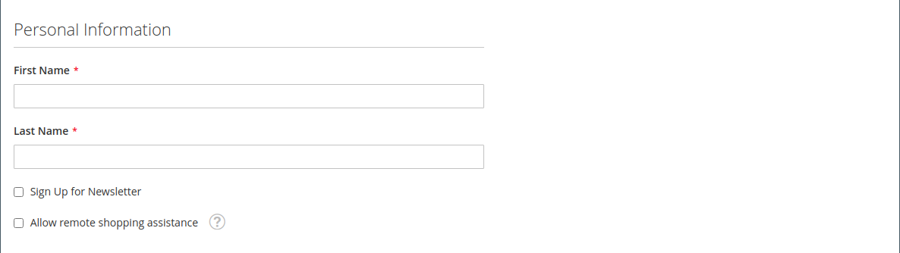
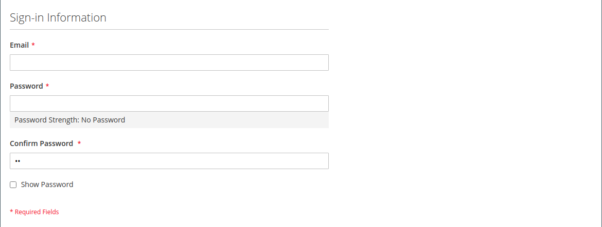
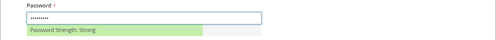
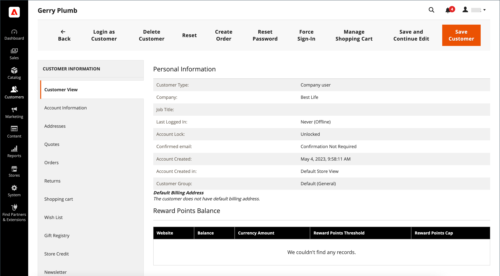
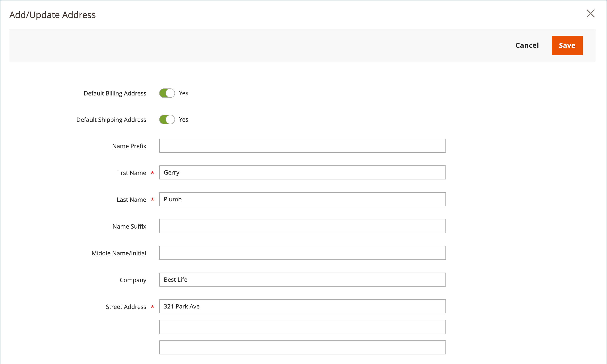

# Création d’un compte client individuel

Les visiteurs de votre boutique peuvent ouvrir un compte pour gérer leurs achats et leurs activités. Les clients créent généralement leurs propres comptes à partir de votre magasin. Cependant, vous pouvez également créer des comptes client directement à partir de l’administration, ce qui s’avère utile pour aider les clients par téléphone.

Les instructions suivantes représentent la configuration par défaut du compte client. Pour modifier la sélection et le comportement de certains champs du formulaire, voir [Configuration des comptes clients](../customers/customer-account-scope.md).

En tant qu’administrateur de boutique, vous pouvez également définir les [options de nouveau compte](../customers/account-options-new.md) pour envoyer un e-mail de confirmation aux nouveaux clients enregistrés, ce qui permet de vous assurer que les comptes enregistrés sont valides.

>[!NOTE]
>
>À partir de la version 2.4.7, les clients doivent saisir à nouveau leur adresse e-mail et leur mot de passe pour se connecter à leur compte après la confirmation par e-mail, quel que soit le navigateur.

## Créer un compte à partir du storefront

Un client du magasin crée un compte sur le storefront.

1. Depuis le storefront, clique sur **[!UICONTROL Create an Account]** dans le coin supérieur droit de l’en-tête.

   {width="700" zoomable="yes"}

1. Sous **[!UICONTROL Personal Information]**, renseignez leurs **[!UICONTROL First Name]** et **[!UICONTROL Last Name]**.

   {width="600" zoomable="yes"}

1. S’il souhaite ajouter son nom et son adresse e-mail à la liste des abonnés à la newsletter, le client coche la case **[!UICONTROL Sign Up for Newsletter]** .

   >[!INFO]
   >
   > Cette option s’affiche même si le magasin ne publie pas de newsletter.

1. S’il souhaite que le personnel d’assistance du magasin [voir ce qu’il voit](../customers/login-as-customer.md) et fournisse une assistance à distance, le client sélectionne la case à cocher **[!UICONTROL Allow remote shopping assistance]**.

1. Sous **[!UICONTROL Sign-in Information]**, saisissez leur adresse **[!UICONTROL Email]**.

   >[!INFO]
   >
   > Cette adresse e-mail fait désormais partie de leurs informations de connexion et ne peut pas être associée à un autre compte client.

   {width="600" zoomable="yes"}

1. Saisit un **[!UICONTROL Password]** qui comprend trois des types d’informations suivants :

   - Caractères en minuscules
   - Caractères en majuscule
   - Nombres
   - Caractères spéciaux

   Une fois qu’ils ont appuyé sur **[!UICONTROL Enter]**, la puissance du mot de passe est évaluée et s’affiche sous le champ. Si le mot de passe est considéré comme _faible_, essayez un autre jusqu’à ce qu’il soit considéré comme _fort_.

   {width="600" zoomable="yes"}

1. Ensuite, le client le saisit à nouveau pour **[!UICONTROL Confirm Password]**.

1. Si nécessaire, clique sur **[!UICONTROL Show Password]** pour afficher le mot de passe saisi.

1. Une fois l’opération terminée, cliquez sur **Créer un compte**.

Le client peut ensuite utiliser son adresse e-mail et son mot de passe pour [se connecter](../customers/customer-sign-in.md) à son compte et renseigner les informations d’adresse.

## Créer un compte à partir de l’administrateur

En tant que commerçant, vous pouvez créer un compte client à partir de l’administrateur.

1. Dans la barre latérale _Admin_, accédez à **[!UICONTROL Customers]** > **[!UICONTROL All Customers]**.

1. Cliquez sur **[!UICONTROL Add New Customer]**.

### Étape 1 : remplir les informations du compte

{width="700" zoomable="yes"}

1. Dans la section **[!UICONTROL Account Information]**, procédez comme suit :

   - Dans le cas d’une installation multisite, définissez **[!UICONTROL Associate to Website]** sur le site web auquel le compte client s’applique.
   - Le cas échéant, affectez le client à un autre **[!UICONTROL Customer Group]**.
   - Si vous utilisez [Validation des identifiants de TVA](../stores-purchase/vat.md) et que vous souhaitez **[!UICONTROL Disable Automatic Group Change Based on VAT ID]**, cochez la case.

1. Renseignez les champs requis :

   - **[!UICONTROL First Name]**
   - **[!UICONTROL Last Name]**
   - **[!UICONTROL Email]**

1. Renseignez les champs facultatifs selon vos besoins :

   - **[!UICONTROL Name Prefix]**
   - **[!UICONTROL Middle Name/Initial]**
   - **[!UICONTROL Name Suffix]**
   - **[!UICONTROL Date of Birth]**
   - **[!UICONTROL Tax/VAT Number]**
   - **[!UICONTROL Gender]**

   >[!WARNING]
   >
   >Conformément aux bonnes pratiques actuelles en matière de sécurité et de confidentialité, soyez conscient de tous les risques juridiques et de sécurité potentiels associés au stockage de la date de naissance complète du client (mois, jour, année) avec d&#39;autres identifiants personnels. Il est recommandé de limiter le stockage des dates de naissance complètes des clientes et clients et d’utiliser l’année de naissance du client comme alternative.

1. Définissez l’**[!UICONTROL Send Welcome Email From]** sur la vue du magasin à partir de laquelle l’e-mail _Bienvenue_ doit être envoyé.

   >[!INFO]
   >
   > Si le magasin propose des vues pour différentes [langues](../stores-purchase/store-localize.md), ce paramètre détermine la langue de l’e-mail de bienvenue.

1. Cliquez sur **[!UICONTROL Save and Continue Edit]** en haut de la page.

   >[!INFO]
   >
   >Une fois le compte client enregistré, l’ensemble complet des options s’affiche dans le panneau de gauche et dans le menu en haut de la page. L’onglet _[!UICONTROL Customer View]_&#x200B;affiche un résumé du compte.

   {width="600" zoomable="yes"}

### Étape 2 : Complétez les informations d&#39;adresse

1. Dans le panneau de gauche, choisissez **[!UICONTROL Addresses]** et cliquez sur **[!UICONTROL Add New Addresses]**.

1. Si la même adresse est utilisée pour la facturation et l’expédition, activez les deux options.

   - **[!UICONTROL Default Billing Address]**
   - **[!UICONTROL Default Shipping Address]**

   {width="600" zoomable="yes"}

1. Faites défiler vers le bas et renseignez les champs d’adresse requis dans la deuxième colonne.

   - **[!UICONTROL Street Address]**
   - **[!UICONTROL City]**
   - **[!UICONTROL Country]**
   - **[!UICONTROL State/Province]**
   - **[!UICONTROL ZIP/Postal Code]**

1. Saisissez le **[!UICONTROL Phone Number]** de cette adresse.

1. Le cas échéant, saisissez le **[!UICONTROL VAT Number]** associé au client.

1. Si cette adresse est la seule requise pour le compte, cliquez sur **[!UICONTROL Save]**.

   Sinon, cliquez sur **[!UICONTROL Save and Continue Edit]** et répétez les étapes précédentes pour ajouter des adresses supplémentaires.

   La nouvelle adresse s’affiche sur la page [!UICONTROL Addresses] avec les adresses _[!UICONTROL Default Billing]_&#x200B;et&#x200B;_[!UICONTROL Default Shipping]_ sélectionnées au-dessus de la liste complète.

   {width="600" zoomable="yes"}

### Étape 3 : réinitialiser le mot de passe

Aucun mot de passe n’est initialement attribué aux comptes clients créés à partir de l’administrateur.

1. Recherchez le nouveau compte client dans la grille.

1. Cliquez sur **[!UICONTROL Edit]** dans la colonne _[!UICONTROL Action]_.

1. Dans la barre de menus en haut de la page, cliquez sur **[!UICONTROL Reset Password]**.

1. Une notification est envoyée au propriétaire du compte, avec des instructions pour définir le mot de passe.

## Barre de boutons

D’autres boutons sont disponibles lorsque le profil est enregistré pour la première fois. Pour en savoir plus, voir [Mettre à jour un profil client](../customers/update-account.md).

| Bouton | Description |
|--- |--- |
| **[!UICONTROL Back]** | Retourne à la page _[!UICONTROL Customers]_&#x200B;sans enregistrer les modifications. |
| **[!UICONTROL Delete Customer]** | Supprime le client actuel. Les commandes terminées associées au client ne sont pas supprimées. |
| **[!UICONTROL Reset]** | Réinitialise toutes les modifications non enregistrées dans le formulaire client à leurs valeurs précédentes. |
| **[!UICONTROL Create Order]** | Crée une commande pour le client. |
| **[!UICONTROL Reset Password]** | Envoie un lien [réinitialiser le mot de passe](../customers/password-reset.md) au client par e-mail. |
| **[!UICONTROL Force Sign-in]** | Révoque les jetons d’accès OAuth associés au compte client. Cette fonction ne peut être utilisée qu’avec des comptes client auxquels des jetons OAuth ont été attribués dans le cadre d’une API web [intégration](../systems/integrations.md). Pour en savoir plus, consultez la section [Authentification basée sur OAuth](https://developer.adobe.com/commerce/webapi/get-started/authentication/gs-authentication-oauth/) dans la documentation du développeur. |
| **[!UICONTROL Manage Shopping Cart]** | Permet à l’administrateur de gérer le panier pour le client. |
| **[!UICONTROL Save and Continue Edit]** | Enregistre les modifications et maintient le profil client ouvert. |
| **[!UICONTROL Save Customer]** | Enregistre les modifications et ferme le profil client. |

{style="table-layout:auto"}

## Descriptions des champs

### [!UICONTROL Account Information]

| Champ | Description |
|--- |--- |
| **[!UICONTROL Associate to Website]** | Identifie le site Web associé au compte client. |
| **[!UICONTROL Group]** | Identifie le [groupe de clients](../customers/customer-groups.md) dont le client est membre. Le cas échéant, cochez la case pour désactiver le changement de groupe automatique basé sur la TVA. |
| **[!UICONTROL Name Prefix]** | S’il est utilisé, le préfixe associé au nom du client (par exemple, M., Mme ou D.). Les valeurs de préfixe sont déterminées par la [configuration](../configuration-reference/customers/customer-configuration.md). Selon la configuration, le contrôle de saisie peut être un champ de texte ou une liste d’options. |
| **[!UICONTROL First Name]** | Prénom du client. |
| **[!UICONTROL Middle Name / Initial]** | Deuxième prénom ou initial du client. Ce champ n’est inclus que s’il est spécifié dans la rubrique [configuration](../configuration-reference/customers/customer-configuration.md). |
| **[!UICONTROL Last Name]** | Nom du client. |
| **[!UICONTROL Name Suffix]** | Le cas échéant, le suffixe associé au nom du client (tel que Jr., Sr. ou III). Les valeurs de suffixe sont déterminées par la [configuration](../configuration-reference/customers/customer-configuration.md). Selon la configuration, le contrôle de saisie peut être un champ de texte ou une liste déroulante d’options. |
| **[!UICONTROL Email]** | Adresse e-mail du client. |
| **[!UICONTROL Date of Birth]** | Date de naissance du client. La date de naissance est incluse si elle est spécifiée dans la rubrique [configuration](../configuration-reference/customers/customer-configuration.md).   Conformément aux bonnes pratiques actuelles en matière de sécurité et de confidentialité, soyez conscient de tous les risques juridiques et de sécurité potentiels associés au stockage de la date de naissance complète du client (mois, jour, année) avec d&#39;autres identifiants personnels. Il est recommandé de limiter le stockage des dates de naissance complètes des clientes et clients et de suggérer d’utiliser leur année de naissance comme alternative. |
| **[!UICONTROL Tax / VAT Number]** | Le numéro de TVA du client, le cas échéant. |
| **[!UICONTROL Gender]** | Identifie le genre du client. Le genre est inclus si spécifié dans la [configuration](../configuration-reference/customers/customer-configuration.md). Options : `Male` / `Female` / `Not Specified` |
| **[!UICONTROL Send Welcome Email From]** | Si vous disposez de plusieurs vues de magasin, ce paramètre identifie la vue de magasin à partir de laquelle le message de bienvenue est envoyé. Si les vues du magasin sont utilisées pour différentes langues, ce paramètre détermine la langue de l’e-mail de bienvenue. |

### [!UICONTROL Addresses]

| Champ | Description |
|--- |--- |
| **[!UICONTROL New Addresses]** | Identifie le type de nouvelle adresse. Options : `Default Billing Address` / `Default Shipping Address` |
| **[!UICONTROL Add New Addresses]** | Affiche une autre section Nouvelle adresse pour identifier le type d’adresse à saisir. |
| **[!UICONTROL Company]** | Nom de la société, le cas échéant, pour cette adresse. |
| **[!UICONTROL Street Address]** | Adresse postale du client. Une deuxième ligne de l’adresse postale est disponible si elle est spécifiée dans la rubrique [configuration](../configuration-reference/customers/customer-configuration.md). |
| **[!UICONTROL City]** | Ville où se trouve l’adresse du client. |
| **[!UICONTROL Country]** | Pays dans lequel se trouve l’adresse du client. |
| **[!UICONTROL State/Province]** | État ou province où se trouve l’adresse du client. |
| **[!UICONTROL Zip/Postal Code]** | Code postal de l’adresse du client. |
| **[!UICONTROL Phone Number]** | Numéro de téléphone du client associé à l’adresse. |
| **[!UICONTROL VAT Number]** | Le cas échéant, numéro de taxe sur la valeur ajoutée qui s&#39;applique au client à cette adresse. |
