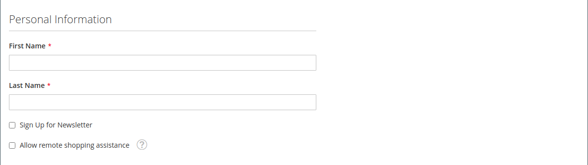

# Création d’un compte client individuel

Les visiteurs de votre boutique peuvent ouvrir un compte pour gérer leurs achats et activités. Les clients créent généralement leurs propres comptes à partir de votre boutique. Cependant, vous pouvez également créer des comptes de clients directement à partir de l’administrateur, ce qui s’avère utile pour aider les clients par téléphone.

Les instructions suivantes représentent la configuration du compte client par défaut. Pour modifier la sélection et le comportement de certains champs du formulaire, voir [Configuration des comptes clients](../customers/customer-account-scope.md).

En tant qu&#39;administrateur de magasin, vous pouvez également définir les [nouvelles options de compte](../customers/account-options-new.md) pour envoyer un email de confirmation aux nouveaux clients enregistrés, ce qui permet de vous assurer que les comptes enregistrés sont valides.

>[!NOTE]
>
>À partir de la version 2.4.7, les clients doivent saisir à nouveau leur adresse électronique et leur mot de passe pour se connecter à leur compte après confirmation par e-mail, quel que soit le navigateur.

## Créer un compte à partir du storefront

Un client de magasin crée un compte sur le storefront.

1. Dans le storefront, cliquez sur **[!UICONTROL Create an Account]** dans le coin supérieur droit de l’en-tête.

   {width="700" zoomable="yes"}

1. Sous **[!UICONTROL Personal Information]**, entre leurs **[!UICONTROL First Name]** et **[!UICONTROL Last Name]**.

   {width="600" zoomable="yes"}

1. S’il souhaite ajouter son nom et son adresse électronique à la liste des abonnés à la newsletter, le client coche la case **[!UICONTROL Sign Up for Newsletter]** .

   >[!INFO]
   >
   > Cette option s’affiche même si le magasin ne publie pas de newsletter.

1. S’ils veulent que le personnel de l’assistance du magasin [voit ce qu’ils voient](../customers/login-as-customer.md) et fournisse une assistance à distance, le client sélectionne la case à cocher **[!UICONTROL Allow remote shopping assistance]**.

1. Sous **[!UICONTROL Sign-in Information]**, saisit leur adresse **[!UICONTROL Email]**.

   >[!INFO]
   >
   > Cette adresse électronique fait partie des informations d’identification de connexion et ne peut pas être associée à un autre compte client.

   {width="600" zoomable="yes"}

1. Entrez un **[!UICONTROL Password]** qui comprend trois des types d’informations suivants :

   - Caractères minuscules
   - Caractères majuscules
   - Nombres
   - Caractères spéciaux

   Après avoir appuyé sur **[!UICONTROL Enter]**, la force du mot de passe est évaluée et apparaît sous le champ . Si le mot de passe est considéré comme _Faible_, essayez autre chose jusqu’à ce qu’il soit évalué comme _Fort_.

   {width="600" zoomable="yes"}

1. Ensuite, le client le saisit à nouveau à **[!UICONTROL Confirm Password]**.

1. Si nécessaire, cliquez sur **[!UICONTROL Show Password]** pour afficher le mot de passe que vous avez saisi.

1. Une fois l’opération terminée, cliquez sur **Créer un compte**.

Le client peut alors utiliser son adresse électronique et son mot de passe pour [se connecter ](../customers/customer-sign-in.md) à son compte et renseigner les informations sur son adresse.

## Création d’un compte à partir de l’administrateur

En tant que commerçant, vous pouvez créer un compte client à partir de l’administrateur.

1. Sur la barre latérale _Admin_, accédez à **[!UICONTROL Customers]** > **[!UICONTROL All Customers]**.

1. Cliquez sur **[!UICONTROL Add New Customer]**.

### Étape 1 : renseigner les informations du compte

{width="700" zoomable="yes"}

1. Dans la section **[!UICONTROL Account Information]** , procédez comme suit :

   - Pour une installation multisite, définissez **[!UICONTROL Associate to Website]** sur le site web sur lequel s’applique le compte client.
   - Le cas échéant, affectez le client à un **[!UICONTROL Customer Group]** différent.
   - Si vous utilisez la [validation de l&#39;ID de TVA](../stores-purchase/vat.md) et souhaitez **[!UICONTROL Disable Automatic Group Change Based on VAT ID]**, cochez la case.

1. Renseignez les champs requis :

   - **[!UICONTROL First Name]**
   - **[!UICONTROL Last Name]**
   - **[!UICONTROL Email]**

1. Renseignez les champs facultatifs suivant les besoins :

   - **[!UICONTROL Name Prefix]**
   - **[!UICONTROL Middle Name/Initial]**
   - **[!UICONTROL Name Suffix]**
   - **[!UICONTROL Date of Birth]**
   - **[!UICONTROL Tax/VAT Number]**
   - **[!UICONTROL Gender]**

   >[!WARNING]
   >
   >Conformément aux bonnes pratiques actuelles en matière de sécurité et de confidentialité, gardez à l’esprit tout risque juridique et de sécurité potentiel associé au stockage de la date de naissance complète des clients (mois, jour, année) avec d’autres identifiants personnels. Il est recommandé de limiter le stockage des dates de naissance complètes des clients et de suggérer d’utiliser l’année de naissance du client comme alternative.

1. Définissez **[!UICONTROL Send Welcome Email From]** sur la vue de magasin à partir de laquelle l&#39;email _Bienvenue_ doit être envoyé.

   >[!INFO]
   >
   > Si le magasin a des vues pour différentes [langues](../stores-purchase/store-localize.md), ce paramètre détermine la langue de l’e-mail de bienvenue.

1. Cliquez sur **[!UICONTROL Save and Continue Edit]** en haut de la page.

   >[!INFO]
   >
   >Une fois le compte client enregistré, l’ensemble des options s’affiche dans le panneau de gauche et dans le menu en haut de la page. L’onglet _[!UICONTROL Customer View]_affiche un résumé du compte.

   {width="600" zoomable="yes"}

### Etape 2 : renseigner les informations sur l&#39;adresse

1. Dans le panneau de gauche, sélectionnez **[!UICONTROL Addresses]** et cliquez sur **[!UICONTROL Add New Addresses]**.

1. Si la même adresse est utilisée pour la facturation et l’expédition, basculez les deux options.

   - **[!UICONTROL Default Billing Address]**
   - **[!UICONTROL Default Shipping Address]**

   {width="600" zoomable="yes"}

1. Faites défiler l’écran vers le bas et remplissez les champs d’adresse requis dans la deuxième colonne.

   - **[!UICONTROL Street Address]**
   - **[!UICONTROL City]**
   - **[!UICONTROL Country]**
   - **[!UICONTROL State/Province]**
   - **[!UICONTROL ZIP/Postal Code]**

1. Saisissez le **[!UICONTROL Phone Number]** correspondant à cette adresse.

1. Le cas échéant, saisissez le **[!UICONTROL VAT Number]** associé au client.

1. Si cette adresse est la seule qui est nécessaire pour le compte, cliquez sur **[!UICONTROL Save]**.

   Sinon, cliquez sur **[!UICONTROL Save and Continue Edit]** et répétez les étapes précédentes pour ajouter des adresses supplémentaires.

   La nouvelle adresse s&#39;affiche dans la page [!UICONTROL Addresses] avec les adresses _[!UICONTROL Default Billing]_et_[!UICONTROL Default Shipping]_ sélectionnées au-dessus de la liste complète.

   {width="600" zoomable="yes"}

### Étape 3 : Réinitialisation du mot de passe

Les mots de passe ne sont pas initialement attribués aux comptes clients créés à partir de l’administrateur.

1. Recherchez le nouveau compte client dans la grille.

1. Cliquez sur **[!UICONTROL Edit]** dans la colonne _[!UICONTROL Action]_.

1. Dans la barre de menus en haut de la page, cliquez sur **[!UICONTROL Reset Password]**.

1. Une notification est envoyée au propriétaire du compte, avec des instructions pour définir le mot de passe.

## Barre de boutons

D’autres boutons deviennent disponibles lorsque le profil est enregistré pour la première fois. Pour en savoir plus, voir [Mise à jour d’un profil client](../customers/update-account.md).

| Bouton | Description |
|--- |--- |
| **[!UICONTROL Back]** | Renvoie à la page _[!UICONTROL Customers]_sans enregistrer les modifications. |
| **[!UICONTROL Delete Customer]** | Supprime le client actuel. Les commandes terminées associées au client ne sont pas supprimées. |
| **[!UICONTROL Reset]** | Réinitialise les modifications non enregistrées du formulaire client à leurs valeurs précédentes. |
| **[!UICONTROL Create Order]** | Crée une commande pour le client. |
| **[!UICONTROL Reset Password]** | Envoie par courrier électronique un lien [reset password](../customers/password-reset.md) au client. |
| **[!UICONTROL Force Sign-in]** | Révoque les jetons d’accès OAuth associés au compte client. Cette fonction ne peut être utilisée qu’avec les comptes clients auxquels des jetons OAuth ont été attribués dans le cadre d’une API web [integration](../systems/integrations.md). Pour en savoir plus, voir [Authentification OAuth](https://developer.adobe.com/commerce/webapi/get-started/authentication/gs-authentication-oauth/) dans la documentation destinée aux développeurs. |
| **[!UICONTROL Manage Shopping Cart]** | Permet à l’administrateur de gérer le panier pour le client. |
| **[!UICONTROL Save and Continue Edit]** | Enregistre les modifications et conserve le profil client ouvert. |
| **[!UICONTROL Save Customer]** | Enregistre les modifications et ferme le profil client. |

{style="table-layout:auto"}

## Descriptions des champs

### [!UICONTROL Account Information]

| Champ | Description |
|--- |--- |
| **[!UICONTROL Associate to Website]** | Identifie le site web associé au compte client. |
| **[!UICONTROL Group]** | Identifie le [groupe de clients](../customers/customer-groups.md) dont le client est membre. Le cas échéant, cochez la case pour désactiver la modification automatique du groupe en fonction de la TVA. |
| **[!UICONTROL Name Prefix]** | S’il est utilisé, le préfixe associé au nom du client (M., Mme ou Dr, par exemple). Les valeurs de préfixe sont déterminées par la [configuration](../configuration-reference/customers/customer-configuration.md). Selon la configuration, le contrôle d’entrée peut être un champ de texte ou une liste d’options. |
| **[!UICONTROL First Name]** | Prénom du client. |
| **[!UICONTROL Middle Name / Initial]** | Nom ou initial du client. Ce champ est inclus uniquement s’il est spécifié dans la rubrique [configuration](../configuration-reference/customers/customer-configuration.md). |
| **[!UICONTROL Last Name]** | Nom du client. |
| **[!UICONTROL Name Suffix]** | S’il est utilisé, le suffixe associé au nom du client (tel que Jr., RS ou III). Les valeurs du suffixe sont déterminées par la [configuration](../configuration-reference/customers/customer-configuration.md). Selon la configuration, le contrôle de saisie peut être un champ de texte ou une liste déroulante d’options. |
| **[!UICONTROL Email]** | Adresse électronique du client. |
| **[!UICONTROL Date of Birth]** | Date de naissance du client. La date de naissance est incluse si elle est spécifiée dans la rubrique [configuration](../configuration-reference/customers/customer-configuration.md).   Conformément aux bonnes pratiques actuelles en matière de sécurité et de confidentialité, gardez à l&#39;esprit les risques potentiels liés à la sécurité et au stockage de la date de naissance complète des clients (mois, jour, année) avec d&#39;autres identifiants personnels. Il est recommandé de limiter le stockage des dates de naissance complètes des clients et de suggérer d’utiliser l’année de naissance du client comme alternative. |
| **[!UICONTROL Tax / VAT Number]** | Numéro de taxe ou de taxe sur la valeur ajoutée du client, le cas échéant. |
| **[!UICONTROL Gender]** | Identifie le genre du client. Le genre est inclus s’il est spécifié dans la [configuration](../configuration-reference/customers/customer-configuration.md). Options : `Male` / `Female` / `Not Specified` |
| **[!UICONTROL Send Welcome Email From]** | Si vous avez plusieurs vues de magasin, ce paramètre identifie la vue de magasin à partir de laquelle le message de bienvenue est envoyé. Si les vues des magasins sont utilisées pour différentes langues, ce paramètre détermine la langue du courriel de bienvenue. |

### [!UICONTROL Addresses]

| Champ | Description |
|--- |--- |
| **[!UICONTROL New Addresses]** | Identifie le type de nouvelle adresse. Options : `Default Billing Address` / `Default Shipping Address` |
| **[!UICONTROL Add New Addresses]** | Affiche une autre section Nouvelle adresse pour identifier le type de l’adresse à saisir. |
| **[!UICONTROL Company]** | Nom de la société, le cas échéant pour cette adresse. |
| **[!UICONTROL Street Address]** | Adresse postale du client. Une seconde ligne de l&#39;adresse postale est disponible si elle est spécifiée dans la rubrique [configuration](../configuration-reference/customers/customer-configuration.md). |
| **[!UICONTROL City]** | Ville où se trouve l’adresse du client. |
| **[!UICONTROL Country]** | Pays où se trouve l’adresse du client. |
| **[!UICONTROL State/Province]** | État ou province où se trouve l’adresse du client. |
| **[!UICONTROL Zip/Postal Code]** | Code postal où se trouve l’adresse du client. |
| **[!UICONTROL Phone Number]** | Numéro de téléphone du client associé à l’adresse. |
| **[!UICONTROL VAT Number]** | Le cas échéant, le numéro de la taxe sur la valeur ajoutée qui s’applique au client à cette adresse. |
