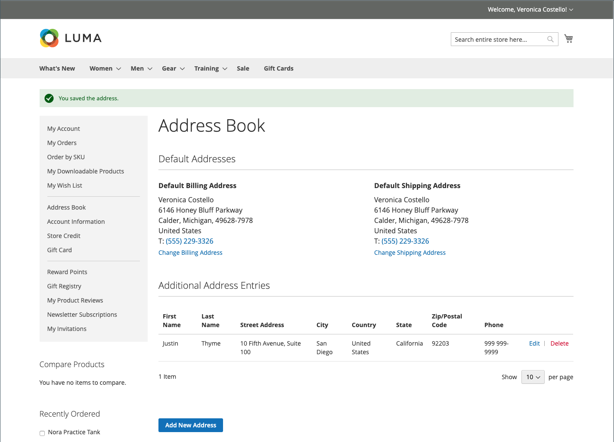

# Carnet d’adresses du client

Les clients qui tiennent leurs carnets d’adresses à jour peuvent accélérer le processus de passage en caisse. Le carnet d’adresses contient les adresses de facturation et d’expédition par défaut du client, ainsi que toutes les adresses supplémentaires qu’il utilise fréquemment. Les entrées d’adresse supplémentaires sont faciles d’accès et de maintenance à partir de la grille. Chaque carnet d’adresses client peut gérer plus de 3 000 entrées de carnet d’adresses sans affecter les performances.

{width="700" zoomable="yes"}

## Ajouter une adresse

1. Dans le volet de navigation de gauche de son compte client, le client choisit **[!UICONTROL Address Book]**.

1. Sur la page _[!UICONTROL Address Book]_sous_ Entrées d’adresse supplémentaires _, clique sur **[!UICONTROL Add New Address]**.

   {width="600" zoomable="yes"}

1. Définit le nouvel élément d’adresse.

1. Complète les coordonnées et l&#39;adresse.

   >[!INFO]
   >
   >Par défaut, le prénom et le nom du client apparaissent initialement dans le formulaire.

1. Sélectionne les cases à cocher suivantes pour indiquer comment l’adresse doit être utilisée.

   Sélectionne les deux cases à cocher si la même adresse est utilisée pour la facturation et l’expédition.

   * [!UICONTROL Use as my default billing address]
   * [!UICONTROL Use as my default shipping address]

1. Une fois l’opération terminée, cliquez sur **[!UICONTROL Save Address]**.

   >[!INFO]
   >
   >La nouvelle adresse est répertoriée sous [!UICONTROL Additional Address Entries].

   {width="700" zoomable="yes"}

## Modifier une adresse

1. Dans le volet de navigation de gauche de son compte client, le client sélectionne **[!UICONTROL Address Book]**.

1. Recherche l&#39;entrée d&#39;adresse à éditer.

1. Effectue un clic sur **[!UICONTROL Edit]**.

1. Apporte les modifications nécessaires.

   >[!INFO]
   >
   >Le client peut définir cette adresse comme adresse de **[!UICONTROL Shipping or Billing]** par défaut en cochant les cases _Utiliser comme adresse de facturation par défaut_.

1. Une fois les modifications apportées, cliquez sur **[!UICONTROL Save Address]**.

## Modification de l’adresse par défaut

1. Dans le volet de navigation de gauche de son compte client, le client sélectionne **[!UICONTROL Address Book]**.

1. Choisit l’une des méthodes d’édition :

   * Clique **[!UICONTROL Change Billing/Shipping Address]** dans la section _[!UICONTROL Default Addresses]_.

   * Clics **[!UICONTROL Edit]** dans la grille de _[!UICONTROL Additional Address Entries]_.

1. Apporte les modifications nécessaires et clique sur **[!UICONTROL Save Address]**.

## Supprimer une adresse

1. Dans le volet de navigation de gauche de son compte client, le client sélectionne **[!UICONTROL Address Book]**.

1. Recherche l&#39;entrée d&#39;adresse à supprimer.

1. Clics **[!UICONTROL Delete]** dans la grille de _[!UICONTROL Additional Address Entries]_.

1. Pour confirmer l’action, cliquez sur **[!UICONTROL OK]**.

   >[!IMPORTANT]
   >
   >Les adresses de facturation et de livraison par défaut ne peuvent pas être supprimées.
