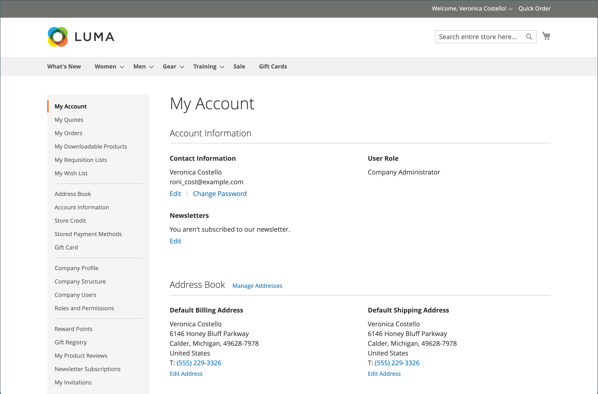

# Tableau de bord du compte client

Les clients peuvent gérer et surveiller leurs propres informations et activités à partir du tableau de bord de leur compte. Les clients peuvent réorganiser leurs commandes, effectuer le suivi de leurs commandes, gérer les adresses d’expédition et les modes de paiement, passer en revue les produits, s’abonner aux newsletters, etc.

{width="700" zoomable="yes"}

>[!NOTE]
>
> Avec l’installation et l’activation d’Adobe Commerce B2B, l’expérience d’achat peut être personnalisée avec des fonctionnalités spécifiques à l’entreprise. La gamme complète des options du tableau de bord des comptes B2B (commandes, listes de demandes d&#39;approvisionnement et devis négociés) peut être activée pour les clients qui sont associés à une société. Pour plus d’informations sur les fonctionnalités B2B, consultez le [Guide de l’utilisateur Adobe Commerce B2B](../b2b/introduction.md).

{width="700" zoomable="yes"}

## Navigation côté tableau de bord du compte

Le tableau suivant contient des informations sur toutes les sections disponibles dans le volet de navigation de gauche du tableau de bord du compte client.

| Section | Description |
|------------------------------------------------------------------------------------------------------------------------------------------------------|----------------------------------------------------------------------------------------------------------------------------------------------------------------------------------------------------------------------------------------------------------------------------------------------------------------------------------------------------------------|
| [**[!UICONTROL My Account]**](../customers/account-dashboard-my-account.md) | Affiche des informations récapitulatives sur votre compte, notamment les coordonnées, les adresses par défaut de votre carnet d&#39;adresses et les commandes récentes. |
| [**[!UICONTROL My Orders]**](../stores-purchase/orders-storefront.md#view-recently-ordered-products) | Affiche une liste de toutes les commandes client, avec un lien vers chacune d’elles. Si cette option est activée dans la configuration, vous pouvez réorganiser n’importe quelle commande en cliquant simplement sur le lien Réorganiser . |
| [**[!UICONTROL My Downloadable Products]**](../catalog/product-create-downloadable.md#storefront-experience) | Répertorie tous les produits téléchargeables que le client a achetés, avec un lien vers chacun d’eux. |
| [**[!UICONTROL My Wish List]**](../stores-purchase/wishlist-storefront.md) | Gérez vos listes de souhaits et passez des commandes à partir d&#39;éléments de liste de souhaits. |
| [**[!UICONTROL Address Book]**](../customers/account-dashboard-address-book.md) | Le carnet d’adresses du client comprend l’adresse de facturation et d’expédition par défaut, ainsi que des entrées d’adresse supplémentaires. |
| [**[!UICONTROL Account Information]**](../customers/account-dashboard-account-information.md) | Les clients peuvent mettre à jour leurs informations de compte et modifier leur mot de passe si nécessaire. L’administrateur de la boutique peut également mettre à jour les comptes des clients et accéder aux informations pour proposer une assistance d’achat. |
| [**[!UICONTROL Billing Agreements]**](../stores-purchase/paypal-billing-agreements.md#storefront-experience) | Affiche une liste de tous les contrats de facturation client. |
| [**[!UICONTROL My Product Reviews]**](../merchandising-promotions/product-reviews.md#product-reviews-on-the-storefront) | Affiche une liste de toutes les critiques de produits soumises par le client, avec un lien vers chacune d&#39;elles. |
| [**[!UICONTROL Newsletter Subscriptions]**](../merchandising-promotions/newsletters.md) | Répertorie toutes les newsletters disponibles, avec une coche en regard des articles auxquels le client est abonné. |
|  [**[!UICONTROL Order by SKU]**](../stores-purchase/order-by-sku.md#order-by-sku-from-a-customer-account) | Permet d’ajouter des articles individuels au panier par SKU ou d’importer une liste de produits à commander à partir d’un fichier CSV. |
|  [**[!UICONTROL Store Credit]**](../customers/account-dashboard-store-credit.md) | Affiche le montant actuel du crédit en magasin pour les retours, les remboursements et les cartes cadeaux échangées qui peut être appliqué aux achats. |
| [**[!UICONTROL Stored Payment Methods]**](../stores-purchase/stored-payment-methods.md) | Répertorie tous les modes de paiement avec coffres sécurisés utilisés par le client pour stocker les informations de carte de crédit. |
|  [**[!UICONTROL Gift Card]**](../catalog/product-gift-card-create.md) | Permet aux clients de vérifier le solde actuel des cartes-cadeaux disponibles et d’échanger ces cartes contre du crédit en magasin. |
|  [**[!UICONTROL Reward Points]**](../merchandising-promotions/rewards-loyalty.md) | Répertorie tous les points de récompense que le client a gagnés et qui peuvent être appliqués aux achats. |
|  [**[!UICONTROL Gift Registry]**](../merchandising-promotions/gift-registries.md) | Utilisé pour répertorier et tenir à jour les registres de cadeaux et en ajouter de nouveaux. |
|  [**[!UICONTROL My Invitations]**](../merchandising-promotions/invitations.md) | Répertorie toutes les invitations que le client a créées et envoyées pour les événements planifiés. |
|  [**[!UICONTROL My Purchase Orders]**](../b2b/account-dashboard-my-purchase-orders.md) Adobe Commerce B2B | (Sociétés uniquement) Répertorie toutes les commandes fournisseur soumises ou contrôlées par le client, avec un lien vers des informations détaillées. |
|  [**[!UICONTROL My Quotes]**](../b2b/account-dashboard-my-quotes.md) Adobe Commerce B2B | (Entreprises uniquement) Répertorie tous les devis soumis par le client, avec un lien vers des informations détaillées. |
|  [**[!UICONTROL My Requisition Lists]**](../b2b/account-dashboard-requisition-lists-manage.md) Adobe Commerce B2B | (Sociétés uniquement) Conserve toutes les listes de demandes d&#39;approvisionnement créées par le client. |
|  [**[!UICONTROL Company Profile]**](../b2b/account-company-manage.md#update-a-company-profile) Adobe Commerce B2B | (Sociétés uniquement) Un administrateur de société désigné peut gérer les informations sur la société, notamment le nom et l&#39;adresse de la société, les coordonnées de l&#39;administrateur de la société et les informations de paiement. |
|  [**[!UICONTROL Company Credit]**](../b2b/credit-company.md#storefront-credit-information) Adobe Commerce B2B | (Sociétés uniquement) Affiche le solde impayé actuel, le crédit disponible et la limite de crédit affectée au compte, suivi d&#39;une liste des factures impayées. La section Crédit de la société s’affiche dans le tableau de bord uniquement lorsque l’option [Paiement sur compte](../b2b/enable-basic-features.md#configure-payment-on-account) est activée dans la configuration. |
|  [**[!UICONTROL Company Structure]**](../b2b/account-company-structure.md) Adobe Commerce B2B | (Sociétés uniquement) Utilisé par l’administrateur de la société pour définir la structure d’entreprise de la société. |
|  [**[!UICONTROL Company Users]**](../b2b/account-company-users.md) Adobe Commerce B2B | (Sociétés uniquement) Utilisé par l’administrateur de la société pour créer des comptes utilisateur pour les acheteurs de la société. |
|  [**[!UICONTROL Roles and Permissions]**](../b2b/account-company-roles-permissions.md) Adobe Commerce B2B | (Entreprises uniquement) Utilisé par l’administrateur d’entreprise pour définir des rôles pour les utilisateurs d’entreprise avec différents niveaux d’autorisation. |
|  [**[!UICONTROL Approval Rules]**](../b2b/account-dashboard-approval-rules.md) Adobe Commerce B2B | (Sociétés uniquement) Utilisé pour définir des règles d&#39;approbation pour les commandes fournisseur. |

{style="table-layout:auto"}
