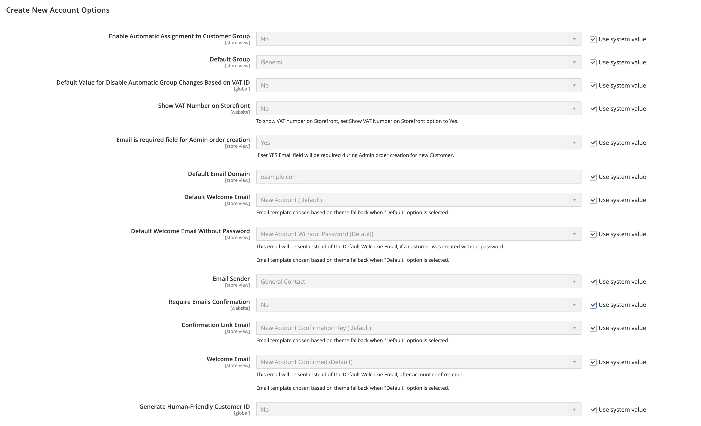
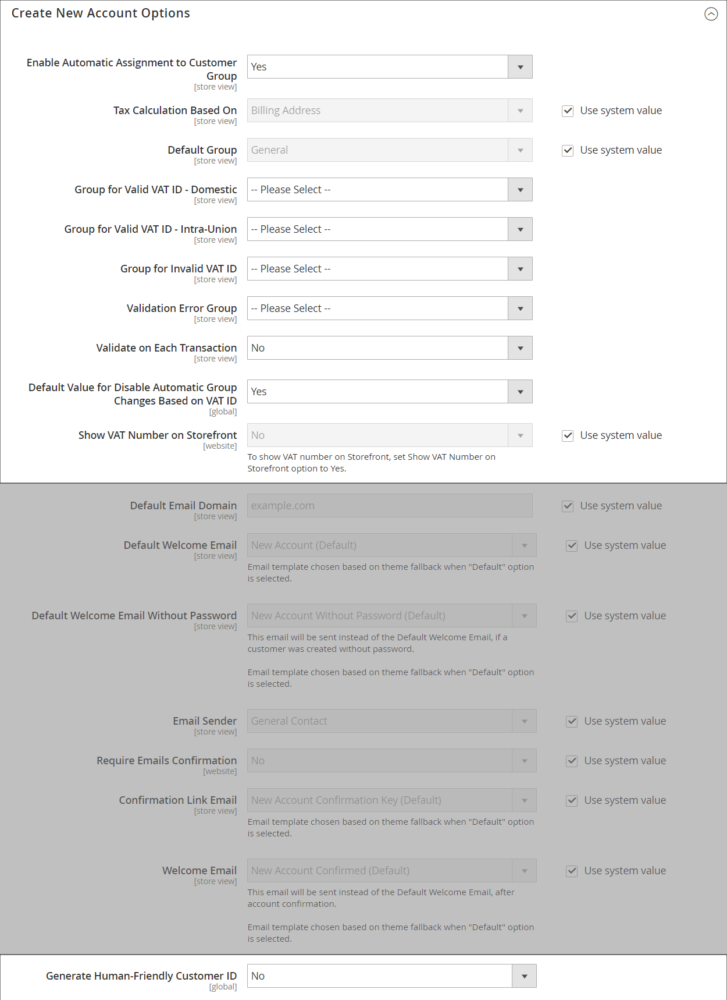

# Nouvelles options de compte client

Dans la section _[!UICONTROL Create New Account Options]_de la configuration, les options de compte de base sont combinées avec des options plus avancées relatives à la validation du numéro individuel d&#39;identification de TVA et aux intégrations personnalisées. Les instructions suivantes ne couvrent que les options les plus fréquemment utilisées. Pour en savoir plus sur les affectations automatiques de groupes de clients, voir [Validation de la TVA](../stores-purchase/vat.md).

{width="600" zoomable="yes"}

## Configurer les options de base du compte client

1. Dans la barre latérale _Admin_, accédez à **[!UICONTROL Stores]** > _[!UICONTROL Settings]_>**[!UICONTROL Configuration]**.

1. Dans le panneau de gauche, développez **[!UICONTROL Customers]** et choisissez **[!UICONTROL Customer Configuration]**.

1. Développez la section **[!UICONTROL Create New Account Options]** :

   {width="600" zoomable="yes"}

1. Définissez chacune des options en fonction de l’expérience client que vous devez prendre en charge sur votre storefront :

   - Définissez **[!UICONTROL Default Group]** sur le groupe de clients affecté aux nouveaux clients lors de la création d’un compte.

   - Si vous disposez d’un numéro _Taxe sur la valeur ajoutée_ et souhaitez qu’il soit visible par les clients, définissez **[!UICONTROL Show VAT Number on Storefront]** sur `Yes`.

   - Pour demander l’e-mail d’un client ou d’une cliente lors de la création d’une commande administrateur pour un client ou une cliente, définissez **[!UICONTROL Email is required field for Admin order creation]** sur `Yes`.

   - Saisissez le **[!UICONTROL Default Email Domain]** du magasin, par exemple `mystore.com`

   - Définissez **[!UICONTROL Default Welcome Email]** sur le modèle utilisé pour l’e-mail de bienvenue envoyé aux nouveaux clients.

   - Pour demander aux clients de confirmer leur demande d’ouverture d’un compte dans votre boutique, définissez **[!UICONTROL Require Emails Confirmation]** sur `Yes`. Ensuite, définissez **[!UICONTROL Confirmation Link Email]** sur le modèle utilisé pour l’e-mail de confirmation.

     >[!NOTE]
     >
     >À partir de la version 2.4.7, les clients doivent saisir à nouveau leur adresse e-mail et leur mot de passe pour se connecter à leur compte après la confirmation par e-mail, quel que soit le navigateur.

   - Définissez **[!UICONTROL Welcome Email]** sur le modèle utilisé pour le message de bienvenue envoyé une fois le compte confirmé.

   - Définissez **[!UICONTROL Default Welcome Email without Password]** sur le modèle utilisé lors de la création d’un compte client qui n’a pas encore de mot de passe. Par exemple, aucun mot de passe n’a encore été attribué au compte client créé à partir de l’administrateur.

   - Définissez **[!UICONTROL Email Sender]** sur le contact du magasin qui apparaît comme expéditeur de l’e-mail de bienvenue.

   - Pour demander aux clients de confirmer leur demande d’ouverture d’un compte dans votre boutique, définissez **[!UICONTROL Require Emails Confirmation]** sur `Yes`. Ensuite, définissez **[!UICONTROL Confirmation Link Email]** sur le modèle utilisé pour l’e-mail de confirmation.

   {width="600" zoomable="yes"}

   Pour plus d’informations sur chacune des options disponibles dans cet ensemble d’options de configuration, consultez le _Guide de référence pour la création d’un compte_ [référence de configuration](../configuration-reference/customers/customer-configuration.md).

1. Cliquez ensuite sur **[!UICONTROL Save Config]**.
