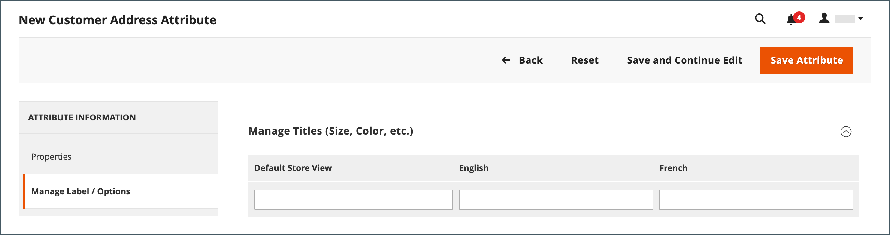

# Attributs d’adresse du client

{{ee-feature}}

Le jeu d’attributs Adresse du client détermine les propriétés des adresses postales saisies dans le [&#x200B; carnet d’adresses &#x200B;](account-dashboard-address-book.md) à partir du compte du client ou lors du [passage en caisse](../stores-purchase/checkout-process.md).

Les attributs d’adresse personnalisés peuvent être configurés pour fournir des informations supplémentaires, telles qu’une adresse e-mail facultative, un compte Skype, un autre numéro de téléphone, un bâtiment ou un pays. L&#39;attribut personnalisé peut ensuite être incorporé dans le modèle [adresse](address-templates.md) utilisé pour produire des documents vente. Le processus de création d’un attribut d’adresse personnalisé est presque identique à celui d’un [attribut du client](attribute-properties.md).

Les attributs d&#39;adresse du client sont utilisés dans les formulaires suivants :

- [Enregistrement de l&#39;adresse du client](account-create.md)
- [Adresse du compte client](account-dashboard-address-book.md)

{width="700" zoomable="yes"}

## Étape 1 : définition des propriétés de l’attribut

1. Dans la barre latérale _Admin_, accédez à **[!UICONTROL Stores]** > _[!UICONTROL Attributes]_>**[!UICONTROL Customer Address]**.

1. Dans le coin supérieur droit, cliquez sur **[!UICONTROL Add New Attribute]**.

   {width="600" zoomable="yes"}

1. Dans la section **[!UICONTROL Attribute Properties]**, procédez comme suit :

   - Saisissez un **[!UICONTROL Default Label]** qui identifie l’attribut lors de la saisie des données.

   - Saisissez un **[!UICONTROL Attribute Code]** qui identifie l’attribut dans le système.

     Le code d’attribut doit commencer par une lettre et peut inclure n’importe quelle combinaison de lettres minuscules (a-z) et de chiffres (0-9). Le code doit comporter moins de 30 caractères et ne peut pas contenir de caractères spéciaux ni d’espaces. Le caractère de soulignement (_) peut être utilisé pour indiquer un espace.

     >[!TIP]
     >
     >**_Shortcut:_** pour ne remplir que les champs obligatoires, faites défiler l’écran vers le bas jusqu’à [!UICONTROL Storefront Properties], saisissez le [!UICONTROL Sort Order] et enregistrez.

1. Pour déterminer le type de contrôle d&#39;entrée utilisé pour la saisie de données, définissez **[!UICONTROL Input Type]** sur l&#39;une des options suivantes :

   - `Text Field` - Champ de texte d’une seule ligne.
   - `Text Area` - Zone de texte multiligne.
   - `Multiple Line` - Crée plusieurs lignes de texte pour l’attribut, comme pour une adresse postale multiligne. Le nombre de lignes de saisie de données distinctes peut être compris entre 2 et 20. Utilisez l’`Default Value` pour spécifier la valeur initiale du champ.
   - `Date` - Affiche un champ de date avec un calendrier pop-up. Propriétés supplémentaires : utilisez `Default Value` pour spécifier la valeur initiale du champ.  Utilisez `Minimal Value` pour spécifier la date la plus proche pouvant être saisie.  Utilisez `Maximum Value` pour spécifier la date la plus récente pouvant être saisie.
   - `Dropdown` - Une liste déroulante qui accepte une seule valeur à sélectionner.
   - `Multiple Select` - Liste déroulante qui accepte plusieurs valeurs à sélectionner.
   - `Yes/No` - Champ qui offre uniquement le choix entre des valeurs `Yes` ou `No`.
   - `File (attachment)` - Champ qui permet de charger un fichier et de l’associer à l’attribut du client en tant que pièce jointe.
   - `Image File` - Champ qui permet de charger une image dans la galerie et de l’associer à l’attribut du client.

1. Si le client doit saisir une valeur dans le champ , définissez **[!UICONTROL Values Required]** sur `Yes`.

1. Pour attribuer une valeur initiale au champ, saisissez un **[!UICONTROL Default Value]**.

1. Pour vérifier l’exactitude des données saisies dans le champ avant l’enregistrement de l’enregistrement, définissez **[!UICONTROL Input Validation]** sur le type de données à autoriser dans le champ. Les valeurs disponibles dépendent du _[!UICONTROL Input Type]_&#x200B;spécifié.

   - `None` - Le champ n’a pas de validation d’entrée lors de la saisie des données.
   - `Alphanumeric` - Accepte toute combinaison de chiffres (0-9) et de caractères alphabétiques (a-z, A-Z) lors de la saisie des données. Pour inclure des caractères spéciaux, reportez-vous à la section [!UICONTROL Escape HTML Entities] de l’étape suivante.
   - `Alphanumeric with Space` - Accepte toute combinaison de chiffres (0-9), de caractères alphabétiques (a-z, A-Z) et d’espaces lors de la saisie des données.
   - `Numeric Only` - Accepte uniquement les nombres (0-9) lors de la saisie des données.
   - `Alpha Only` - Accepte uniquement les caractères alphabétiques (a-z, A-Z) lors de la saisie des données.
   - `URL` - Accepte uniquement une URL lors de la saisie des données.
   - `Email` - Accepte uniquement une adresse e-mail lors de la saisie des données.
   - `Length Only` - Valide l’entrée en fonction de la longueur des données saisies dans le champ.

   >[!NOTE]
   >
   >Pour les attributs d’adresse client définis par le système, tels que _Téléphone_, _Ville_ et _Rue_, Commerce applique la validation côté serveur intégrée, quel que soit le paramètre **[!UICONTROL Input Validation]**. Ces règles par défaut limitent les caractères autorisés pour chaque champ (par exemple, les numéros de téléphone ne peuvent contenir que des chiffres, des espaces et certains symboles). Le paramètre **[!UICONTROL Input Validation]** ajoute d’autres restrictions, mais ne peut pas remplacer la validation intégrée, qui ne peut pas être désactivée via l’interface utilisateur d’administration.

1. Pour appliquer un filtre de prétraitement aux valeurs saisies dans un champ de texte, une zone de texte ou un type de saisie sur plusieurs lignes, définissez **[!UICONTROL Input/Output Filter]** sur l’une des options suivantes :

   - `None` - N’applique pas de filtre au texte saisi dans le champ.
   - `Strip HTML Tags` - Supprime les balises HTML du texte. Ce filtre peut vous aider à nettoyer les données collées dans un champ à partir d’une autre source qui inclut des balises HTML.
   - `Escape  HTML Entities` - Convertit les caractères spéciaux trouvés dans le texte en une séquence d’échappement HTML valide, telle que `&;`. Les séquences d&#39;échappement sont entourées d&#39;une esperluette et d&#39;un point-virgule et sont fréquemment utilisées pour les guillemets intelligents, les droits d&#39;auteur et les symboles de marque. Les séquences d’échappement sont également utilisées pour identifier les caractères tels que les symboles inférieur à (`<`) et supérieur à (`>`), ainsi que l’esperluette, qui sont également utilisés dans le code. Ce filtre peut aider à nettoyer les caractères spéciaux qui sont parfois collés dans les champs de la base de données à partir de traitements de texte.

1. Renseignez les propriétés de la grille et du segment client :

   - Pour pouvoir inclure la colonne dans la grille Clients, définissez **[!UICONTROL Add to Column Options]** sur `Yes`.

   - Pour filtrer la grille Clients en fonction de cet attribut, définissez **[!UICONTROL Use in Filter Options]** sur `Yes`.

   - Pour filtrer la grille des clients par attribut de texte avec différentes conditions de filtrage correspondantes, définissez **[!UICONTROL Grid Filter Condition Type]** sur `Partial Match`, `Prefix Match` ou `Full Match`. Cela n’a aucune incidence sur le champ _Recherche par mot-clé_ de la grille.

   - Pour effectuer une recherche dans la grille des clients à l’aide de cet attribut, définissez **[!UICONTROL Use in Search Options]** sur `Yes`.

   - Pour rendre cet attribut disponible pour les [segments clients](customer-segments.md), définissez **[!UICONTROL Use in Customer Segment]** sur `Yes`.

## Étape 2 : définition des propriétés du storefront

1. Faites défiler l’écran jusqu’à la section **[!UICONTROL Storefront Properties]** .

   {width="600" zoomable="yes"}

1. Pour rendre l’attribut visible pour les clients, définissez **[!UICONTROL Show on Storefront]** sur `Yes`.

1. Saisissez un nombre dans le champ **[!UICONTROL Sort Order]**, qui détermine son ordre d’apparition lorsqu’il est répertorié avec d’autres attributs.

1. Définissez **[!UICONTROL Forms to Use]** sur chaque formulaire à inclure l’attribut.

   Pour choisir les deux options, maintenez la touche Ctrl (PC) ou Commande (Mac) enfoncée tout en cliquant sur chaque formulaire.

   - [Enregistrement de l’adresse du client](account-create.md)
   - [Adresse du compte client](account-dashboard-address-book.md)

## Étape 3 : remplir le libellé et enregistrer

1. Dans le panneau de gauche, choisissez **[!UICONTROL Manage Labels/Options]**.

1. Sous **[!UICONTROL Manage Titles]**, saisissez un libellé pour identifier l’attribut pour chaque [vue de magasin](../getting-started/websites-stores-views.md).

1. Cliquez ensuite sur **[!UICONTROL Save Attribute]**.

   {width="600" zoomable="yes"}

## Descriptions des champs

### [!UICONTROL Attribute Properties]

| Champ | Description |
|--- |--- |
| [!UICONTROL Default Label] | Libellé par défaut qui identifie l’attribut dans Admin et Storefront. |
| [!UICONTROL Attribute Code] | Code unique qui identifie l’attribut dans le système. Le code peut contenir jusqu’à 21 caractères et ne peut pas contenir d’espaces ni de caractères spéciaux. Le symbole de soulignement peut être utilisé à la place d’un espace. |
| [!UICONTROL Input Type] | Détermine le [contrôle de saisie](../catalog/attributes-input-types.md) utilisé pour la saisie de données. Options :  **`Text Field`**- Champ de texte d’une seule ligne. **`Text Area`** - Zone de texte multiligne.  **`Multiple Line`**- Crée plusieurs lignes de texte pour l’attribut, comme pour une adresse postale multiligne. Le nombre de lignes de saisie de données distinctes peut être compris entre 2 et 20. **`Date`** - Affiche un champ de date avec un calendrier pop-up. **`Dropdown`**- Une liste déroulante qui accepte une seule valeur à sélectionner. **`Multiple Select`** - Liste déroulante qui accepte plusieurs valeurs à sélectionner.  **`Yes/No`**- Champ qui offre uniquement le choix entre des valeurs `Yes` ou `No`. **`File (attachment)`** - Champ qui permet de charger un fichier et de l’associer à l’attribut du client en tant que pièce jointe.  **`Image File`**- Champ qui permet de charger une image dans la galerie et de l’associer à l’attribut du client. |
| [!UICONTROL Values Required] | Détermine si une valeur doit être saisie dans le champ. Options : `Yes` / `No` |
| [!UICONTROL Default Value] | Indique la valeur initiale de l’attribut. |
| [!UICONTROL Input Validation] | La sélection des options est déterminée par le type d’entrée. Options :  **`None`**- Le champ n’a pas de validation d’entrée lors de la saisie des données. **`Alphanumeric`** - Accepte toute combinaison de chiffres (0-9) et de caractères alphabétiques (a-z, A-Z) lors de la saisie des données.  **`Alphanumeric with Space`**: autorise les espaces dans l’adresse postale pour répondre aux exigences de longueur maximale de l’opérateur. Lors du passage en caisse, les clients peuvent saisir des lettres (a-z, A-Z), des chiffres (0-9) et des espaces. Les espaces supplémentaires sont supprimés lorsque l’adresse est enregistrée. **`Numeric Only`** - Accepte uniquement les nombres (0-9) lors de la saisie des données.  **`Alpha Only`**- Accepte uniquement les caractères alphabétiques (a-z, A-Z) lors de la saisie des données. **&#x200B; URL &#x200B;**- Accepte uniquement une URL lors de la saisie des données. **`Email`** - Accepte uniquement une adresse e-mail lors de la saisie des données.  **`Length Only`**- Valide l’entrée en fonction de la longueur des données saisies dans le champ.  **&#x200B; Remarque :**&#x200B;pour les attributs définis par le système tels que _Téléphone_, _Ville_ et _Rue_, la validation côté serveur intégrée est toujours appliquée en plus de tout paramètre **[!UICONTROL Input Validation]**. Ces règles par défaut limitent les caractères autorisés pour chaque champ et ne peuvent pas être remplacées. Le paramètre **[!UICONTROL Input Validation]**&#x200B;ajoute uniquement d’autres contraintes. |
| [!UICONTROL Input/Output Filter] | Applique un filtre de pré-traitement aux valeurs saisies dans un champ de texte, une zone de texte ou un type de saisie sur plusieurs lignes avant l’enregistrement. Options :  **`None`**- N’applique pas de filtre au texte saisi dans le champ. **`Strip HTML Tags`** - Supprime les balises HTML du texte. Ce filtre peut vous aider à nettoyer les données collées dans un champ à partir d’une autre source qui inclut des balises HTML.  **`Escape HTML Entities`**- Convertit les caractères spéciaux trouvés dans le texte en une séquence d’échappement HTML valide, telle que `amp;`. Les séquences d&#39;échappement sont comprises entre une esperluette et un point-virgule et sont fréquemment utilisées pour les guillemets intelligents, les symboles de copyright et les symboles de marque de commerce de typographe. Les séquences d’échappement sont également utilisées pour identifier les caractères tels que les symboles inférieur à (`<`) et supérieur à (`>`), ainsi que l’esperluette, qui sont également utilisés dans le code. Ce filtre peut aider à nettoyer les caractères spéciaux qui sont parfois collés dans les champs de la base de données à partir de traitements de texte. |
| [!UICONTROL Add to Column Options] | Indique si l’attribut est inclus en tant que colonne dans la grille [Clients](./customers-all.md). Options : `Yes` / `No` |
| Utiliser dans les options de filtre | Indique si l’attribut peut être utilisé comme filtre pour les opérations de recherche dans la grille. Options : `Yes` / `No` |
| [!UICONTROL Grid Filter Condition Type] | Indique les conditions de correspondance de filtre pour les attributs dans les opérations de recherche à partir de la grille. Cela n’affecte pas le champ _[!UICONTROL Search by keyword]_&#x200B;de la grille. Options : `Partial Match` / `Prefix Match` / `Full Match` |
| [!UICONTROL Use in Search Options] | Indique si la valeur d’attribut peut être utilisée comme mot-clé dans les opérations de recherche. Options : `Yes` / `No` |
| [!UICONTROL Use in Customer Segment] | Détermine si l’attribut est inclus dans les conditions [segment client](./customer-segments.md). Options : `Yes` / `No` |

### [!UICONTROL Storefront Properties]

| Champ | Description |
|--- |--- |
| [!UICONTROL Show on Storefront] | Détermine si l’attribut apparaît en tant que champ dans les informations du client dans le storefront. Options : `Yes` / `No` |
| [!UICONTROL Sort Order] | Indique l’ordre de tri de cet attribut par rapport aux autres attributs du client. L’ordre de tri détermine la séquence dans laquelle les champs reçoivent le focus lors de la saisie de données lors de la navigation au clavier. |
| [!UICONTROL Forms to Use in] | Détermine les pages contenant des formulaires de saisie où l&#39;attribut apparaît. Options :  [`Customer Address Registration`](account-create.md)  [`Customer Account Address`](account-dashboard-address-book.md) |
