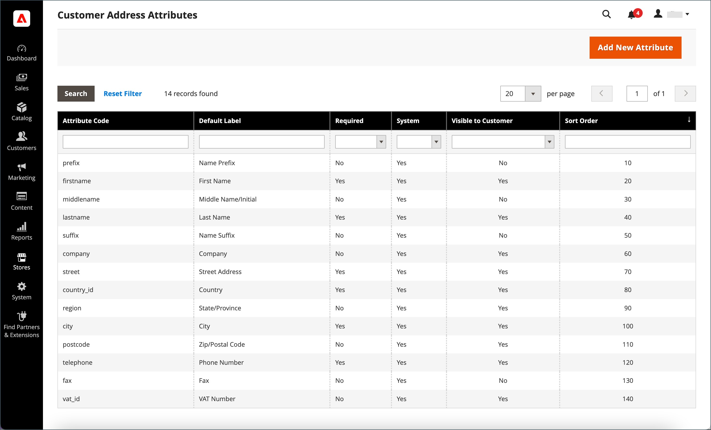

# Attributs d’adresse du client

{{ee-feature}}

Le jeu d’attributs Adresse client détermine les propriétés des adresses de rue saisies dans la variable [carnet d&#39;adresses](account-dashboard-address-book.md) du compte du client ou pendant la [passage en caisse](../stores-purchase/checkout-process.md).

Les attributs d’adresse personnalisés peuvent être configurés pour fournir des informations supplémentaires, telles qu’une adresse électronique facultative, un compte Skype, un numéro de téléphone alternatif, un bâtiment ou un département. L’attribut personnalisé peut ensuite être incorporé dans la variable [modèle d&#39;adresse](address-templates.md) qui est utilisé pour produire des documents de vente. Le processus de création d’un attribut d’adresse personnalisé est presque identique à celui de la création d’un [Attribut du client](attribute-properties.md).

Les attributs d’adresse du client sont utilisés dans les formulaires suivants :

- [Enregistrement de l’adresse du client](account-create.md)
- [Adresse du compte client](account-dashboard-address-book.md)

{width="700" zoomable="yes"}

## Étape 1 : propriétés de l’attribut

1. Sur le _Administration_ barre latérale, accédez à **[!UICONTROL Stores]** > _[!UICONTROL Attributes]_>**[!UICONTROL Customer Address]**.

1. Dans le coin supérieur droit, cliquez sur **[!UICONTROL Add New Attribute]**.

   {width="600" zoomable="yes"}

1. Dans le **[!UICONTROL Attribute Properties]** , procédez comme suit :

   - Saisissez un **[!UICONTROL Default Label]** qui identifie l’attribut lors de la saisie des données.

   - Saisissez un **[!UICONTROL Attribute Code]** qui identifie l’attribut dans le système.

     Le code d’attribut doit commencer par une lettre et peut inclure toute combinaison de lettres minuscules (a-z) et de nombres (0-9). Le code doit comporter moins de 30 caractères et ne peut pas contenir de caractères spéciaux ni d’espaces. Le caractère de soulignement (_) peut être utilisé pour indiquer un espace.

     >[!TIP]
     >
     >**_Raccourci :_** Pour remplir uniquement les champs requis, faites défiler l’écran jusqu’à [!UICONTROL Storefront Properties], saisissez la variable [!UICONTROL Sort Order]et enregistrez.

1. Pour déterminer le type de contrôle d’entrée utilisé pour la saisie de données, définissez **[!UICONTROL Input Type]** à l’une des options suivantes :

   - `Text Field` - Champ de texte d’une seule ligne.
   - `Text Area` - Zone de texte multiligne.
   - `Multiple Line` - Crée plusieurs lignes de texte pour l’attribut, comme une adresse de rue multi-lignes. Le nombre de lignes de saisie de données distinctes peut être compris entre 2 et 20. Utilisez la variable `Default Value` pour spécifier la valeur initiale du champ.
   - `Date` : affiche un champ de date avec un calendrier contextuel. Propriétés supplémentaires : utilisez `Default Value` pour spécifier la valeur initiale du champ.  Utilisation `Minimal Value` pour spécifier la date la plus ancienne pouvant être saisie.  Utilisation `Maximum Value` pour indiquer la date la plus récente pouvant être saisie.
   - `Dropdown` - Liste déroulante qui accepte une seule valeur à sélectionner.
   - `Multiple Select` - Liste déroulante qui accepte plusieurs valeurs à sélectionner.
   - `Yes/No` - Un champ qui offre uniquement un choix `Yes` ou `No` valeurs.
   - `File (attachment)` - Champ qui permet de charger un fichier et de l’associer à l’attribut du client en tant que pièce jointe.
   - `Image File` - Champ qui permet de charger une image dans la galerie et de l’associer à l’attribut du client.

1. Si le client doit saisir une valeur dans le champ, définissez **[!UICONTROL Values Required]** to `Yes`.

1. Pour attribuer une valeur initiale au champ, saisissez une **[!UICONTROL Default Value]**.

1. Pour vérifier l’exactitude des données saisies dans le champ avant l’enregistrement, définissez **[!UICONTROL Input Validation]** au type de données à autoriser dans le champ. Les valeurs disponibles dépendent du _[!UICONTROL Input Type]_spécifié.

   - `None` - Le champ n’a aucune validation d’entrée lors de la saisie des données.
   - `Alphanumeric` - Accepte toute combinaison de nombres (0-9) et de caractères alphabétiques (a-z, A-Z) lors de la saisie des données. Pour inclure des caractères spéciaux, voir [!UICONTROL Escape HTML Entities] à l’étape suivante.
   - `Alphanumeric with Space` - Accepte toute combinaison de nombres (0-9), de caractères alphabétiques (a-z, A-Z) et d’espaces lors de la saisie des données.
   - `Numeric Only` - Accepte uniquement les nombres (0 à 9) lors de la saisie des données.
   - `Alpha Only` : accepte uniquement les caractères alphabétiques (a-z, A-Z) lors de la saisie des données.
   - `URL` : accepte uniquement une URL lors de la saisie des données.
   - `Email` : accepte uniquement une adresse électronique lors de la saisie des données.
   - `Length Only` : valide l’entrée en fonction de la longueur des données saisies dans le champ.

1. Pour appliquer un filtre de prétraitement aux valeurs saisies dans un champ de texte, une zone de texte ou un type de saisie multi-lignes, définissez **[!UICONTROL Input/Output Filter]** à l’une des options suivantes :

   - `None` - N’applique pas de filtre au texte saisi dans le champ.
   - `Strip HTML Tags` - Supprime les balises de HTML du texte. Ce filtre peut aider à nettoyer les données collées dans un champ à partir d’une autre source qui inclut des balises de HTML.
   - `Escape  HTML Entities`  - Convertit les caractères spéciaux trouvés dans le texte en séquence d’échappement de HTML valide, telle que `&;`. Les séquences d’échappement sont entourées d’une esperluette et d’un point-virgule. Elles sont fréquemment utilisées pour les guillemets intelligents du typographe, les symboles de copyright et de marque. Les séquences d’échappement sont également utilisées pour identifier des caractères tels que &quot;inférieur à&quot; (`<`) et supérieur à (`>`) et le caractère de l’esperluette, également utilisés dans le code. Ce filtre peut aider à nettoyer les caractères spéciaux qui sont parfois collés dans des champs de base de données à partir de programmes de traitement de texte.

1. Renseignez les propriétés de grille et de segment du client :

   - Pour inclure la colonne dans la grille Clients, définissez **[!UICONTROL Add to Column Options]** to `Yes`.

   - Pour filtrer la grille Clients selon cet attribut, définissez **[!UICONTROL Use in Filter Options]** to `Yes`.

   - Pour filtrer la grille Clients par attribut de texte avec différentes conditions de correspondance de filtre, définissez **[!UICONTROL Grid Filter Condition Type]** to `Partial Match`, `Prefix Match`, ou `Full Match`. Cela n’affecte pas la variable _Recherche par mot-clé_ pour la grille.

   - Pour rechercher la grille Clients en fonction de cet attribut, définissez **[!UICONTROL Use in Search Options]** to `Yes`.

   - Pour rendre cet attribut disponible pour [segments client](customer-segments.md), définit **[!UICONTROL Use in Customer Segment]** to `Yes`.

## Étape 2 : propriétés du storefront

1. Faites défiler l’écran vers le bas jusqu’à **[!UICONTROL Storefront Properties]** .

   {width="600" zoomable="yes"}

1. Pour rendre l’attribut visible aux clients, définissez **[!UICONTROL Show on Storefront]** to `Yes`.

1. Saisissez un nombre dans le champ **[!UICONTROL Sort Order]** qui détermine son ordre d’apparition lorsqu’il est répertorié avec d’autres attributs.

1. Définir **[!UICONTROL Forms to Use]** à chaque formulaire devant inclure l’attribut .

   Pour choisir les deux options, maintenez la touche Ctrl (PC) ou la touche Commande (Mac) enfoncée lorsque vous cliquez sur chaque formulaire.

   - [Enregistrement de l’adresse du client](account-create.md)
   - [Adresse du compte client](account-dashboard-address-book.md)

## Etape 3 : renseigner le libellé et enregistrer

1. Dans le panneau de gauche, choisissez **[!UICONTROL Manage Labels/Options]**.

1. Sous **[!UICONTROL Manage Titles]**, saisissez un libellé pour identifier l’attribut pour chaque [vue de magasin](../getting-started/websites-stores-views.md).

1. Lorsque vous avez terminé, cliquez sur **[!UICONTROL Save Attribute]**.

   {width="600" zoomable="yes"}

## Descriptions des champs

### [!UICONTROL Attribute Properties]

| Champ | Description |
|--- |--- |
| [!UICONTROL Default Label] | Libellé par défaut qui identifie l’attribut dans l’Admin et le storefront. |
| [!UICONTROL Attribute Code] | Code unique qui identifie l’attribut dans le système. Le code peut contenir jusqu’à 21 caractères et ne peut pas contenir d’espaces ni de caractères spéciaux. Le caractère de soulignement peut être utilisé à la place d’un espace. |
| [!UICONTROL Input Type] | Détermine la variable [contrôle d’entrée](../catalog/attributes-input-types.md) utilisé pour la saisie de données. Options :  **`Text Field`**- Champ de texte d’une seule ligne. **`Text Area`** - Zone de texte multiligne.  **`Multiple Line`**- Crée plusieurs lignes de texte pour l’attribut, comme une adresse de rue multi-lignes. Le nombre de lignes de saisie de données distinctes peut être compris entre 2 et 20. **`Date`** : affiche un champ de date avec un calendrier contextuel. **`Dropdown`**- Liste déroulante qui accepte une seule valeur à sélectionner. **`Multiple Select`** - Liste déroulante qui accepte plusieurs valeurs à sélectionner.  **`Yes/No`**- Un champ qui offre uniquement un choix `Yes` ou `No` valeurs. **`File (attachment)`** - Champ qui permet de charger un fichier et de l’associer à l’attribut du client en tant que pièce jointe.  **`Image File`**- Champ qui permet de charger une image dans la galerie et de l’associer à l’attribut du client. |
| [!UICONTROL Values Required] | Détermine si une valeur doit être saisie dans le champ. Options : `Yes` / `No` |
| [!UICONTROL Default Value] | Indique la valeur initiale de l’attribut. |
| [!UICONTROL Input Validation] | La sélection des options est déterminée par le type d’entrée. Options :  **`None`**- Le champ n’a aucune validation d’entrée lors de la saisie des données. **`Alphanumeric`** - Accepte toute combinaison de nombres (0-9) et de caractères alphabétiques (a-z, A-Z) lors de la saisie des données.  **`Alphanumeric with Space`**- Permet aux espaces de l’adresse de la rue de se conformer aux exigences de longueur maximale du transporteur. Lors du passage en caisse, le client peut saisir n&#39;importe quelle combinaison de nombres (0-9), de caractères alphabétiques (a-z, A-Z) et d&#39;espaces dans l&#39;adresse postale du destinataire et de l&#39;expéditeur. Les espaces supplémentaires sont supprimés lors de l’enregistrement de l’adresse. **`Numeric Only`** - Accepte uniquement les nombres (0 à 9) lors de la saisie des données.  **`Alpha Only`**: accepte uniquement les caractères alphabétiques (a-z, A-Z) lors de la saisie des données. ** URL **: accepte uniquement une URL lors de la saisie des données. **`Email`** : accepte uniquement une adresse électronique lors de la saisie des données.  **`Length Only`**: valide l’entrée en fonction de la longueur des données saisies dans le champ. |
| [!UICONTROL Input/Output Filter] | Applique un filtre de prétraitement aux valeurs saisies dans un champ de texte, une zone de texte ou un type d’entrée multi-lignes avant l’enregistrement. Options :  **`None`**- N’applique pas de filtre au texte saisi dans le champ. **`Strip HTML Tags`** - Supprime les balises de HTML du texte. Ce filtre peut aider à nettoyer les données collées dans un champ à partir d’une autre source qui inclut des balises de HTML.  **`Escape HTML Entities`**- Convertit les caractères spéciaux trouvés dans le texte en séquence d’échappement de HTML valide, telle que `amp;`. Les séquences d’échappement sont entourées d’une esperluette et d’un point-virgule. Elles sont fréquemment utilisées pour les guillemets intelligents du typographe, les symboles de copyright et les symboles de marque. Les séquences d’échappement sont également utilisées pour identifier des caractères tels que &quot;inférieur à&quot; (`<`) et supérieur à (`>`) et le caractère de l’esperluette, également utilisés dans le code. Ce filtre peut aider à nettoyer les caractères spéciaux qui sont parfois collés dans des champs de base de données à partir de programmes de traitement de texte. |
| [!UICONTROL Add to Column Options] | Indique si l’attribut est inclus en tant que colonne dans la variable [Clients](./customers-all.md) grid. Options : `Yes` / `No` |
| Utilisation dans les options de filtre | Indique si l’attribut peut être utilisé comme filtre pour les opérations de recherche à partir de la grille. Options : `Yes` / `No` |
| [!UICONTROL Grid Filter Condition Type] | Spécifie les conditions de correspondance de filtre pour les attributs dans les opérations de recherche à partir de la grille. Cela n’affecte pas la variable _[!UICONTROL Search by keyword]_pour la grille. Options : `Partial Match` / `Prefix Match` / `Full Match` |
| [!UICONTROL Use in Search Options] | Indique si la valeur d’attribut peut être utilisée comme mot-clé dans les opérations de recherche. Options : `Yes` / `No` |
| [!UICONTROL Use in Customer Segment] | Détermine si l’attribut est inclus dans [segment client](./customer-segments.md) conditions. Options : `Yes` / `No` |

### [!UICONTROL Storefront Properties]

| Champ | Description |
|--- |--- |
| [!UICONTROL Show on Storefront] | Détermine si l’attribut apparaît comme un champ dans les informations sur le client dans le storefront. Options : `Yes` / `No` |
| [!UICONTROL Sort Order] | Indique l’ordre de tri de cet attribut par rapport aux autres attributs du client. L’ordre de tri détermine la séquence selon laquelle les champs reçoivent le focus lors de la saisie des données lors de l’utilisation de la navigation au clavier. |
| [!UICONTROL Forms to Use in] | Détermine les pages contenant des formulaires de saisie de données où l’attribut apparaît. Options :  [`Customer Address Registration`](account-create.md)  [`Customer Account Address`](account-dashboard-address-book.md) |
