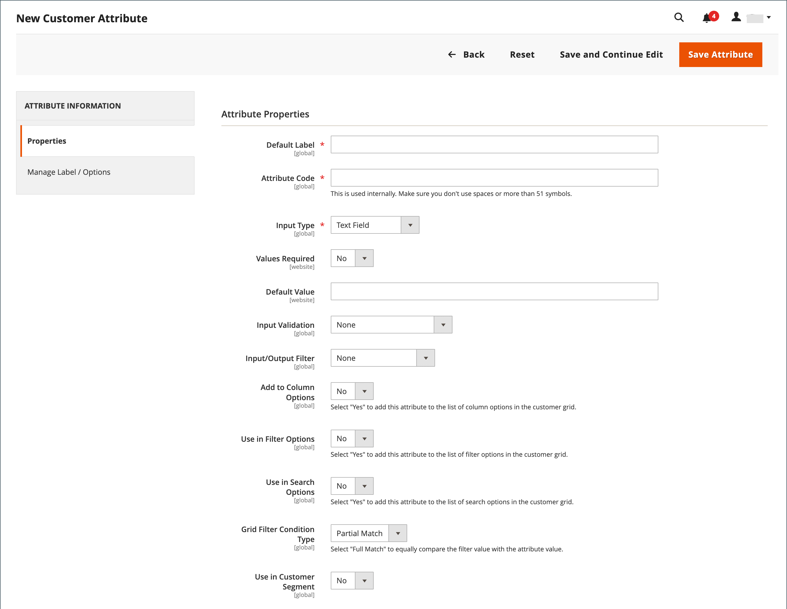
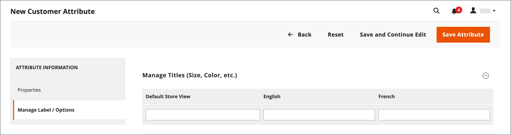

# Propriétés d’attribut du client

{{ee-feature}}

Les attributs du client fournissent les informations requises pour prendre en charge les processus de commande, d’exécution et de gestion des clients. Votre entreprise étant unique, vous aurez peut-être besoin de champs en plus des éléments par défaut fournis par le système. Vous pouvez ajouter des attributs personnalisés aux sections Informations du compte, Carnet d’adresses et Informations de facturation du compte du client. Les [attributs d’adresse](address-attributes.md) du client peuvent également être utilisés dans la section _Informations de facturation_ lors du passage en caisse ou lorsque les clients s’enregistrent pour un compte.

{width="700" zoomable="yes"}

## Étape 1 : définition des propriétés d’attribut

1. Dans la barre latérale _Admin_, accédez à **[!UICONTROL Stores]** > _[!UICONTROL Attributes]_>**[!UICONTROL Customer]**.

1. Dans le coin supérieur droit, cliquez sur **[!UICONTROL Add New Attribute]**.

   {width="600" zoomable="yes"}

1. Dans la section **[!UICONTROL Attribute Properties]**, procédez comme suit :

   - Saisissez un **[!UICONTROL Default Label]** qui identifie l’attribut lors de la saisie des données.

   - Saisissez un **[!UICONTROL Attribute Code]** qui identifie l’attribut dans le système.

   Le code d’attribut doit commencer par une lettre et peut inclure n’importe quelle combinaison de lettres minuscules (a-z) et de chiffres (0-9). Le code doit comporter moins de 30 caractères et ne peut pas contenir de caractères spéciaux ni d’espaces. Le caractère de soulignement (`_`) peut être utilisé pour indiquer un espace.

   >[!TIP]
   >
   >**Raccourci :** pour ne remplir que les champs obligatoires, faites défiler l’écran vers le bas jusqu’à _[!UICONTROL Storefront Properties]_, saisissez le&#x200B;_[!UICONTROL Sort Order]_ et enregistrez.

1. Renseignez les propriétés de saisie des données :

   - Pour déterminer le type de contrôle d&#39;entrée utilisé pour la saisie de données, définissez **[!UICONTROL Input Type]** sur l&#39;une des options suivantes :

     | Type | Description |
     |----|-----------|
     | `Text Field` | Champ de texte d’une seule ligne. |
     | `Text Area` | Champ de saisie de plusieurs lignes permettant de saisir des paragraphes de texte, tels qu’une description de produit. Vous pouvez utiliser l’éditeur WYSIWYG pour formater le texte avec des balises HTML ou saisir directement les balises dans le texte. |
     | `Multiple Line` | Crée plusieurs lignes de texte pour l’attribut, comme pour une adresse postale multiligne. Le nombre de lignes de saisie de données distinctes peut être compris entre deux et 20. Utilisez l’`Default Value` pour spécifier la valeur initiale du champ. |
     | `Date` | Affiche une valeur de date au format de date et dans le fuseau horaire préférés. Les valeurs de date peuvent être sélectionnées dans une liste ou un calendrier (  ).   **_Remarque:_**&#x200B;selon la configuration de votre système, les utilisateurs_ administrateurs_ peuvent saisir des dates directement dans un champ ou sélectionner une date dans le calendrier ou la liste. Pour plus d’informations sur la spécification des valeurs de date et d’heure, voir [Options de date et d’heure](../catalog/attributes-input-types.md#date-and-time-options). |
     | `Yes/No` | Affiche une liste déroulante avec les options prédéfinies de `Yes` et `No`. |
     | `Dropdown` | Affiche une liste déroulante de valeurs qui accepte une seule sélection. Le type d’entrée de liste déroulante est un composant clé des [produits configurables](../catalog/product-create-configurable.md). |
     | `Multiple Select` | Liste déroulante qui accepte plusieurs valeurs à sélectionner. |
     | `File (attachment)` | Champ qui permet de charger un fichier et de l’associer à l’attribut du client en tant que pièce jointe. |
     | `Image File` | Champ qui permet de charger une image dans la galerie et de l’associer à l’attribut du client. |

   - Si le client doit saisir une valeur dans le champ , définissez **[!UICONTROL Values Required]** sur `Yes`.

   - Pour attribuer une valeur initiale au champ, saisissez un **[!UICONTROL Default Value]**.

   - Pour vérifier l’exactitude des données saisies dans le champ avant l’enregistrement de l’enregistrement, définissez **[!UICONTROL Input Validation]** sur le type de données à autoriser dans le champ. Les valeurs disponibles dépendent du [!UICONTROL Input Type] spécifié.

     | Valeur | Description |
     |-----|-----------|
     | `None` | Le champ n’a pas de validation d’entrée lors de la saisie des données. |
     | `Alphanumeric` | Accepte toute combinaison de chiffres (0-9) et de caractères alphabétiques (a-z, A-Z) lors de la saisie des données. Pour inclure des caractères spéciaux, voir _Échappement des entités HTML_. |
     | `Alphanumeric with Space` | Accepte toute combinaison de chiffres (0-9), de caractères alphabétiques (a-z, A-Z) et d&#39;espaces lors de la saisie des données. |
     | `Numeric Only` | Accepte uniquement les nombres (0-9) lors de la saisie des données. |
     | `Alpha Only` | Accepte uniquement les caractères alphabétiques (a-z, A-Z) lors de la saisie des données. |
     | `URL` | Accepte uniquement une URL lors de la saisie des données. |
     | `Email` | Accepte uniquement une adresse e-mail lors de la saisie des données. |
     | `Length Only` | Valide l’entrée en fonction de la longueur des données saisies dans le champ. |

   - Pour limiter la taille des types d’entrée Champ de texte et Zone de texte, saisissez les **[!UICONTROL Minimum Text Length]** et **[!UICONTROL Maximum Text Length]**.

   - Pour appliquer un filtre de prétraitement aux valeurs saisies dans un champ de texte, une zone de texte ou un type de saisie sur plusieurs lignes, définissez **[!UICONTROL Input/Output Filter]** sur l’une des options suivantes :

     | Valeur | Description |
     |-----|-----------|
     | `None` | N’applique pas de filtre au texte saisi dans le champ. |
     | `Strip HTML Tags` | Supprime les balises HTML du texte. Ce filtre peut vous aider à nettoyer les données collées dans un champ à partir d’une autre source qui inclut des balises HTML. |
     | `Escape  HTML Entities` | Convertit les caractères spéciaux trouvés dans le texte en une séquence d’échappement HTML valide, telle que `&;`. Les séquences d&#39;échappement sont entourées d&#39;une esperluette et d&#39;un point-virgule et sont fréquemment utilisées pour les guillemets intelligents, les droits d&#39;auteur et les symboles de marque. Les séquences d’échappement sont également utilisées pour identifier les caractères tels que les symboles inférieur à (`<`) et supérieur à (`>`), ainsi que l’esperluette, qui sont également utilisés dans le code. Ce filtre peut aider à nettoyer les caractères spéciaux qui sont parfois collés dans les champs de la base de données à partir de traitements de texte. |

1. Renseignez les propriétés de la grille et du segment client :

   - Pour pouvoir inclure la colonne dans la grille Clients, définissez **[!UICONTROL Add to Column Options]** sur `Yes`.

   - Pour filtrer la grille Clients en fonction de cet attribut, définissez **[!UICONTROL Use in Filter Options]** sur `Yes`.

   - Pour filtrer la grille des clients par attribut de texte avec différentes conditions de filtrage correspondantes, définissez **[!UICONTROL Grid Filter Condition Type]** sur `Partial Match`, `Prefix Match` ou `Full Match`. Cela n’a aucune incidence sur le champ _Recherche par mot-clé_ de la grille.

   - Pour effectuer une recherche dans la grille des clients à l’aide de cet attribut, définissez **[!UICONTROL Use in Search Options]** sur `Yes`.

   - Pour rendre cet attribut disponible pour les [segments clients](customer-segments.md), définissez **[!UICONTROL Use in Customer Segment]** sur `Yes`.

## Étape 2 : définition des propriétés du storefront

1. Faites défiler l’écran jusqu’à la section **[!UICONTROL Storefront Properties]** .

   {width="600" zoomable="yes"}

1. Pour rendre l’attribut visible pour les clients, définissez **[!UICONTROL Show on Storefront]** sur `Yes`.

1. Saisissez un nombre dans le champ **[!UICONTROL Sort Order]**, qui détermine son ordre d’apparition lorsqu’il est répertorié avec d’autres attributs.

1. Définissez **[!UICONTROL Forms to Use]** sur chaque formulaire à inclure l’attribut. Pour choisir plusieurs options, maintenez la touche Ctrl enfoncée et cliquez sur chaque formulaire.

   - [`Customer Registration`](customer-sign-in.md)
   - [`Customer Account Edit`](account-create.md)
   - [`Admin Checkout`](../stores-purchase/checkout-process.md)

## Étape 3 : remplir le libellé et enregistrer

1. Dans le panneau de gauche, choisissez **[!UICONTROL Manage Labels/Options]**.

1. Sous **[!UICONTROL Manage Titles]**, saisissez un libellé pour identifier l’attribut pour chaque [vue de magasin](../getting-started/websites-stores-views.md).

1. Cliquez ensuite sur **[!UICONTROL Save Attribute]**.

   {width="600" zoomable="yes"}

## Descriptions des champs

### [!UICONTROL Attribute Properties]

| Champ | Description |
|--- |--- |
| [!UICONTROL Default Label] | Libellé par défaut qui identifie l’attribut dans Admin et Storefront. |
| [!UICONTROL Attribute Code] | Code unique qui identifie l’attribut dans le système. Le code peut contenir jusqu’à 60 caractères et ne peut pas contenir d’espaces ni de caractères spéciaux. Le symbole de soulignement peut être utilisé à la place d’un espace. |
| [!UICONTROL Input Type] | Détermine le contrôle d&#39;entrée utilisé pour la saisie de données. Options :  **`Text Field`**- Champ de texte d’une seule ligne. **`Text Area`** - Zone de texte multiligne.  **`Multiple Line`**- Crée plusieurs lignes de texte pour l’attribut, comme pour une adresse postale multiligne. Le nombre de lignes de saisie de données distinctes peut être compris entre 2 et 20. **`Date`** - Affiche un champ de date avec un calendrier pop-up. **`Dropdown`**: une liste déroulante qui accepte une seule valeur à sélectionner. **`Multiple Select`** - Liste déroulante qui accepte plusieurs valeurs à sélectionner.  **`Yes/No`**- Champ qui offre uniquement le choix entre des valeurs `Yes` ou `No`. **`File (attachment)`** - Champ qui permet de charger un fichier et de l’associer à l’attribut du client en tant que pièce jointe.  **`Image File`**- Champ qui permet de charger une image dans la galerie et de l’associer à l’attribut du client. |
| [!UICONTROL Values Required] | Détermine si une valeur doit être saisie dans le champ. Options : `Yes` / `No` |
| [!UICONTROL Default Value] | Indique la valeur initiale de l’attribut. |
| [!UICONTROL Input Validation] | La sélection des options est déterminée par le type d’entrée. Options :  **`None`**- Le champ n’a pas de validation d’entrée lors de la saisie des données. **`Alphanumeric`** - Accepte toute combinaison de chiffres (0-9) et de caractères alphabétiques (a-z, A-Z) lors de la saisie des données.  **`Alphanumeric with Space`**- Permet aux espaces dans l&#39;adresse de la rue de se conformer aux exigences de longueur maximale du transporteur. Lors du passage en caisse, le client peut saisir n’importe quelle combinaison de chiffres (0-9), de caractères alphabétiques (a-z, A-Z) et d’espaces dans la rue du destinataire et de l’expéditeur. Les espaces supplémentaires sont supprimés lorsque l’adresse est enregistrée. **`Numeric Only`** - Accepte uniquement les nombres (0-9) lors de la saisie des données.  **`Alpha Only`**- Accepte uniquement les caractères alphabétiques (a-z, A-Z) lors de la saisie des données. **`URL`** - Accepte uniquement une URL lors de la saisie des données.  **`Email`**- Accepte uniquement une adresse e-mail lors de la saisie des données. **`Length Only`** - Valide l’entrée en fonction de la longueur des données saisies dans le champ. |
| [!UICONTROL Input/Output Filter] | Applique un filtre de pré-traitement aux valeurs saisies dans un champ de texte, une zone de texte ou un type de saisie sur plusieurs lignes avant l’enregistrement. Options :  **`None`**- N’applique pas de filtre au texte saisi dans le champ. **`Strip HTML Tags`** - Supprime les balises HTML du texte. Ce filtre peut vous aider à nettoyer les données collées dans un champ à partir d’une autre source qui inclut des balises HTML.  **`Escape HTML Entities`**- Convertit les caractères spéciaux trouvés dans le texte en une séquence d’échappement HTML valide, telle que `amp;`. Les séquences d&#39;échappement sont comprises entre une esperluette et un point-virgule et sont fréquemment utilisées pour les guillemets intelligents, les symboles de copyright et les symboles de marque de commerce de typographe. Les séquences d’échappement sont également utilisées pour identifier les caractères tels que les symboles inférieur à (`<`) et supérieur à (`>`), ainsi que l’esperluette, qui sont également utilisés dans le code. Ce filtre peut aider à nettoyer les caractères spéciaux qui sont parfois collés dans les champs de la base de données à partir de traitements de texte. |
| [!UICONTROL Add to Column Options] | Indique si l’attribut est inclus en tant que colonne dans la grille [Clients](customers-all.md). Options : `Yes` / `No` |
| [!UICONTROL Use in Filter Options] | Indique si l’attribut peut être utilisé comme filtre pour les opérations de recherche dans la grille. Options : `Yes` / `No` |
| [!UICONTROL Grid Filter Condition Type] | Indique les conditions de filtrage correspondant aux attributs pour les opérations de recherche à partir de la grille. Cela n’a aucune incidence sur le champ _Recherche par mot-clé_ de la grille. Options : `Partial Match` / `Prefix Match` / `Full Match` |
| [!UICONTROL Use in Search Options] | Indique si la valeur d’attribut peut être utilisée comme mot-clé dans les opérations de recherche. Options : `Yes` / `No` |
| [!UICONTROL Use in Customer Segment] | Détermine si l’attribut est inclus dans les conditions [segment client](customer-segments.md). Options : `Yes` / `No` |

### [!UICONTROL Storefront Properties]

| Champ | Description |
|--- |--- |
| [!UICONTROL Show on Storefront] | Détermine si l’attribut apparaît en tant que champ dans les informations du client dans le storefront. Options : `Yes` / `No` |
| [!UICONTROL Sort Order] | Indique l’ordre de tri de cet attribut par rapport aux autres attributs du client. L’ordre de tri détermine la séquence dans laquelle les champs reçoivent le focus lors de la saisie de données lors de la navigation au clavier. |
| [!UICONTROL Forms to Use in] | Détermine les pages contenant des formulaires de saisie où l&#39;attribut apparaît. Options :  [`Customer Registration`](account-dashboard-account-information.md)  [`Customer Account Edit`](account-create.md)  [`Admin Checkout`](../stores-purchase/checkout-process.md) |

## Attributs du client par défaut

| Code attribut | Description |
| --------------- | ------------------ |
| `created_at` | Date de création du compte client. |
| `updated_at` | Date de la dernière mise à jour du compte client. |
| `website_id` | Identifiant du site web sur lequel le compte client a été créé. |
| `store_id` | ID de magasin du site sur lequel le compte client a été créé. |
| `created_in` | Vue du magasin dans lequel le compte a été créé. |
| `group_id` | ID du groupe de clients auquel le client est affecté. |
| `disable_auto_group_change` | Détermine si des groupes de clients peuvent être affectés dynamiquement pendant la validation du [numéro de TVA](../stores-purchase/vat.md#configure-vat-id-validation). |
| `prefix` | Tout préfixe utilisé avec le nom du client (par exemple, M., Mme ou D.). |
| `firstname` | Prénom du client. |
| `middlename` | Deuxième prénom ou deuxième initiale du client. |
| `lastname` | Nom du client. |
| `suffix` | Tout suffixe utilisé avec le nom du client. (comme Jr., Sr. ou Esquire) |
| `email` | Adresse e-mail du client. |
| `dob` | Date de naissance du client.    **_Important:_** Conformément aux bonnes pratiques actuelles en matière de sécurité et de confidentialité, soyez conscient de tous les risques juridiques et de sécurité potentiels associés au stockage de la date de naissance complète du client (mois, jour, année) avec d&#39;autres identifiants personnels. Il est recommandé de limiter le stockage des dates de naissance complètes des clientes et clients et de suggérer d’utiliser leur année de naissance comme alternative. |
| `taxvat` | Identifiant de taxe sur la valeur ajoutée (TVA) attribué au client. Le libellé par défaut de cet attribut est `VAT Number`. Le champ Numéro de TVA est toujours présent dans toutes les adresses des clients pour l’expédition et la facturation lorsqu’il est affiché depuis l’administration, mais n’est pas un champ obligatoire. |
| `gender` | Sexe du client. |

## Démonstration des attributs du client

Pour une démonstration de la création d’attributs du client, regardez cette vidéo :

>[!VIDEO](https://video.tv.adobe.com/v/3410184?captions=fre_fr&quality=12&learn=on)
