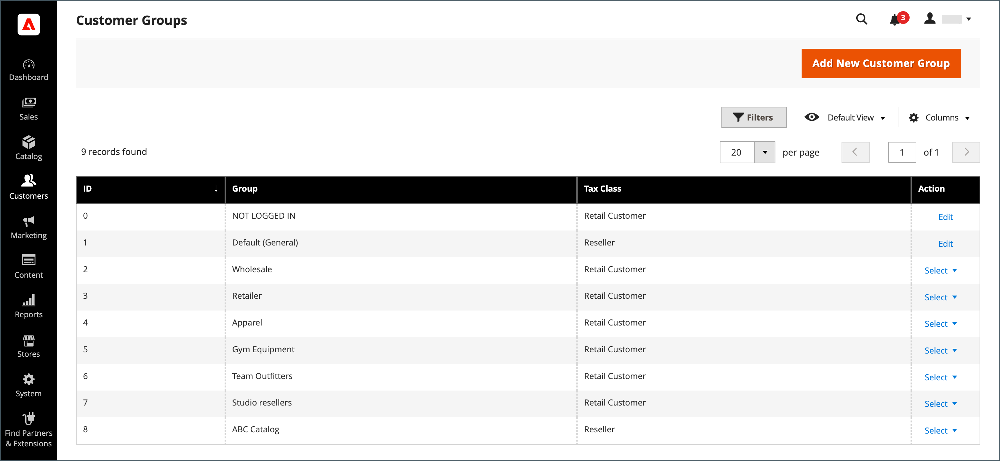
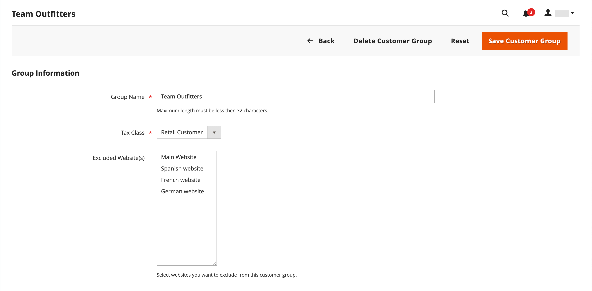
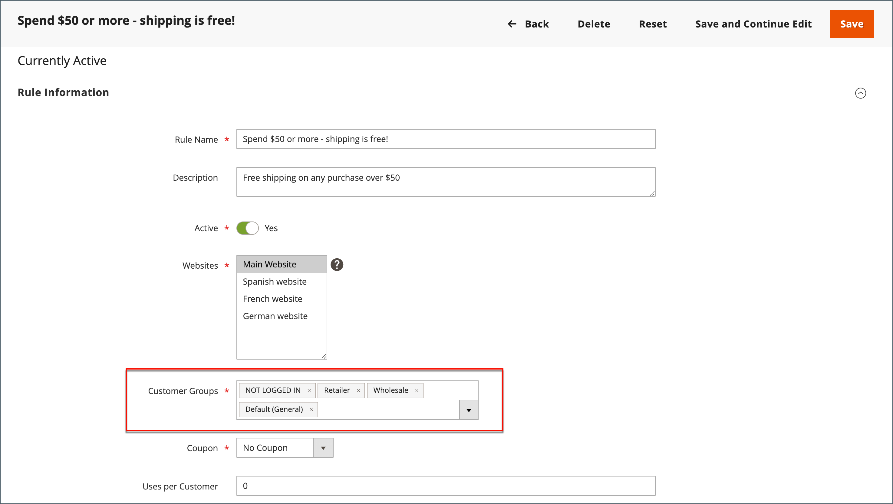

# Groupes de clients

Les groupes de clients déterminent les remises disponibles et la classe de taxe associée au groupe. Les groupes de clients par défaut sont `General`, `Not Logged In` et `Wholesale`.

{width="700" zoomable="yes"}

## Filtrer la liste des [!UICONTROL Customer Groups]

1. Dans la barre latérale _Admin_, accédez à **[!UICONTROL Customers]** > **[!UICONTROL Customer Groups]**.

1. Cliquez sur **[!UICONTROL Filters]**.

1. Saisissez les critères de recherche de groupes, y compris une plage d&#39;ID, de groupe ou de classe de taxe.

   {width="600" zoomable="yes"}

1. Cliquez ensuite sur **[!UICONTROL Apply Filters]**.

## Créer un groupe de clients

>[!NOTE]
>
>Les utilisateurs administrateurs qui n’ont pas accès à tous les sites web (dotés d’un rôle avec un [!UICONTROL Role Scope] « Personnalisé ») ne peuvent pas créer, modifier ni supprimer des groupes de clients.

1. Dans la barre latérale _Admin_, accédez à **[!UICONTROL Customers]** > **[!UICONTROL Customer Groups]**.

1. Cliquez sur **[!UICONTROL Add New Customer Group]**.

1. Par **, saisissez un nom unique contenant moins de 32 caractères pour identifier le groupe.[!DNL **Group Name]

1. Sélectionnez la **[!UICONTROL Tax Class]** qui s’applique au groupe.

   {width="600" zoomable="yes"}

1. Sélectionnez le **[!UICONTROL Excluded Website(s)]** que vous souhaitez exclure du groupe.

   >[!IMPORTANT]
   >
   >L’exclusion de sites web peut réduire le prix des produits et le temps d’indexation des règles de catalogue, car les sites web exclus ne sont pas indexés. Lorsqu’un groupe de clients est enregistré avec une exclusion de site web ajoutée, le prix du produit, la règle de catalogue et les index de recherche catalogue sont invalidés. Si vous disposez de nombreux produits, sites web et groupes de clients, il est recommandé de suspendre le processus de réindexation jusqu’à ce que vous ayez exclu les sites web des groupes de clients.

   Aucun site web n’est exclu par défaut. Pour sélectionner plusieurs valeurs, maintenez la touche _Ctrl_ (PC) ou _Commande_ (Mac) enfoncée et cliquez sur chaque option.

1. Cliquez ensuite sur **[!UICONTROL Save Customer Group]**.

## Modification d’un groupe de clients

1. Dans la barre latérale _Admin_, accédez à **[!UICONTROL Customers]** > **[!UICONTROL Customer Groups]**.

1. Ouvrez l’enregistrement en mode d’édition.

1. Effectuez les modifications nécessaires.

1. Cliquez ensuite sur **[!UICONTROL Save Customer Group]**.

## Affecter un client à un autre groupe

>[!NOTE]
>
>Après avoir modifié le groupe de sociétés, un utilisateur de société doit se déconnecter et se connecter au Storefront pour voir les nouveaux prix dans le catalogue.
>Une fois qu’un client est affecté à une entreprise, le groupe de clients est en lecture seule et ne peut pas être mis à jour par un utilisateur administrateur.

1. Dans la barre latérale _Admin_, accédez à **[!UICONTROL Customers]** > **[!UICONTROL All Customers]**.

1. Recherchez le client dans la liste et cochez la case dans la première colonne.

1. Définissez le contrôle **Actions** sur `Assign a Customer Group` et sélectionnez le groupe dans le menu.

   {width="600" zoomable="yes"}

1. Lorsque vous êtes invité à confirmer, cliquez sur **OK**.

## Associer un groupe de clients à des remises spécifiques

1. Dans la barre latérale _Admin_, accédez à **[!UICONTROL Marketing]** > _Promotions_ > **[!UICONTROL Cart Price Rules]**.

1. Sélectionnez la règle de prix du panier à laquelle vous souhaitez associer un groupe pour la remise appliquée ou [créez une règle de prix](../merchandising-promotions/price-rules-catalog.md).

1. Sélectionnez les groupes de clients auxquels la règle s’applique.

   {width="600" zoomable="yes"}

1. Cliquez sur **[!UICONTROL Save]**.

>[!NOTE]
>
> Vous pouvez également utiliser la tarification anticipée pour appliquer des remises produit à des groupes de clients. Voir [Tarification avancée](../catalog/product-price-group.md).

## Supprimer un groupe de clients

1. Dans la barre latérale _Admin_, accédez à **[!UICONTROL Customers]** > **[!UICONTROL Customer Groups]**.

1. Ouvrez l’enregistrement en mode d’édition.

1. Dans la barre de boutons, cliquez sur **[!UICONTROL Delete Customer Group]**.

1. Lorsque vous êtes invité à confirmer, cliquez sur **OK**.

## Démonstration de groupes de clients

Découvrez comment créer des groupes de clients en regardant cette démonstration :

>[!VIDEO](https://video.tv.adobe.com/v/343660/?quality=12&learn=on)
