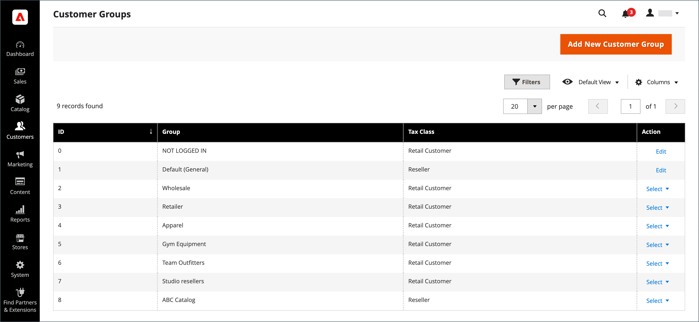
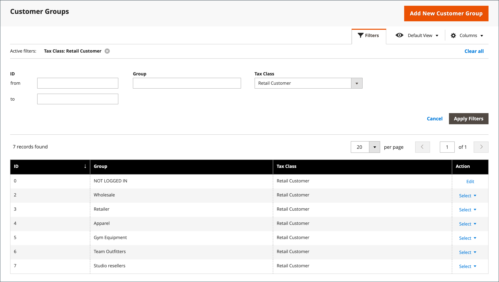

# Groupes de clients

Les groupes de clients déterminent quelles remises sont disponibles et la classe de taxe associée au groupe. Les groupes de clients par défaut sont `General`, `Not Logged In` et `Wholesale`.

{width="700" zoomable="yes"}

## Filtrage de la liste [!UICONTROL Customer Groups]

1. Sur la barre latérale _Admin_, accédez à **[!UICONTROL Customers]** > **[!UICONTROL Customer Groups]**.

1. Cliquez sur **[!UICONTROL Filters]**.

1. Saisissez les critères de recherche de groupes, y compris une plage d’identifiants, de groupe ou de classe fiscale.

   {width="600" zoomable="yes"}

1. Une fois l’opération terminée, cliquez sur **[!UICONTROL Apply Filters]**.

## Créer un groupe de clients

>[!NOTE]
>
>Les utilisateurs administrateurs qui n’ont pas accès à tous les sites web (auxquels est affecté un rôle avec un [!UICONTROL Role Scope] &quot;personnalisé&quot;) ne peuvent pas créer, modifier ou supprimer des groupes de clients.

1. Sur la barre latérale _Admin_, accédez à **[!UICONTROL Customers]** > **[!UICONTROL Customer Groups]**.

1. Cliquez sur **[!UICONTROL Add New Customer Group]**.

1. Pour [!DNL **Group Name]**, saisissez un nom unique de moins de 32 caractères pour identifier le groupe.

1. Sélectionnez le **[!UICONTROL Tax Class]** qui s’applique au groupe.

   {width="600" zoomable="yes"}

1. Sélectionnez le **[!UICONTROL Excluded Website(s)]** que vous souhaitez exclure du groupe.

   >[!IMPORTANT]
   >
   >L’exclusion de sites web peut diminuer le prix du produit et le temps d’indexation des règles de catalogue, car les sites web exclus ne sont pas indexés. Lorsqu’un groupe de clients est enregistré avec une exclusion de site web ajoutée, le prix du produit, la règle de catalogue et les index de recherche de catalogue sont invalidés. Si vous disposez de nombreux produits, sites Web et groupes de clients, il est recommandé de suspendre le processus de réindexation jusqu’à ce que vous ayez exclu les sites Web des groupes de clients.

   Aucun site web n’est exclu par défaut. Pour sélectionner plusieurs valeurs, maintenez la touche _Ctrl_ (PC) ou la touche _Commande_ (Mac) enfoncée et cliquez sur chaque option.

1. Une fois l’opération terminée, cliquez sur **[!UICONTROL Save Customer Group]**.

## Modifier un groupe de clients

1. Sur la barre latérale _Admin_, accédez à **[!UICONTROL Customers]** > **[!UICONTROL Customer Groups]**.

1. Ouvrez l’enregistrement en mode d’édition.

1. Effectuez les modifications nécessaires.

1. Une fois l’opération terminée, cliquez sur **[!UICONTROL Save Customer Group]**.

## Affectation d’un client à un autre groupe

>[!NOTE]
>
>Après avoir modifié le groupe de la société, un utilisateur de la société doit se déconnecter et se connecter à Storefront pour afficher les nouveaux prix dans le catalogue.

1. Sur la barre latérale _Admin_, accédez à **[!UICONTROL Customers]** > **[!UICONTROL All Customers]**.

1. Recherchez le client dans la liste et cochez la case dans la première colonne.

1. Définissez le contrôle **Actions** sur `Assign a Customer Group` et choisissez le groupe dans le menu.

   {width="600" zoomable="yes"}

1. Lorsque vous êtes invité à confirmer l’opération, cliquez sur **OK**.

## Associer un groupe de clients à des remises spécifiques

1. Sur la barre latérale _Admin_, accédez à **[!UICONTROL Marketing]** > _Promotions_ > **[!UICONTROL Cart Price Rules]**.

1. Sélectionnez la règle de prix du panier où vous souhaitez associer un groupe pour la remise appliquée ou [créer une règle de prix](../merchandising-promotions/price-rules-catalog.md).

1. Sélectionnez les groupes de clients auxquels s’applique la règle.

   {width="600" zoomable="yes"}

1. Cliquez sur **[!UICONTROL Save]**.

>[!NOTE]
>
> Vous pouvez également utiliser les tarifs avancés pour appliquer des remises à des groupes de clients. Voir [Prix avancé](../catalog/product-price-group.md).

## Supprimer un groupe de clients

1. Sur la barre latérale _Admin_, accédez à **[!UICONTROL Customers]** > **[!UICONTROL Customer Groups]**.

1. Ouvrez l’enregistrement en mode d’édition.

1. Dans la barre de boutons, cliquez sur **[!UICONTROL Delete Customer Group]**.

1. Lorsque vous êtes invité à confirmer l’opération, cliquez sur **OK**.

## Démonstration des groupes de clients

Découvrez comment créer des groupes de clients en regardant cette démonstration :

>[!VIDEO](https://video.tv.adobe.com/v/343660/?quality=12&learn=on)
