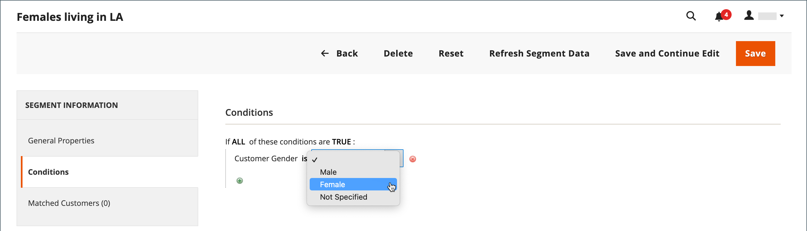

# Création et suppression de segments de clients

{{ee-feature}}

La création d’un segment client est similaire à la création d’un [règle de prix du panier](../merchandising-promotions/price-rules-cart.md), sauf que les options incluent [attributs spécifiques au segment client](../customers/customer-segments.md).

{width="700" zoomable="yes"}

_**[!UICONTROL Customer Segments]grid **_

| Colonne | Description |
|--- |--- |
| **[!UICONTROL ID]** | Identifiant unique du segment client. |
| **[!UICONTROL Segment]** | Nom du segment de client. |
| **[!UICONTROL Status]** | Indique si le segment client est _[!UICONTROL Active]_ou_[!UICONTROL Inactive]_. |
| **[!UICONTROL Website]** | Indique le site web auquel appartient le segment client. |

{style="table-layout:auto"}

## Condition préalable : activation des segments client

1. Sur le _Administration_ barre latérale, accédez à **[!UICONTROL Stores]**  > _[!UICONTROL Settings]_>**[!UICONTROL Configuration]**.

1. Dans le panneau de gauche, développez **[!UICONTROL Customers]** et choisissez **[!UICONTROL Customer Configuration]**.

1. Développez l’objet **[!UICONTROL Customer Segments]** .

1. Vérifiez que **[!UICONTROL Enable Customer Segment Functionality]** est défini sur `Yes`.

   {width="600" zoomable="yes"}

1. (Facultatif) Pour désactiver la validation en temps réel des segments client, définissez **[!UICONTROL Real-time Check if Customer is Matched by Segment]** to `No`.

   Lorsque vous désactivez la validation en temps réel, les segments client sont validés par une seule requête SQL de condition combinée. La désactivation de cette fonction améliore les performances de la validation des segments si le système contient de nombreux segments de clients. Cependant, la validation ne fonctionne pas avec une base de données partagée ou lorsqu’il n’y a aucun client enregistré.

1. Lorsque vous avez terminé, cliquez sur **[!UICONTROL Save Config]**.

## Création d’un segment

Les étapes suivantes utilisent un exemple de création d’un segment client qui cible les clients femmes à Los Angeles.

### Étape 1 : Ajout d’un segment client

1. Sur le _Administration_ barre latérale, accédez à **[!UICONTROL Customers]** > **[!UICONTROL Segments]**.

1. Dans le coin supérieur droit, cliquez sur **[!UICONTROL Add Segment]**.

1. Saisissez un **[!UICONTROL Segment Name]** qui identifie le segment client lorsque vous utilisez l’administrateur.

1. Entrez un résumé **[!UICONTROL Description]** qui explique l’objectif du segment.

1. Définir **[!UICONTROL Assigned to Website]** sur le site web où le segment client peut être utilisé.

1. Définissez la variable **[!UICONTROL Status]** to _Actif_ ou _Inactif_.

1. Pour identifier les types de clients à utiliser pour appliquer le segment, définissez **[!UICONTROL Apply to]** à l’une des options suivantes :

   - `Visitors and Registered Customers` - Inclut tous les acheteurs, qu’ils soient connectés à un compte ou non.
   - `Registered Customers` - Inclut uniquement les acheteurs connectés à un compte.
   - `Visitors` - Inclut uniquement les acheteurs qui ne sont pas connectés à un compte.

   >[!TIP]
   >
   >Si vous créez un segment d’après les attributs du client stockés dans un compte client, il est recommandé d’appliquer le segment uniquement aux clients enregistrés.

   >[!NOTE]
   >
   > Si un segment s’applique à `Visitors and Registered Customers`, la variable [!UICONTROL Matched Customers] affiche uniquement `Registered Customers`. C’est le cas même si les visiteurs peuvent être ciblés selon les conditions qui leur sont applicables. Pour `Visitors` segments uniquement, non `Matched Customers` s’affiche.

1. Cliquez sur **[!UICONTROL Save and Continue Edit]**.

   Après l’enregistrement du segment _[!UICONTROL General Properties]_, d’autres options deviennent disponibles dans le panneau de gauche.

   {width="600" zoomable="yes"}

**_[!UICONTROL General Properties]_**

| Champ | Description |
|--- |---|
| **[!UICONTROL Segment Name]** | Nom qui identifie le segment à des fins de référence interne. |
| **[!UICONTROL Description]** | Brève description qui explique l’objectif du segment à des fins de référence interne. |
| **[!UICONTROL Assigned to Website]** | Site web unique sur lequel le segment peut être utilisé. |
| **[!UICONTROL Status]** | Active et désactive le segment. Toutes les règles de prix et bannières associées sont désactivées lorsque le segment est désactivé. Options : `Active` / `Inactive` |
| **[!UICONTROL Apply to]** | Définit les types de clients auxquels le segment est appliqué. La sélection influence l’ensemble des conditions disponibles pour la création du segment. Une fois le segment enregistré, le paramètre ne peut plus être modifié. |

{style="table-layout:auto"}

### Etape 2 : définir les conditions

>[!NOTE]
>
> Pour les visiteurs, seules les conditions suivantes s’appliquent : Conditions du panier (montant du sous-total du panier, articles de panier et quantité de produits du panier), Règles de produit (produits figurant dans le panier et l’historique des produits) et combinaisons de ces éléments. Si un segment doit s’appliquer à la fois aux visiteurs et aux clients enregistrés, le suivi des visiteurs est effectué en fonction des conditions répertoriées uniquement.

1. Dans le volet de gauche, cliquez sur **[!UICONTROL Conditions]**.

   La condition par défaut commence par _[!UICONTROL If ALL of these conditions are TRUE:]_sur la page.

   {width="600" zoomable="yes"}

1. Créez une condition qui cible les clientes féminines :

   - Cliquez sur le bouton **[!UICONTROL Add]** pour afficher la liste des conditions et sélectionner `Gender`.

   - Laissez la valeur par défaut **is** option de contrôle des conditions.

   - Cliquez sur **..** et sélectionnez `female`.

   {width="600" zoomable="yes"}

1. Créez une autre condition qui cible les résidents de Los Angeles :

   - Sur la ligne suivante, cliquez sur le bouton **[!UICONTROL Add]** et sélectionnez `Customer Address`.

     Cette action crée une condition parent dans laquelle vous pouvez définir un ou plusieurs champs d’adresse à associer.

   - Cliquez sur le bouton **[!UICONTROL Add]** pour afficher la liste des champs d&#39;adresse et sélectionner `City`.

   - Cliquez sur **is** pour afficher les options de contrôle des conditions, puis sélectionnez `contains`.

   - Cliquez sur **..** et saisissez `Los Angeles`.

   - Sur la ligne suivante, cliquez sur le bouton **[!UICONTROL Add]** et sélectionnez `State/Province`.

   - Laissez la valeur par défaut **is** option de contrôle des conditions.

   - Cliquez sur **..** et sélectionnez `United States > California`.

   {width="600" zoomable="yes"}

1. Cliquez sur **[!UICONTROL Save and Continue Edit]**.

### Étape 3 : consultez la liste des clients correspondants

1. Dans le volet de gauche, cliquez sur **[!UICONTROL Matched Customers]** pour afficher tous les clients qui correspondent à la condition.

   {width="600" zoomable="yes"}

1. Si la liste de clients atteint votre objectif, cliquez sur **[!UICONTROL Save]** pour terminer le segment client.

1. Le segment de client peut désormais être utilisé pour cibler des promotions, du contenu et des envois.

_**[!UICONTROL Matched Customers]grid **_

| Colonne | Description |
|--- |--- |
| **[!UICONTROL ID]** | ID de client d’un client enregistré. |
| **[!UICONTROL Name]** | Nom d’un client enregistré. |
| **[!UICONTROL Email]** | Adresse électronique d’un client enregistré. |
| **[!UICONTROL Group]** | Groupe de clients auquel le client est affecté. |
| **[!UICONTROL Phone]** | Numéro de téléphone du client. |
| **[!UICONTROL ZIP]** | Code postal du client. |
| **[!UICONTROL Country]** | Pays où se trouve le client. |
| **[!UICONTROL State / Province]** | État ou province où se trouve le client. |
| **[!UICONTROL Customer Since]** | Date et heure de création du compte client. |

{style="table-layout:auto"}

## Suppression d’un segment client

1. Sur le _Administration_ barre latérale, accédez à **[!UICONTROL Customers]** > **[!UICONTROL Segments]**.

1. Recherchez le segment à supprimer et sélectionnez-le.

1. Dans la barre de menus, cliquez sur **[!UICONTROL Delete]** bouton .

1. Pour confirmer l’action, cliquez sur **[!UICONTROL OK]**.

## Barre de boutons

| Bouton | Description |
|--- |--- |
| **[!UICONTROL Back]** | Renvoie à la variable _[!UICONTROL Customer Segments]_sans enregistrer les modifications. |
| **[!UICONTROL Delete]** | Supprime le segment client actuel. Les clients ou les commandes terminées associées au client dans le segment ne sont pas supprimés. |
| **[!UICONTROL Reset]** | Réinitialise les modifications non enregistrées du formulaire de segment client sur leurs valeurs précédentes. |
| **[!UICONTROL Refresh Segment Data]** | Actualise les données du segment aux valeurs enregistrées les plus récemment. Pertinent si des données de segment sont indisponibles ou obsolètes. |
| **[!UICONTROL Save and Continue Edit]** | Enregistre les modifications et conserve le segment client ouvert. |
| **[!UICONTROL Save]** | Enregistre les modifications et ferme le segment client. |

{style="table-layout:auto"}

## Démonstration des segments client

Regardez cette vidéo pour une démonstration de la création de segments de clients :

>[!VIDEO](https://video.tv.adobe.com/v/343659/?quality=12)
