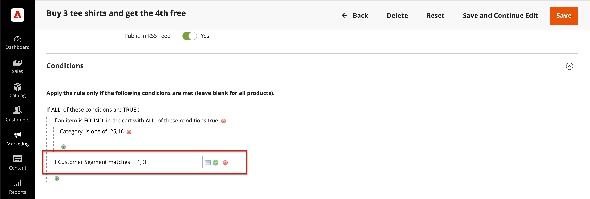

# Segments de client dans les règles de prix

{{ee-feature}}

Un segment de client peut être utilisé pour les promotions ciblées en l’associant à un [règle de prix du panier](../merchandising-promotions/price-rules-cart.md).

{width="700" zoomable="yes"}

_**Pour associer un segment à une règle de prix de panier :**_

1. Sur le _Administration_ barre latérale, accédez à **[!UICONTROL Marketing]** > _Promotions_ > **[!UICONTROL Cart Price Rules]**.

1. Ouvrez une règle nouvelle ou existante :

   * Pour utiliser une nouvelle règle, cliquez sur **[!UICONTROL Add New Rule]** dans le coin supérieur droit.
   * Pour utiliser une règle existante, cliquez sur la règle dans la liste pour l’ouvrir en mode d’édition.

1. Faites défiler l’écran vers le bas et développez **[!UICONTROL Conditions]** .

1. Ajoutez la condition .

   * Cliquez sur le bouton _Ajouter_ (), qui affiche la liste des conditions. Sélectionnez ensuite **[!UICONTROL Customer Segment]**.

   {width="600" zoomable="yes"}

   Par défaut, la condition est définie pour trouver une condition correspondante. Si nécessaire, cliquez sur l’icône **[!UICONTROL matches]** et définissez l&#39;opérateur sur l&#39;une des options suivantes :

   * `does not match`
   * `is one of`
   * `is not one of`

   {width="600" zoomable="yes"}

1. Pour cibler un segment spécifique, cliquez sur Plus **..** pour afficher d’autres options. Cliquez ensuite sur le bouton _Sélecteur_ () pour afficher la liste des segments de clients.

1. Dans la liste, cochez la case de chaque segment que vous souhaitez cibler avec la condition .

   {width="600" zoomable="yes"}

1. Cliquez sur **[!UICONTROL Select]** pour placer les segments de clients sélectionnés dans la condition.

1. Effectuez le reste de la règle de prix selon vos besoins.

1. Lorsque vous avez terminé, cliquez sur **[!UICONTROL Save]**.
