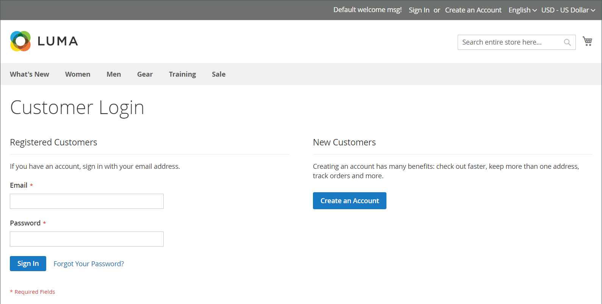

# Connexion client

Les clients ont facilement accès à leurs comptes depuis chaque page de votre boutique. Selon la [configuration](../customers/account-options-new.md), les clients peuvent être redirigés vers le tableau de bord de leur compte ou continuer à acheter après s’être connectés à leur compte.

Si le [CAPTCHA](../systems/security-captcha.md) est activé dans la configuration, la personne doit effectuer correctement un test qui vérifie qu’elle est humaine, avant d’accéder à ses comptes.

Lorsque les clients oublient leurs mots de passe, un lien de réinitialisation est envoyé à l’adresse e-mail associée au compte. La configuration [Options de mot de passe](../customers/password-options.md) contrôle l’expérience client pour les tentatives de connexion :

- Nombre de fois qu’un client peut tenter de saisir un mot de passe
- Nombre de minutes entre les tentatives
- Nombre total de tentatives avant verrouillage du compte
- Durée du verrouillage

{width="700" zoomable="yes"}

## Connexion à un compte client

1. Dans l’en-tête du magasin, le client clique sur **[!UICONTROL Sign in]**.

   {width="700" zoomable="yes"}

1. Saisit leur adresse **[!UICONTROL Email]** et leur **[!UICONTROL Password]**.

1. Effectue un clic sur **[!UICONTROL Sign in]**.

   >[!IMPORTANT]
   >
   >S’il ne parvient pas à se souvenir de son mot de passe, le client peut cliquer sur **[!UICONTROL Forgot Your Password?]** et suivre les [instructions](../customers/password-reset.md) pour le réinitialiser.

## Définir la redirection vers le tableau de bord du compte après la connexion du client

Vous pouvez configurer le magasin pour rediriger les clients vers le tableau de bord de leur compte après leur connexion ou les laisser continuer leurs achats.

1. Dans la barre latérale _Admin_, accédez à **[!UICONTROL Stores]** > _[!UICONTROL Settings]_>**[!UICONTROL Configuration]**.

1. Dans le panneau de gauche, développez **[!UICONTROL Customers]** et choisissez **[!UICONTROL Customer Configuration]**.

1. Développez la section **[!UICONTROL Login Options]** .

1. Définissez **[!UICONTROL Redirect Customer to Account Dashboard after Logging in]** sur l’une des options suivantes :

   - `Yes` - Le tableau de bord du compte s’affiche lorsque les clients se connectent à leur compte.
   - `No` - Les clients peuvent continuer à faire des achats après s’être connectés à leur compte.

1. Cliquez ensuite sur **[!UICONTROL Save Config]**.

## Se connecter avec Amazon

Pour les magasins disposant d’une intégration [!DNL Amazon Pay] et [!DNL Login with Amazon] configurée, les clients peuvent se connecter à leur compte d’acheteur Amazon.

1. Dans l’en-tête du magasin, le client clique sur **[!UICONTROL Sign in]**.

1. Effectue un clic sur **[!UICONTROL Login with Amazon]**.

   {width="700" zoomable="yes"}

1. Lorsque vous êtes invité à vous connecter, le client saisit le **[!UICONTROL email address]** et le **[!UICONTROL password]** de son compte d&#39;acheteur Amazon.

   {width="700" zoomable="yes"}

1. Pour accorder à Amazon l’autorisation de partager les informations suivantes de son compte avec la boutique lors du traitement des achats, clique sur **OK**.

   - Nom
   - Adresse e-mail
   - Adresses d’expédition

   {width="700" zoomable="yes"}

## Se déconnecter d’un compte client

1. Dans le coin supérieur droit à côté de _[!UICONTROL Welcome, Customer Name!]_, le client clique sur le sélecteur de menu **[!UICONTROL v]**.

1. Choisissez **[!UICONTROL Sign Out]**.

Après la déconnexion, le client est redirigé vers la page d’accueil.
