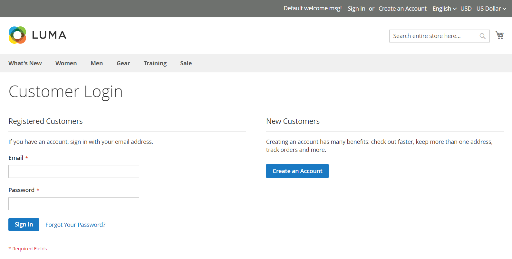

# Connexion du client

Les clients ont un accès facile à leurs comptes à partir de chaque page de votre magasin. Selon la [configuration](../customers/account-options-new.md), les clients peuvent être redirigés vers le tableau de bord de leur compte ou continuer à faire des achats après s’être connectés à leurs comptes.

Si [CAPTCHA](../systems/security-captcha.md) est activé dans la configuration, la personne doit effectuer correctement un test qui les vérifie comme étant humains, avant d’accéder à ses comptes.

Lorsque les clients oublient leurs mots de passe, un lien de réinitialisation est envoyé à l’adresse électronique associée au compte. La configuration [Password Options](../customers/password-options.md) contrôle l’expérience client pour les tentatives de connexion :

- Nombre de tentatives de saisie d’un mot de passe par un client
- Nombre de minutes entre les tentatives
- Nombre total de tentatives avant le verrouillage du compte.
- Durée du verrouillage

{width="700" zoomable="yes"}

## Connexion à un compte client

1. Dans l’en-tête du magasin, le client clique sur **[!UICONTROL Sign in]**.

   {width="700" zoomable="yes"}

1. Entrez leur adresse **[!UICONTROL Email]** et **[!UICONTROL Password]**.

1. Clics **[!UICONTROL Sign in]**.

   >[!IMPORTANT]
   >
   >S’ils ne peuvent pas mémoriser leur mot de passe, le client peut cliquer sur **[!UICONTROL Forgot Your Password?]** et suivre les [instructions](../customers/password-reset.md) pour réinitialiser le mot de passe.

## Définir la redirection vers le tableau de bord du compte après connexion du client

Vous pouvez configurer le magasin pour rediriger les clients vers le tableau de bord de leur compte une fois qu’ils se sont connectés ou leur permettre de continuer à effectuer des achats.

1. Sur la barre latérale _Admin_, accédez à **[!UICONTROL Stores]** > _[!UICONTROL Settings]_>**[!UICONTROL Configuration]**.

1. Dans le panneau de gauche, développez **[!UICONTROL Customers]** et choisissez **[!UICONTROL Customer Configuration]**.

1. Développez la section **[!UICONTROL Login Options]** .

1. Définissez **[!UICONTROL Redirect Customer to Account Dashboard after Logging in]** sur l’une des options suivantes :

   - `Yes` - Le tableau de bord du compte s’affiche lorsque les clients se connectent à leurs comptes.
   - `No` - Les clients peuvent continuer à effectuer des achats après s’être connectés à leurs comptes.

1. Une fois l’opération terminée, cliquez sur **[!UICONTROL Save Config]**.

## Connexion avec Amazon

Pour les magasins avec une intégration [!DNL Amazon Pay] et [!DNL Login with Amazon] configurée, les clients peuvent se connecter à leur compte client Amazon.

1. Dans l’en-tête du magasin, le client clique sur **[!UICONTROL Sign in]**.

1. Clics **[!UICONTROL Login with Amazon]**.

   {width="700" zoomable="yes"}

1. Lorsque le client est invité à se connecter, il entre dans les **[!UICONTROL email address]** et **[!UICONTROL password]** pour son compte d’acheteur Amazon.

   {width="700" zoomable="yes"}

1. Pour accorder à Amazon l’autorisation de partager les informations suivantes de leur compte avec la boutique lors du traitement des achats, cliquez sur **Ok**.

   - Nom
   - Adresse électronique
   - Adresses d’expédition

   {width="700" zoomable="yes"}

## Déconnexion d’un compte client

1. Dans le coin supérieur droit en regard de _[!UICONTROL Welcome, Customer Name!]_, le client clique sur le sélecteur de menus **[!UICONTROL v]**.

1. Sélectionnez **[!UICONTROL Sign Out]**.

Après la déconnexion, le client est redirigé vers la page d’accueil.
