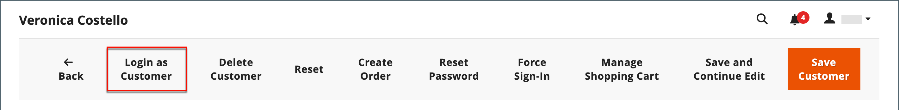
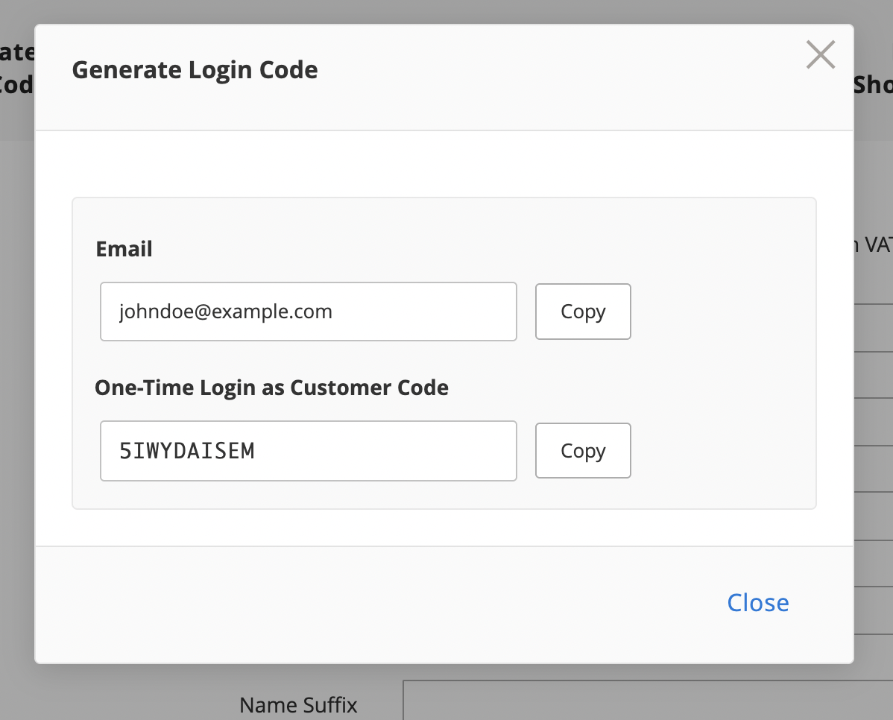

# Fournir une assistance aux acheteurs

Parfois, les clients ont besoin d’aide pour passer leur commande. Les administrateurs de boutique peuvent utiliser _Connexion en tant que client_, ce qui leur permet de voir ce que le client voit et d’effectuer des mises à jour pour les aider.

Toutes les actions effectuées lors de la connexion en tant que client sont appliquées au compte réel du client.

>[!BEGINTABS]

>[!TAB Tab]

[!BADGE PaaS uniquement]{type=Informative url="https://experienceleague.adobe.com/fr/docs/commerce/user-guides/product-solutions" tooltip="S’applique uniquement aux projets Adobe Commerce on Cloud (infrastructure PaaS gérée par Adobe) et aux projets On-premise."}

Lorsqu’il est activé pour un utilisateur _Admin_, le bouton _[!UICONTROL Login as Customer]_&#x200B;s’affiche sur plusieurs pages :

* [Page de modification du client](../customers/update-account.md)
* [Page Vue Commande](../stores-purchase/order-processing.md)
* [Page Vue Facture](../stores-purchase/invoices.md)
* [Page Expédition - Vue](../stores-purchase/shipments.md)
* [Page d&#39;affichage de l&#39;avoir](../stores-purchase/credit-memo-create.md)

{width="600" zoomable="yes"}

>[!TAB Adobe Commerce as a Cloud Service]

[!BADGE SaaS uniquement]{type=Positive url="https://experienceleague.adobe.com/fr/docs/commerce/user-guides/product-solutions" tooltip="S’applique uniquement aux projets Adobe Commerce as a Cloud Service et Adobe Commerce Optimizer (infrastructure SaaS gérée par Adobe)."}

Dans Adobe Commerce as a Cloud Service, la fonction Connexion en tant que client utilise un workflow **Code à usage unique (OTC)** plutôt qu’une connexion directe. Les administrateurs génèrent un code de courte durée à usage unique pour un client. Ce code peut ensuite être échangé contre un jeton d’accès client via GraphQL, ce qui permet une connexion sans mot de passe en tant que workflows client pour les scénarios d’achats assistés par le vendeur.

La fonction comprend les composants suivants :

* **Interface utilisateur d’administration** - Sur la page de modification du client, les administrateurs peuvent demander un code à usage unique (OTC) au lieu de se connecter directement en tant que client.
* **[API REST](https://developer.adobe.com/commerce/webapi/rest/saas-integrations/login-as-customer/)** - Point d’entrée programmatique pour la génération OTC, utile pour les scripts d’administration et les intégrations tierces.
* **API GraphQL** - Mutations qui échangent un OTC contre un jeton d’accès client pour les flux commerciaux storefront ou headless.

>[!ENDTABS]

## Activer la connexion en tant que client

L’activation de la _Connexion en tant que client_ nécessite l’activation de la fonctionnalité dans votre instance Commerce, puis l’activation de l’accès pour les utilisateurs administrateurs dans les autorisations de rôle d’utilisateur.

### Activer la fonctionnalité

1. Dans la barre latérale d’administration, accédez à **[!UICONTROL Stores]** > _[!UICONTROL Settings]_>**[!UICONTROL Configuration]**.

1. Dans le panneau de gauche, développez **[!UICONTROL Customers]** et choisissez **[!UICONTROL Login as Customer]**.

   {width="600" zoomable="yes"}

1. Définissez **[!UICONTROL Enable Login as Customer]** sur `Yes`.

1. _(Facultatif)_ Définissez **[!UICONTROL Disable Page Cache for Admin User]** sur `No` pour activer le cache de page lorsque l’utilisateur administrateur se connecte en tant que client.

   >[!WARNING]
   >
   > La désactivation du cache de page (`Yes`, par défaut) garantit que l’utilisateur qui se connecte en tant que client obtient des données récentes et non mises en cache.

1. _(Facultatif)_ Définissez **[!UICONTROL Store View to Log in]** sur `Manual Selection` si vous disposez d’une configuration multisite et/ou multimagasin et souhaitez que l’utilisateur administrateur sélectionne la vue du magasin lors de la connexion en tant que client.

1. Cliquez ensuite sur **[!UICONTROL Save Config]**.

### Activer l’accès pour les utilisateurs administrateurs

1. Dans la barre latérale _Admin_, accédez à **[!UICONTROL System]** > _Autorisations_ > **[!UICONTROL User Roles]**.

1. Cliquez sur le rôle dans la liste.

1. Dans le panneau de gauche [!UICONTROL _Informations sur le rôle_], cliquez sur **[!UICONTROL Role Resources]**.

1. Remplacez **[!UICONTROL Role Resources]** sur la page par `Custom`.

   >[!INFO]
   >
   > Lorsque cette option est sélectionnée, la hiérarchie de ressources s’affiche dans la page.

1. Faites défiler l’écran jusqu’à l’élément parent **[!UICONTROL Customers]** et l’élément **[!UICONTROL Login as Customer]** en dessous. Sélectionnez ensuite les ressources à activer pour le rôle :

   * **[!UICONTROL Allow Login as Customer]** : permet à l’utilisateur administrateur d’utiliser la fonction _Connexion en tant que client_.
   * **[!UICONTROL View Login as Customer Log]** : permet à l’utilisateur administrateur d’afficher le journal _Connexion en tant que client_.

   {width="400" zoomable="yes"}

1. Cliquez sur **[!UICONTROL Save Role]**.

## Autorisation du compte client pour l’assistance d’achat à distance

Pour autoriser l’accès au compte pour le personnel d’assistance du magasin à partir de l’administrateur, un client doit activer la fonctionnalité pour son compte :

>[!BEGINTABS]

>[!TAB Tab]

[!BADGE PaaS uniquement]{type=Informative url="https://experienceleague.adobe.com/fr/docs/commerce/user-guides/product-solutions" tooltip="S’applique uniquement aux projets Adobe Commerce on Cloud (infrastructure PaaS gérée par Adobe) et aux projets On-premise."}

1. Le client accède à la page de **[!UICONTROL Account Information]**.

1. Sélectionne la case à cocher **[!UICONTROL Allow remote shopping assistance]**.

1. Le client clique sur **[!UICONTROL Save]**.

{width="700" zoomable="yes"}

>[!TAB Adobe Commerce as a Cloud Service]

[!BADGE SaaS uniquement]{type=Positive url="https://experienceleague.adobe.com/fr/docs/commerce/user-guides/product-solutions" tooltip="S’applique uniquement aux projets Adobe Commerce as a Cloud Service et Adobe Commerce Optimizer (infrastructure SaaS gérée par Adobe)."}

L’attribut d’extension `login_as_customer_assistance_allowed` doit être défini sur **2** pour le client. Elle peut être configurée sur la page **Modifier le client** dans l’administration ou via GraphQL lors de la création ou de la modification d’un client.

>[!WARNING]
>
>Sans cette autorisation, un utilisateur administrateur ne peut pas se connecter en tant que ce client.

{width="600" zoomable="yes"}

Pour définir cette autorisation avec GraphQL pour un compte client existant, définissez l’entrée `allow_remote_shopping_assistance` sur `true` à l’aide des mutations [`updateCustomerV2`](https://developer.adobe.com/commerce/webapi/graphql/schema/customer/mutations/update-v2/) ou [`createCustomerV2`](https://developer.adobe.com/commerce/webapi/graphql/schema/customer/mutations/create-v2/).

>[!ENDTABS]

## Connectez-vous en tant que client à partir de l’administrateur

>[!BEGINTABS]

>[!TAB Tab]

[!BADGE PaaS uniquement]{type=Informative url="https://experienceleague.adobe.com/fr/docs/commerce/user-guides/product-solutions" tooltip="S’applique uniquement aux projets Adobe Commerce on Cloud (infrastructure PaaS gérée par Adobe) et aux projets On-premise."}

1. Dans la barre latérale _Admin_, accédez à **[!UICONTROL Customers]** > [!UICONTROL _Tous les clients_].

1. Ouvrez un utilisateur en mode d’édition.

1. Dans le panneau **[!UICONTROL Customer Information]**, choisissez la section **[!UICONTROL Account Information]** .

1. Définissez la **[!UICONTROL Allow remote shopping assistance]** sur `Yes`.

   >[!INFO]
   >
   >L’administrateur peut désormais se connecter en tant qu’utilisateur sans son autorisation du storefront.

>[!TAB Adobe Commerce as a Cloud Service]

[!BADGE SaaS uniquement]{type=Positive url="https://experienceleague.adobe.com/fr/docs/commerce/user-guides/product-solutions" tooltip="S’applique uniquement aux projets Adobe Commerce as a Cloud Service et Adobe Commerce Optimizer (infrastructure SaaS gérée par Adobe)."}

>[!NOTE]
>
>Pour obtenir des conseils sur l’implémentation de cette fonctionnalité à l’aide de REST, consultez la documentation de l’API REST [Connexion en tant que client](https://developer.adobe.com/commerce/webapi/rest/saas-integrations/login-as-customer/).

### Demander un code à usage unique (OTC) à l’administrateur

1. Accédez à **[!UICONTROL Customers]** et sélectionnez un client pour ouvrir la page de modification.

1. Sur la page Modifier le client, cliquez sur **[!UICONTROL Generate Login Code]**.

   {width="600" zoomable="yes"}

1. Saisissez un **[!UICONTROL Reason]** (obligatoire) et cliquez sur **[!UICONTROL Request]**.

   {width="600" zoomable="yes"}

   >[!NOTE]
   >
   >Le champ **Motif** est obligatoire. Il est transmis au flux de génération OTP et est réservé à une utilisation dans les fonctionnalités d’audit et de journalisation des événements à venir.

1. Le document OTC généré s’affiche dans la boîte de dialogue modale. Utilisez ce code avec la mutation `generateCustomerToken` ou `exchangeOtpForCustomerToken` GraphQL pour l’autorisation du client.

   {width="300" zoomable="yes"}

>[!IMPORTANT]
>
>Le code à usage unique généré en vente libre est valide pendant 60 secondes par défaut et est invalidé après une seule utilisation. La TTL peut être configurée en envoyant un ticket d’assistance [support](https://experienceleague.adobe.com/home?lang=fr&support-tab=home#support).

Une fois le code unique généré, vous pouvez l’utiliser en accédant à votre storefront et en vous connectant à l’aide des informations d’identification suivantes :

* **E-mail** : adresse e-mail du client
* **Mot de passe** : code à usage unique (OTC) généré

>[!ENDTABS]

## Utiliser la connexion en tant que client

>[!INFO]
>
>Pour utiliser _Connexion en tant que client_, vérifiez que votre administrateur est configuré comme décrit précédemment.

_Connexion en tant que client_ vous permet d’afficher le site comme le fait le client, ainsi que de résoudre les problèmes et d’effectuer d’autres actions pour le client. Si un rôle d’utilisateur vous est affecté avec les autorisations requises :

1. Vous pouvez cliquer sur **[!UICONTROL Login as Customer]** ou **[!UICONTROL Generate Login Code]** dans les pages répertoriées dans la section précédente.
1. Les actions Se connecter en tant que client sont disponibles dans le rapport d’actions.

>[!WARNING]
>
>Toutes les actions entreprises lors de la connexion [!UICONTROL _en tant que client_] (telles que l’ajout ou la suppression de produits) sont appliquées à la commande réelle du client. Sur le storefront, une bannière s’affiche lorsque vous êtes `logged in as customer_name` de fournir un rappel de l’état spécial.

## Connexion en tant que journalisation client

{{ee-feature}}

Adobe Commerce fournit une journalisation pour les actions _Connexion en tant que client_. Il répertorie toutes les sessions au cours desquelles un utilisateur administrateur accède à la fonctionnalité. Pour accéder aux actions consignées, accédez au [Rapport d’actions de l’administrateur](../systems/action-log-report.md).

Vous pouvez filtrer le paramètre de rapport **[!UICONTROL Action Group]** pour qu’il s’`Login As Customer` en haut de la page et en cliquant sur **[!UICONTROL Search]**.

{width="700" zoomable="yes"}
