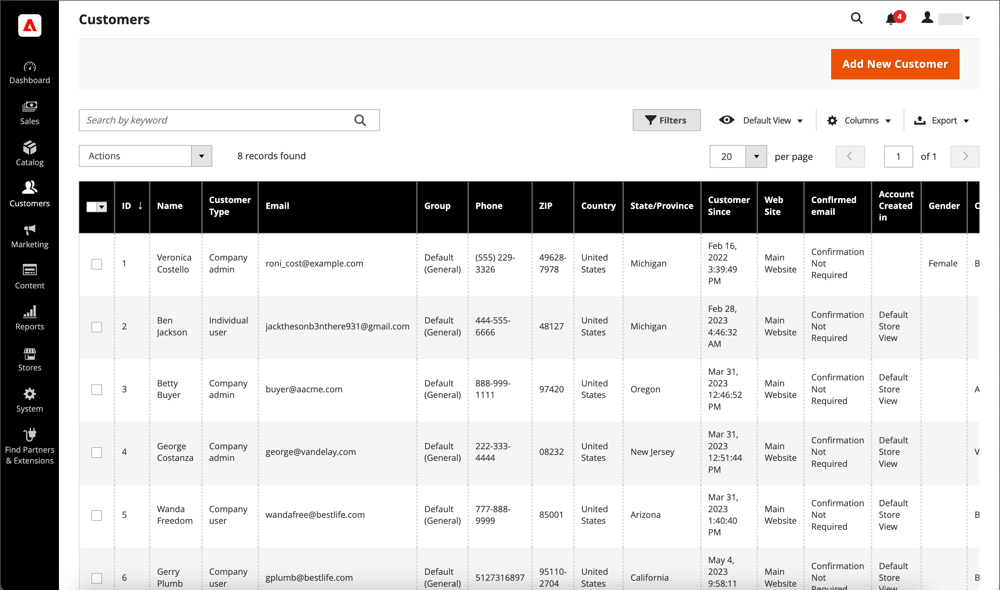

# Gestion des comptes clients

Utilisez la variable _[!UICONTROL Customers]_grille pour trouver n’importe quel compte client. Vous pouvez utiliser la variable [contrôles sur le lieu de travail](../getting-started/admin-workspace.md) pour filtrer la liste, modifiez la variable [mise en page des colonnes](../getting-started/admin-grid-controls.md), enregistrez les vues et exportez les données. La variable [Contrôle des actions](../getting-started/admin-actions-control.md) au-dessus de la grille peut être utilisé pour appliquer une opération à plusieurs enregistrements de client.

{width="700" zoomable="yes"}

Voir [Mise à jour du profil client](update-account.md) pour plus d’informations sur les mises à jour manuelles d’un compte client.

## Actions du compte client

1. Sur le _Administration_ barre latérale, accédez à **[!UICONTROL Customers]** > **[!UICONTROL All Customers]**.

1. Dans la première colonne de la grille, cochez la case de chaque enregistrement à mettre à jour.

1. Suivez les instructions de l’action que vous souhaitez appliquer.

   >[!INFO]
   >
   >Les actions suivantes peuvent être appliquées à un ou plusieurs enregistrements.

1. Lorsque vous avez terminé, cliquez sur **[!UICONTROL Save Config]**.

### S’abonner à la newsletter

Dans les configurations multi-magasin et multi-site avec une [portée du compte client](../customers/customer-account-scope.md), un compte client peut être abonné à des newsletters dans plusieurs sites ou magasins. Si vous appliquez la variable _Abonner_ pour un compte client, elle active l’abonnement à la newsletter uniquement pour la vue de site/magasin par défaut.

* Définissez la variable **[!UICONTROL Actions]** contrôler à `Subscribe to newsletter`.

Voir [Gestion des abonnés](../merchandising-promotions/newsletter-subscribers.md) pour plus d’informations sur la gestion des abonnements à des newsletters pour un client.

### Se désabonner de la newsletter

Dans les configurations multi-magasin et multi-site avec une [portée du compte client](customer-account-scope.md), un compte client peut être abonné à des newsletters pour plusieurs sites/magasins. Si vous appliquez la variable _Désabonner_ pour un compte client, tous les abonnements actifs sont désabonnés.

1. Définissez la variable **[!UICONTROL Actions]** contrôler à `Unsubscribe to newsletter`.

1. Lorsque vous y êtes invité, cliquez sur **OK**.

### Attribution d’un groupe de clients

1. Définissez la variable **[!UICONTROL Actions]** contrôler à `Assign a customer group`.

1. Sélectionnez le groupe de clients auquel tous les enregistrements de clients sélectionnés doivent être attribués.

1. Lorsque vous y êtes invité, cliquez sur **[!UICONTROL OK]**.

### Suppression de comptes clients

Les comptes clients supprimés ne peuvent pas être restaurés. Les informations sur l’activité et les transactions des clients sont conservées dans le système.

1. Définissez la variable **[!UICONTROL Actions]** contrôler à `Delete`.

1. Lorsque vous y êtes invité, cliquez sur **[!UICONTROL OK]**.

## Exporter des comptes clients

1. Sur le _Administration_ barre latérale, accédez à **[!UICONTROL Customers]** > **[!UICONTROL All Customers]**.

1. Dans le menu En-tête du tableau, cliquez sur **[!UICONTROL Export]** et sélectionnez le format souhaité :

   * CSV
   * XML Excel

1. Cliquez sur **[!UICONTROL OK]**.

   Le fichier se trouve dans votre dossier de téléchargements par défaut.

L’instruction ci-dessus exporte tous les comptes clients. Si vous souhaitez exporter un ensemble limité, cochez les cases correspondant aux comptes à exporter ou utilisez des filtres dans le panneau de contrôle pour sélectionner une plage de comptes clients.

## Actions/contrôles

| Option | Description |
|--- |--- |
| **[!UICONTROL Delete]** | Supprime les comptes clients sélectionnés. Si le compte client appartient à un administrateur de société pour un magasin B2B, un autre utilisateur de société doit être affecté en tant qu’administrateur pour que le compte client puisse être supprimé. |
| **[!UICONTROL Subscribe to Newsletter]** | Abonne les clients sélectionnés à la newsletter. |
| **[!UICONTROL Unsubscribe from Newsletter]** | Désabonne les clients sélectionnés de la newsletter. |
| **[!UICONTROL Assign a Customer Group]** | Affecte des clients sélectionnés à un groupe de clients. |
| **[!UICONTROL Edit]** | Permet de modifier certaines valeurs d’un seul enregistrement client sélectionné à partir de la grille. Par défaut, les valeurs suivantes sont disponibles pour une modification rapide : Email, Groupe, Téléphone, ZIP, Site Web, Numéro de TVA fiscal et Genre. |

{style="table-layout:auto"}

## Colonnes

| Colonne | Description |
|--- |--- |
| **[!UICONTROL Select]** | Gère les sélections de cases à cocher pour les enregistrements de client lors de l’application d’une action. Vous pouvez également utiliser le contrôle de sélection dans l’en-tête de colonne pour tout sélectionner/tout désélectionner. |
| **[!UICONTROL ID]** | Identifiant numérique unique attribué lors de la création du compte client. |
| **[!UICONTROL Name]** | Prénom et nom du client. |
| **[!UICONTROL Email]** | Adresse électronique du client. |
| **[!UICONTROL Group]** | Groupe de clients auquel le client est affecté. |
| **[!UICONTROL Phone]** | Numéro de téléphone du client. |
| **[!UICONTROL ZIP]** | Code postal du client. |
| **[!UICONTROL Country]** | Pays où se trouve le client. |
| **[!UICONTROL State/Province]** | État ou province où se trouve le client. |
| **[!UICONTROL Customer Since]** | Date et heure de création du compte client. |
| **[!UICONTROL Web Site]** | Site web dans la hiérarchie de magasins à laquelle le compte client est associé. |
| **[!UICONTROL Confirmed Email]** | Indique si un email de confirmation est requis. |
| **[!UICONTROL Account Created In]** | Indique la vue de magasin à partir de laquelle le compte client a été créé. |
| **[!UICONTROL Date of Birth]** | La date de naissance du client. Conformément aux bonnes pratiques actuelles en matière de sécurité et de confidentialité, gardez à l’esprit tout risque juridique et de sécurité potentiel associé au stockage de la date de naissance complète des clients (mois, jour, année) avec d’autres identifiants personnels. Il est recommandé de limiter le stockage des dates de naissance complètes des clients et de suggérer d’utiliser l’année de naissance du client comme alternative. |
| **[!UICONTROL Tax / VAT Number]** | Le cas échéant, le numéro de la taxe ou [taxe sur la valeur ajoutée](../stores-purchase/vat.md) numéro attribué au client.    Ce champ est différent du champ Numéro de TVA. |
| **[!UICONTROL Gender]** | Genre du client. |
| **[!UICONTROL Action]** | Modifier : ouvre le compte de l’entreprise en mode d’édition. |

{style="table-layout:auto"}

### Colonnes supplémentaires

Ces colonnes sont disponibles en modifiant la variable [mise en page des colonnes](../getting-started/admin-grid-controls.md) de la grille.

| Colonne | Description |
|--- |--- |
| **[!UICONTROL Company]** | Nom de la société du client. |
| **[!UICONTROL Street Address]** | Adresse postale du client. |
| **[!UICONTROL City]** | Ville où se trouve le client. |
| **[!UICONTROL Fax]** | Le numéro de fax du client, le cas échéant. |
| **[!UICONTROL Billing Firstname]** | Prénom dans l’adresse de facturation du client. |
| **[!UICONTROL Billing Lastname]** | Nom dans l’adresse de facturation du client. |
| **[!UICONTROL Billing Address]** | Adresse à laquelle les informations de facturation doivent être envoyées. |
| **[!UICONTROL Shipping Address]** | Adresse à laquelle les commandes doivent être expédiées. |
| **[!UICONTROL VAT Number]** | Numéro de taxe sur la valeur ajoutée associé à l’adresse du client. Pour [biens numériques](../stores-purchase/taxes.md) vendue dans l&#39;UE, la TVA est basée sur l&#39;adresse de facturation du client.    Ce champ n&#39;est pas le même que le champ Numéro de taxe/TVA. |
| **[!UICONTROL Account Lock]** | Indique le statut du compte. Pour des raisons de sécurité, les comptes clients peuvent être [verrouillé](../customers/password-options.md) après trop de tentatives de connexion. Valeurs : `Locked` / `Unlocked` |
| **[!UICONTROL Status]** | État actuel de l’utilisateur. Options : `Active` / `Inactive` |
| **[!UICONTROL Customer Type]** | Classification du client. Options : `Individual user` / `Company admin` / `Company user` |
| **[!UICONTROL Sales Representative]** | Le représentant commercial qui est désigné comme point de contact pour un compte de société et reçoit tous les messages électroniques automatisés liés à la société. |

{style="table-layout:auto"}
