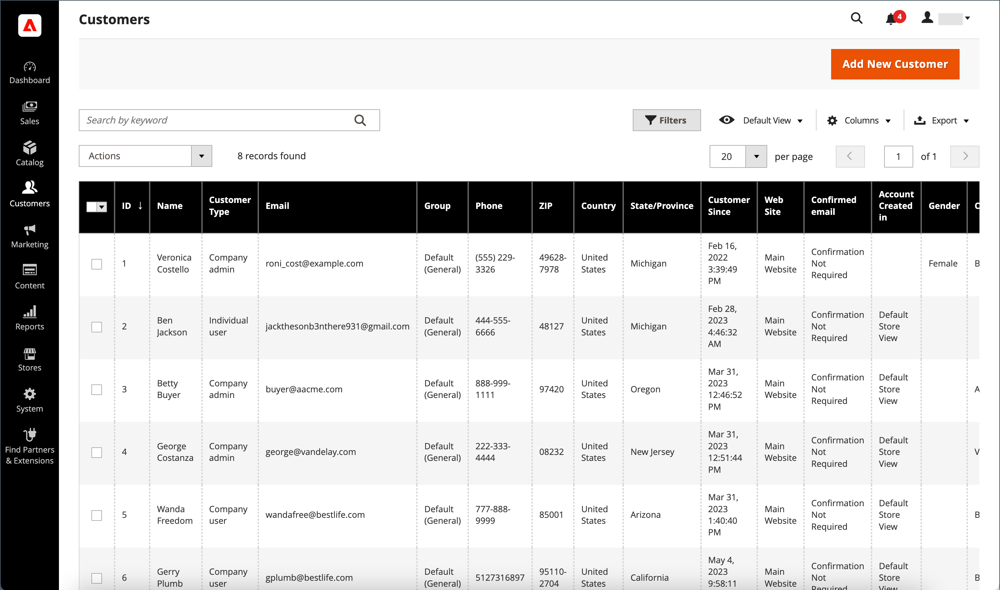

# Gestion des comptes client

Utilisez la grille de _[!UICONTROL Customers]_pour trouver n’importe quel compte client. Vous pouvez utiliser les [contrôles de lieu de travail](../getting-started/admin-workspace.md) standard pour filtrer la liste, modifier la [disposition des colonnes](../getting-started/admin-grid-controls.md), enregistrer les vues et exporter les données. Le contrôle [Actions](../getting-started/admin-actions-control.md) situé au-dessus de la grille peut être utilisé pour appliquer une opération à plusieurs enregistrements de clients.

{width="700" zoomable="yes"}

Voir [Mettre à jour le profil client](update-account.md) pour plus d’informations sur les mises à jour manuelles d’un compte client.

## Actions du compte client

1. Dans la barre latérale _Admin_, accédez à **[!UICONTROL Customers]** > **[!UICONTROL All Customers]**.

1. Dans la première colonne de la grille, cochez la case de chaque enregistrement à mettre à jour.

1. Suivez les instructions correspondant à l’action à appliquer.

   >[!INFO]
   >
   >Les actions suivantes peuvent être appliquées à un ou plusieurs enregistrements.

1. Cliquez ensuite sur **[!UICONTROL Save Config]**.

### S’abonner à la newsletter

Dans les configurations multi-magasin et multi-site avec une étendue de compte client globale [customer account scope](../customers/customer-account-scope.md), un compte client peut être abonné à des newsletters de plusieurs sites ou magasins. Si vous appliquez l’action _S’abonner_ à un compte client, elle active uniquement l’abonnement à la newsletter pour la vue de site/magasin par défaut.

* Définissez la commande **[!UICONTROL Actions]** sur `Subscribe to newsletter`.

Consultez [Gérer les abonnés](../merchandising-promotions/newsletter-subscribers.md) pour plus d’informations sur la gestion des abonnements aux newsletters pour un client.

### Se désabonner de la newsletter

Dans les configurations multi-magasin et multi-site avec une étendue de compte client globale [customer account scope](customer-account-scope.md), un compte client peut être abonné à des newsletters pour plusieurs sites/magasins. Si vous appliquez l’action _Se désabonner_ à un compte client, tous les abonnements actifs sont désabonnés.

1. Définissez la commande **[!UICONTROL Actions]** sur `Unsubscribe to newsletter`.

1. Lorsque vous êtes invité à confirmer, cliquez sur **OK**.

### Affecter un groupe de clients

1. Définissez la commande **[!UICONTROL Actions]** sur `Assign a customer group`.

1. Choisissez le groupe de clients auquel tous les enregistrements de clients sélectionnés doivent être affectés.

1. Lorsque vous êtes invité à confirmer, cliquez sur **[!UICONTROL OK]**.

### Supprimer des comptes clients

Les comptes client supprimés ne peuvent pas être restaurés. Les informations sur l’activité et les transactions des clients sont conservées dans le système.

1. Définissez la commande **[!UICONTROL Actions]** sur `Delete`.

1. Lorsque vous êtes invité à confirmer, cliquez sur **[!UICONTROL OK]**.

## Exporter les comptes clients

1. Dans la barre latérale _Admin_, accédez à **[!UICONTROL Customers]** > **[!UICONTROL All Customers]**.

1. Dans le menu d’en-tête du tableau, cliquez sur **[!UICONTROL Export]** et sélectionnez le format souhaité :

   * CSV
   * XML Excel

1. Cliquez sur **[!UICONTROL OK]**.

   Le fichier est placé dans votre dossier de téléchargements par défaut.

L’instruction ci-dessus exporte tous les comptes clients. Si vous souhaitez exporter un ensemble limité, cochez les cases correspondant aux comptes à exporter ou utilisez les filtres du Panneau de contrôle pour sélectionner une plage de comptes clients.

## Actions/contrôles

| Option | Description |
|--- |--- |
| **[!UICONTROL Delete]** | Supprime les comptes clients sélectionnés. Si le compte client appartient à un administrateur d’entreprise pour un magasin B2B, un autre utilisateur d’entreprise doit être affecté en tant qu’administrateur avant que le compte client puisse être supprimé. |
| **[!UICONTROL Subscribe to Newsletter]** | Abonne les clients sélectionnés à la newsletter. |
| **[!UICONTROL Unsubscribe from Newsletter]** | Désabonne les clients sélectionnés de la newsletter. |
| **[!UICONTROL Assign a Customer Group]** | Affecte les clients sélectionnés à un groupe de clients. |
| **[!UICONTROL Edit]** | Permet de modifier certaines valeurs d’un seul enregistrement client sélectionné à partir de la grille. Par défaut, les valeurs suivantes sont disponibles pour une modification rapide : E-mail, Groupe, Téléphone, ZIP, Site web, Numéro de TVA fiscal et Sexe. |

{style="table-layout:auto"}

## Colonnes

| Colonne | Description |
|--- |--- |
| **[!UICONTROL Select]** | Gère les sélections de cases à cocher pour les enregistrements de client pour l’application d’une action. Vous pouvez également utiliser la commande de sélection de l’en-tête de colonne pour tout sélectionner/désélectionner. |
| **[!UICONTROL ID]** | Identifiant numérique unique attribué lors de la création du compte client. |
| **[!UICONTROL Name]** | Prénom et nom du client. |
| **[!UICONTROL Email]** | Adresse e-mail du client. |
| **[!UICONTROL Group]** | Groupe de clients auquel le client est affecté. |
| **[!UICONTROL Phone]** | Numéro de téléphone du client. |
| **[!UICONTROL ZIP]** | Code postal du client. |
| **[!UICONTROL Country]** | Pays dans lequel le client est situé. |
| **[!UICONTROL State/Province]** | État ou province où se trouve le client. |
| **[!UICONTROL Customer Since]** | Date et heure de création du compte client. |
| **[!UICONTROL Web Site]** | Site web dans la hiérarchie du magasin auquel le compte client est associé. |
| **[!UICONTROL Confirmed Email]** | Indique si un e-mail de confirmation est requis. |
| **[!UICONTROL Account Created In]** | Indique la vue du magasin à partir de laquelle le compte client a été créé. |
| **[!UICONTROL Date of Birth]** | Date de naissance du client. Conformément aux bonnes pratiques actuelles en matière de sécurité et de confidentialité, soyez conscient de tous les risques juridiques et de sécurité potentiels associés au stockage de la date de naissance complète du client (mois, jour, année) avec d&#39;autres identifiants personnels. Il est recommandé de limiter le stockage des dates de naissance complètes des clientes et clients et de suggérer d’utiliser leur année de naissance comme alternative. |
| **[!UICONTROL Tax / VAT Number]** | Le cas échéant, le numéro de taxe ou [taxe sur la valeur ajoutée](../stores-purchase/vat.md) attribué au client.    Ce champ est différent du numéro de TVA. |
| **[!UICONTROL Gender]** | Sexe du client. |
| **[!UICONTROL Action]** | Modifier - Ouvre le compte d’entreprise en mode d’édition. |

{style="table-layout:auto"}

### Colonnes supplémentaires

Ces colonnes sont disponibles en modifiant la [disposition des colonnes](../getting-started/admin-grid-controls.md) de la grille.

| Colonne | Description |
|--- |--- |
| **[!UICONTROL Company]** | Nom de la société du client. |
| **[!UICONTROL Street Address]** | Adresse postale du client. |
| **[!UICONTROL City]** | Ville où se trouve le client. |
| **[!UICONTROL Fax]** | Numéro de fax du client, le cas échéant. |
| **[!UICONTROL Billing Firstname]** | Prénom dans l’adresse de facturation du client. |
| **[!UICONTROL Billing Lastname]** | Nom dans l’adresse de facturation du client. |
| **[!UICONTROL Billing Address]** | Adresse à laquelle les informations de facturation doivent être envoyées. |
| **[!UICONTROL Shipping Address]** | Adresse à laquelle les commandes doivent être expédiées. |
| **[!UICONTROL VAT Number]** | Numéro de TVA associé à l&#39;adresse du client. Pour les [biens numériques](../stores-purchase/taxes.md) vendus dans l’UE, la TVA est basée sur l’adresse de facturation du client.    Ce champ n&#39;est pas identique au numéro de taxe/TVA. |
| **[!UICONTROL Account Lock]** | Indique le statut du compte. Par mesure de sécurité, les comptes clients peuvent être [verrouillés](../customers/password-options.md) après un trop grand nombre de tentatives de connexion. Valeurs : `Locked` / `Unlocked` |
| **[!UICONTROL Status]** | Statut actuel de l’utilisateur. Options : `Active` / `Inactive` |
| **[!UICONTROL Customer Type]** | Classification des clients. Options : `Individual user` / `Company admin` / `Company user` |
| **[!UICONTROL Sales Representative]** | Représentant commercial désigné comme point de contact pour un compte d’entreprise et qui reçoit tous les e-mails automatisés liés à l’entreprise. |

{style="table-layout:auto"}
