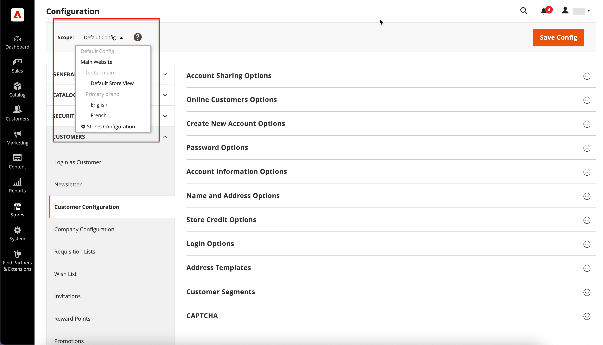
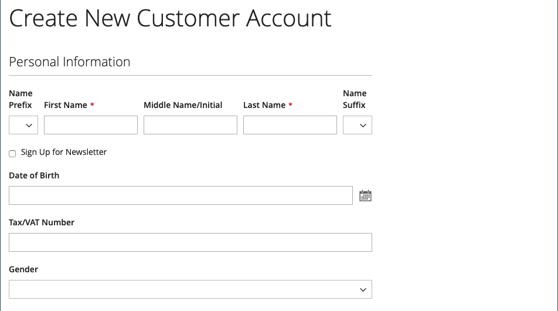

# Options de nom et d’adresse du client

Les _options de nom et d’adresse_ déterminent quels champs sont inclus dans les formulaires de nom et d’adresse lorsque les clients créent un [compte](../customers/account-create.md) avec votre boutique.

{width="500" zoomable="yes"}

Les étapes de configuration des options de nom et d’adresse sont différentes pour Adobe Commerce et Magento Open Source.

## Configuration des options de nom et d’adresse pour Adobe Commerce

Vous pouvez configurer les options de nom et d’adresse qui sont présentées aux clients sur le storefront lors de la création de leur compte.

### Etape 1 : définir la portée de la configuration

1. Sur la barre latérale _Admin_, accédez à **[!UICONTROL Stores]** > _[!UICONTROL Settings]_>**[!UICONTROL Configuration]**.

1. Dans le panneau de gauche, développez **[!UICONTROL Customers]** et choisissez **[!UICONTROL Customer Configuration]**.

1. Développez la section **[!UICONTROL Name and Address Options]** .

   >[!INFO]
   >
   >Notez que la portée des options de nom et d’adresse s’applique au niveau `website`.

1. Faites défiler la page jusqu’en haut de la page et définissez la portée de la configuration sur l’une des options suivantes :

   - `Default Config`
   - `Main Website` (ou site spécifique pour les installations multi-site)

   >[!INFO]
   >
   >La section _[!UICONTROL Name and Address Options]_n’apparaît pas lorsque la portée est définie sur `Default Store View`.

   {width="700" zoomable="yes"}

### Étape 2 : Configuration des options de nom et d’adresse

1. Revenez à la section [!UICONTROL _Nom et options d’adresse_] de la page Configuration client.

   >[!INFO]
   >
   > Si vous n’utilisez pas le paramètre de portée `Default config`, vous devez décocher la case `Use Default` pour chaque champ avant de modifier la valeur.

   {width="600" zoomable="yes"}

1. Pour **[!UICONTROL Prefix Dropdown Options]**, saisissez chaque préfixe à afficher dans la liste, séparé par un point-virgule.

   >[!IMPORTANT]
   >
   >Placez un point-virgule avant la première valeur pour afficher une valeur vide en haut de la liste.

1. Pour **[!UICONTROL Suffix Dropdown Options]**, saisissez chaque suffixe à afficher dans la liste, séparé par un point-virgule.

1. Pour inclure les champs suivants dans les formulaires client, définissez la valeur de chacun sur `Optional` ou `Required`, selon les besoins.

   - **[!UICONTROL Show Telephone]**
   - **[!UICONTROL Show Company]**
   - **[!UICONTROL Show Fax]**

### Étape 3 : Enregistrer et actualiser

1. Une fois l’opération terminée, cliquez sur **[!UICONTROL Save Config]**.

1. Dans le message en haut de la page, cliquez sur **[!UICONTROL Cache Management]** et [actualiser](../systems/cache-management.md) chaque cache non valide.

## Configuration des options de nom et d’adresse pour Magento Open Source

Configurez les options de nom et d’adresse qui sont présentées aux clients du storefront lors de la création de leur compte.

{width="500" zoomable="yes"}

### Etape 1 : définir la portée de la configuration

1. Sur la barre latérale _Admin_, accédez à **[!UICONTROL Stores]** > _[!UICONTROL Settings]_>**[!UICONTROL Configuration]**.

1. Dans le panneau de gauche, développez **[!UICONTROL Customers]** et choisissez **[!UICONTROL Customer Configuration]**.

1. Développez la section **[!UICONTROL Name and Address Options]** .

   >[!IMPORTANT]
   >
   > Notez que la portée des options de nom et d’adresse s’applique au niveau `website`.

   {width="600" zoomable="yes"}

1. Faites défiler la page jusqu’en haut de la page et définissez la portée de la configuration sur l’une des options suivantes :

   - `Default Config`
   - `Main Website` (ou site spécifique pour les installations multi-site)

   >[!NOTE]
   >
   >La section _Nom et options d’adresse_ n’apparaît pas lorsque la portée est définie sur `Default Store View`.

   {width="600" zoomable="yes"}

### Étape 2 : Configuration des options de nom et d’adresse

1. Revenez à la section [!UICONTROL _Nom et options d’adresse_] de la page Configuration client.

   >[!INFO]
   >
   >Si vous n’utilisez pas le paramètre de portée `Default config`, vous devez décocher la case `Use Default` pour chaque champ avant de modifier la valeur.

1. Pour **Nombre de lignes dans une adresse de rue**, saisissez un nombre compris entre 1 et 4.

   >[!WARNING]
   >
   >Par défaut, l&#39;adresse postale est de trois lignes.

1. Pour inclure un préfixe (tel que M. ou Mme) dans le nom, définissez **Afficher le préfixe** sur `Yes`.

   {width="600" zoomable="yes"}

   >[!INFO]
   >
   >Pour les **options de liste déroulante de préfixes**, saisissez chaque préfixe à afficher dans la liste, séparé par un point-virgule. Vous pouvez placer un point-virgule avant la première valeur pour afficher une valeur vide en haut de la liste.

1. Pour inclure un champ facultatif pour le deuxième nom ou l’initial du client, définissez **[!UICONTROL Show Middle Name (initial)]** sur `Yes`.

1. Pour inclure un suffixe (tel que Jr. ou Sr.) après le nom du client, définissez **[!UICONTROL Show Suffix]** sur l’une des options suivantes :

   - `Optional`
   - `Required`

   >[!INFO]
   >
   >Pour les **options de liste déroulante de suffixes**, saisissez chaque suffixe à afficher dans la liste, séparé par un point-virgule. Vous pouvez placer un point-virgule avant la première valeur pour afficher une valeur vide en haut de la liste.

1. Pour inclure la date de naissance, définissez **[!UICONTROL Show Date of Birth]** sur l’une des valeurs suivantes :

   - `Optional`
   - `Required`

   >[!INFO]
   >
   >Conformément aux bonnes pratiques actuelles en matière de sécurité et de confidentialité, gardez à l’esprit tout risque juridique et de sécurité potentiel associé au stockage de la date de naissance complète des clients (mois, jour, année) avec d’autres identifiants personnels. Il est recommandé de limiter le stockage des dates de naissance complètes des clients et de suggérer d’utiliser l’année de naissance du client comme alternative.

   Les clients peuvent utiliser l’icône Calendrier après le champ pour choisir la date de naissance dans un calendrier contextuel.

   {width="600" zoomable="yes"}

1. Pour permettre aux clients de saisir leur taxe ou leur numéro [TVA](../stores-purchase/vat.md), définissez **[!UICONTROL Show Tax/VAT Number]** sur l&#39;une des options suivantes :

   - `Optional`
   - `Required`

1. Pour inclure un champ pour le genre dans le formulaire client, définissez **[!UICONTROL Show Gender]** sur l’un des champs suivants :

   - `Optional`
   - `Required`

   {width="600" zoomable="yes"}

1. Pour inclure les champs suivants dans les formulaires client, définissez la valeur de chacun sur `Optional` ou `Required`, selon les besoins.

   - **[!UICONTROL Show Telephone]**
   - **[!UICONTROL Show Company]**
   - **[!UICONTROL Show Fax]**

### Étape 3 : Enregistrer et actualiser

1. Une fois l’opération terminée, cliquez sur **[!UICONTROL Save Config]**.

1. Dans le message en haut de la page, cliquez sur **[!UICONTROL Cache Management]** et [actualiser](../systems/cache-management.md) chaque cache non valide.
