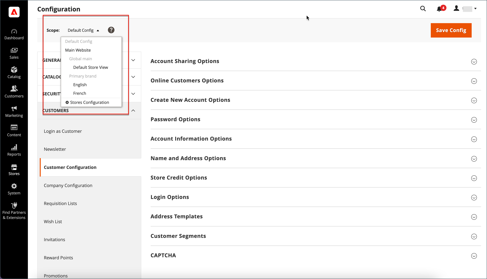
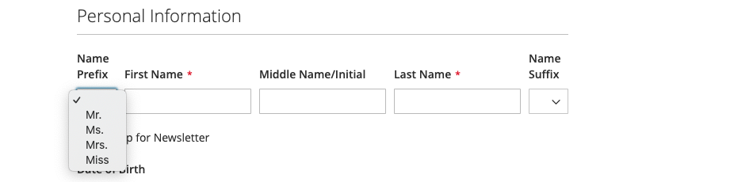

# Options de nom et d’adresse du client

Les _Options de nom et d’adresse_ déterminent quels champs sont inclus dans les formulaires de nom et d’adresse lorsque les clients créent un [compte](../customers/account-create.md) avec votre magasin.

{width="500" zoomable="yes"}

Les étapes de configuration des options nom et adresse sont différentes pour Adobe Commerce et Magento Open Source.

## Configurer les options de nom et d’adresse pour Adobe Commerce

Vous pouvez configurer les options de nom et d’adresse qui sont présentées aux clients sur le storefront lorsqu’ils créent leur compte.

### Étape 1 : définir la portée de la configuration

1. Dans la barre latérale _Admin_, accédez à **[!UICONTROL Stores]** > _[!UICONTROL Settings]_>**[!UICONTROL Configuration]**.

1. Dans le panneau de gauche, développez **[!UICONTROL Customers]** et choisissez **[!UICONTROL Customer Configuration]**.

1. Développez la section **[!UICONTROL Name and Address Options]** .

   >[!INFO]
   >
   >Notez que la portée des options de nom et d’adresse s’applique au niveau du `website`.

1. Faites défiler la page jusqu’en haut et définissez la portée de la configuration sur l’une des options suivantes :

   - `Default Config`
   - `Main Website` (ou site spécifique pour les installations multi-sites)

   >[!INFO]
   >
   >La section _[!UICONTROL Name and Address Options]_&#x200B;n’apparaît pas lorsque l’étendue est définie sur `Default Store View`.

   {width="700" zoomable="yes"}

### Étape 2 : configurer les options de nom et d’adresse

1. Revenez à la section [!UICONTROL _Options de nom et d’adresse_] de la page Configuration du client.

   >[!INFO]
   >
   > Si vous n’utilisez pas le paramètre d’étendue `Default config`, vous devez décocher la case `Use Default` pour chaque champ avant de modifier la valeur.

   {width="600" zoomable="yes"}

1. Par **[!UICONTROL Prefix Dropdown Options]**, saisissez chaque préfixe qui doit apparaître dans la liste en les séparant par des points-virgules.

   >[!IMPORTANT]
   >
   >Placez un point-virgule avant la première valeur pour afficher une valeur vide en haut de la liste.

1. Par **[!UICONTROL Suffix Dropdown Options]**, saisissez chaque suffixe que vous souhaitez voir apparaître dans la liste, séparé par un point-virgule.

1. Pour inclure les champs suivants dans les formulaires client, définissez la valeur de chaque sur `Optional` ou `Required`, selon les besoins.

   - **[!UICONTROL Show Telephone]**
   - **[!UICONTROL Show Company]**
   - **[!UICONTROL Show Fax]**

### Étape 3 : Enregistrer et actualiser

1. Cliquez ensuite sur **[!UICONTROL Save Config]**.

1. Dans le message en haut de la page, cliquez sur **[!UICONTROL Cache Management]** et [actualiser](../systems/cache-management.md) chaque cache non valide.

## Configurer les options de nom et d’adresse pour Magento Open Source

Configurez les options de nom et d’adresse qui sont présentées aux clients sur le storefront lorsqu’ils créent leur compte.

{width="500" zoomable="yes"}

### Étape 1 : définir la portée de la configuration

1. Dans la barre latérale _Admin_, accédez à **[!UICONTROL Stores]** > _[!UICONTROL Settings]_>**[!UICONTROL Configuration]**.

1. Dans le panneau de gauche, développez **[!UICONTROL Customers]** et choisissez **[!UICONTROL Customer Configuration]**.

1. Développez la section **[!UICONTROL Name and Address Options]** .

   >[!IMPORTANT]
   >
   > Notez que la portée des options de nom et d’adresse s’applique au niveau du `website`.

   {width="600" zoomable="yes"}

1. Faites défiler jusqu’en haut de la page et définissez la portée de la configuration sur l’une des options suivantes :

   - `Default Config`
   - `Main Website` (ou site spécifique pour les installations multi-sites)

   >[!NOTE]
   >
   >La section _Options de nom et d’adresse_ n’apparaît pas lorsque l’étendue est définie sur `Default Store View`.

   {width="600" zoomable="yes"}

### Étape 2 : configurer les options de nom et d’adresse

1. Revenez à la section [!UICONTROL _Options de nom et d’adresse_] de la page Configuration du client.

   >[!INFO]
   >
   >Si vous n’utilisez pas le paramètre d’étendue `Default config`, vous devez décocher la case `Use Default` pour chaque champ avant de modifier la valeur.

1. Pour **Nombre de lignes dans une adresse postale**, saisissez un nombre compris entre 1 et 4.

   >[!WARNING]
   >
   >Par défaut, l’adresse postale est de trois lignes.

1. Pour inclure un préfixe (tel que M. ou Mme) dans le cadre du nom, définissez **Afficher le préfixe** sur `Yes`.

   {width="600" zoomable="yes"}

   >[!INFO]
   >
   >Pour **Options de liste déroulante de préfixe**, saisissez chaque préfixe qui doit apparaître dans la liste, en les séparant par des points-virgules. Vous pouvez placer un point-virgule avant la première valeur pour afficher une valeur vide en haut de la liste.

1. Pour inclure un champ facultatif pour le deuxième prénom ou l’initial du client, définissez **[!UICONTROL Show Middle Name (initial)]** sur `Yes`.

1. Pour inclure un suffixe (comme Jr. ou père) après le nom du client, définissez **[!UICONTROL Show Suffix]** sur l’une des valeurs suivantes :

   - `Optional`
   - `Required`

   >[!INFO]
   >
   >Pour **Options de liste déroulante des suffixes**, saisissez chaque suffixe qui doit apparaître dans la liste, en les séparant par des points-virgules. Vous pouvez placer un point-virgule avant la première valeur pour afficher une valeur vide en haut de la liste.

1. Pour inclure la date de naissance, définissez **[!UICONTROL Show Date of Birth]** sur l’une des valeurs suivantes :

   - `Optional`
   - `Required`

   >[!INFO]
   >
   >Conformément aux bonnes pratiques actuelles en matière de sécurité et de confidentialité, soyez conscient de tous les risques juridiques et de sécurité potentiels associés au stockage de la date de naissance complète du client (mois, jour, année) avec d&#39;autres identifiants personnels. Il est recommandé de limiter le stockage des dates de naissance complètes des clientes et clients et de suggérer d’utiliser leur année de naissance comme alternative.

   Les clients peuvent utiliser l’icône Calendrier après le champ pour choisir la date de naissance dans un calendrier pop-up.

   {width="600" zoomable="yes"}

1. Pour permettre aux clients de saisir leur numéro de taxe ou de [TVA](../stores-purchase/vat.md), définissez l&#39;**[!UICONTROL Show Tax/VAT Number]** sur l&#39;une des valeurs suivantes :

   - `Optional`
   - `Required`

1. Pour inclure un champ pour le genre dans le formulaire client, définissez **[!UICONTROL Show Gender]** sur l’une des valeurs suivantes :

   - `Optional`
   - `Required`

   {width="600" zoomable="yes"}

1. Pour inclure les champs suivants dans les formulaires client, définissez la valeur de chaque sur `Optional` ou `Required`, selon les besoins.

   - **[!UICONTROL Show Telephone]**
   - **[!UICONTROL Show Company]**
   - **[!UICONTROL Show Fax]**

### Étape 3 : Enregistrer et actualiser

1. Cliquez ensuite sur **[!UICONTROL Save Config]**.

1. Dans le message en haut de la page, cliquez sur **[!UICONTROL Cache Management]** et [actualiser](../systems/cache-management.md) chaque cache non valide.
