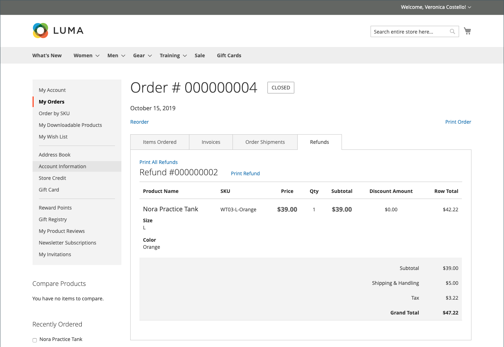

# Remboursements dans le tableau de bord du compte client

{{ee-feature}}

Si un remboursement a été émis pour une commande, les clients peuvent consulter les informations de remboursement associées à la commande dans leur tableau de bord de compte. Si vous avez activé l’option [!UICONTROL _Afficher l’historique de crédit de la boutique aux clients_] pour [Configuration du crédit de la boutique](../customers/credit-configure.md), les clients peuvent également accéder à leur historique de [crédit de la boutique](../customers/store-credit.md).

## Afficher un remboursement sur le storefront

1. À partir du storefront, le client se connecte à son compte.

1. Localise leur commande à l’aide de l’une des méthodes suivantes :

   * Recherche de la commande dans la liste des **Commandes récentes** et clic sur **[!UICONTROL View]**.
   * Dans le panneau de gauche, choisissez **[!UICONTROL My Orders]**. Recherchez ensuite l’ordre dans la liste, puis cliquez sur **[!UICONTROL View]**.

1. Le client clique sur l&#39;onglet **[!UICONTROL Refunds]** pour consulter les détails du remboursement.

   {width="700" zoomable="yes"}

## Afficher le solde et l&#39;historique du crédit de la boutique sur le storefront

Méthode 1 : **à partir du tableau de bord du compte client**

1. À partir du storefront, le client se connecte au compte .

1. Si le remboursement a été appliqué au crédit de la boutique, sélectionne **[!UICONTROL Store Credit]** dans le panneau de gauche.

1. Le montant remboursé à leur crédit de magasin apparaît dans la liste avec la date et l’heure de l’action.

   {width="700" zoomable="yes"}

   >[!INFO]
   >
   >La page Crédit de la boutique fournit également un lien permettant au client d’utiliser une [carte cadeau](../stores-purchase/product-gift-card-workflow.md#check-status-and-balance-of-the-gift-card).

Méthode 2 : **à partir de la page _Révision et paiements_**

1. Le client ajoute un produit au panier.

2. Accède à la page _Passage en caisse_.

3. Passe l’étape **[!UICONTROL Shipping]**.

4. Si le crédit de la boutique est disponible, le client clique sur **[!UICONTROL Use Store Credit]**.

   {width="700" zoomable="yes"}

5. Si le client change d&#39;avis au sujet de l&#39;utilisation du crédit de la boutique, clique sur **[!UICONTROL Remove]** dans la section _Résumé de la commande_.

## Actions de paiement dans l’administrateur

Vous pouvez configurer des actions de paiement pour votre [Mode de paiement](../configuration-reference/sales/payment-methods.md) spécifique. Chaque mode de paiement comporte un ensemble différent d&#39;actions de paiement.

| Action de paiement | Description |
|--- |---|
| [!UICONTROL Capture Online] | Lorsque la facture est soumise, le système capture le paiement à partir de la passerelle de paiement tierce. Un utilisateur administrateur peut ensuite créer un avoir et annuler la facture. |
| [!UICONTROL Capture Offline] | Lorsque la facture est soumise, le système ne capture pas le paiement. On suppose que le paiement est capturé directement par le biais de la passerelle et qu’il ne peut pas être capturé via Adobe Commerce. Un utilisateur administrateur peut ensuite créer un avoir, mais ne peut pas annuler la facture. (Même si la commande a utilisé un paiement en ligne, la facture est essentiellement une facture hors ligne.) |
| [!UICONTROL Not Capture] | Lorsque la facture est soumise, le système ne capture pas le paiement. On suppose que le paiement est capturé ultérieurement via Adobe Commerce. La facture remplie contient un bouton [!UICONTROL _Capturer_]. Avant la capture, vous pouvez annuler la facture. Après la capture, vous pouvez créer un avoir et annuler la facture. |

{style="table-layout:auto"}

>[!WARNING]
>
>Sélectionnez l’option [!UICONTROL _Pas de capture_] sauf si vous êtes certain de capturer le paiement via Adobe Commerce ultérieurement. Vous ne pouvez pas créer d&#39;avoir tant que le paiement n&#39;a pas été saisi à l&#39;aide du bouton [!UICONTROL _Capturer_].
